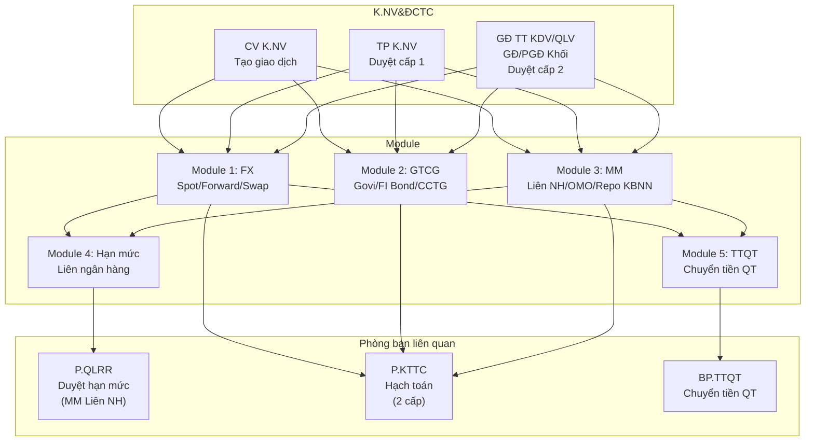
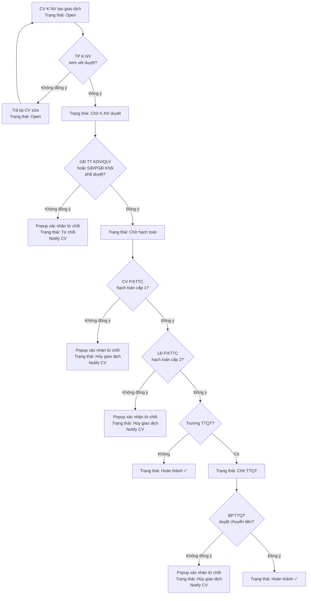
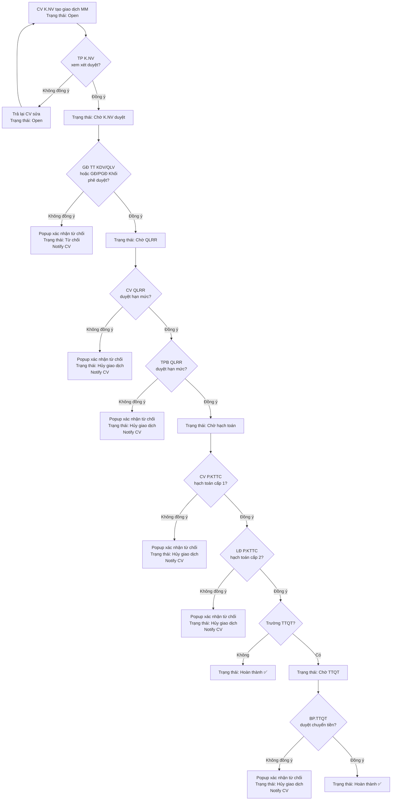
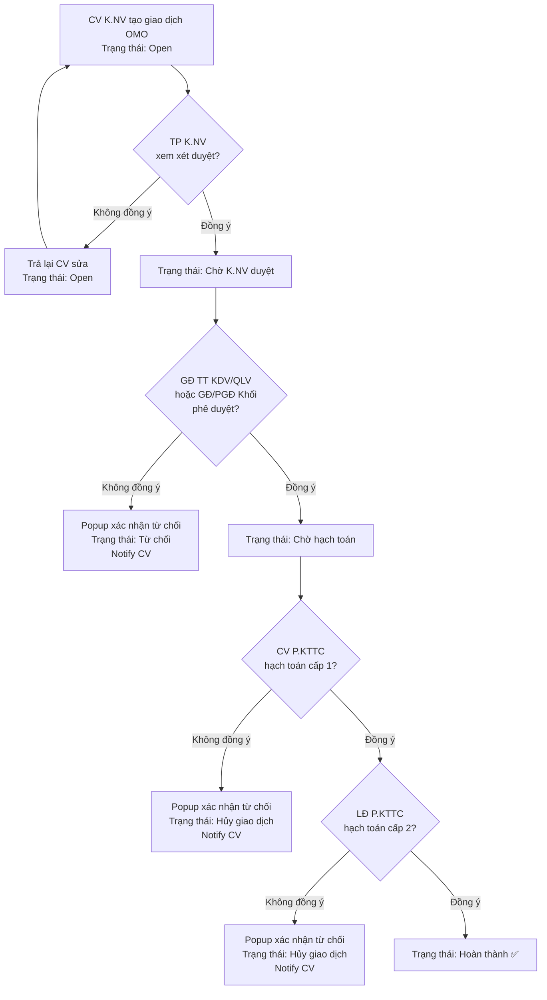
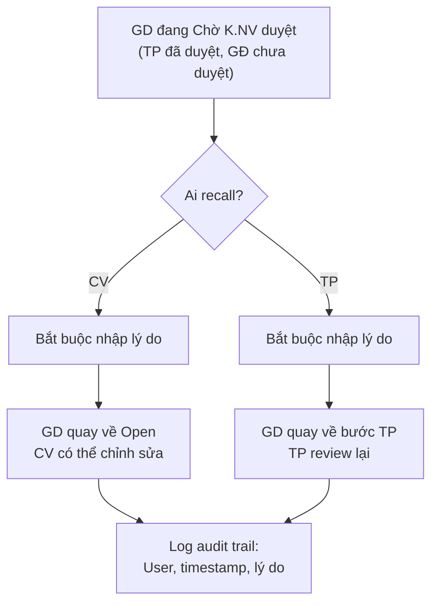
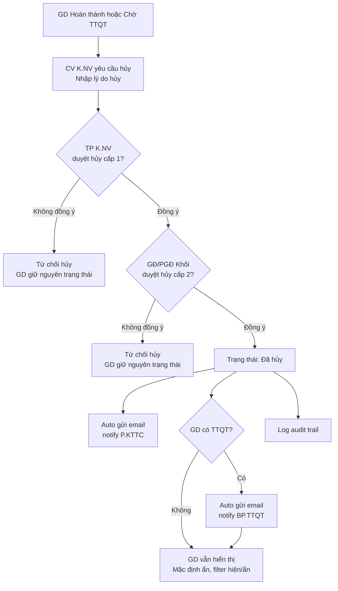
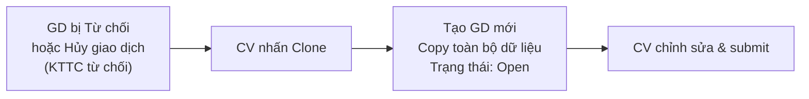

# TÀI LIỆU ĐẶC TẢ YÊU CẦU NGƯỜI SỬ DỤNG

# HỆ THỐNG TREASURY — KIENLONGBANK

| Thông tin | Chi tiết |
|-----------|----------|
| **Mã tài liệu** | BM01-v3 |
| **Phiên bản** | 3.0 |
| **Ngày ban hành** | 02/04/2026 |
| **Đơn vị soạn thảo** | K.NV&ĐCTC |
| **Tác giả** | Trần Thị Linh Phương, Dương Thanh Tùng |
| **Trạng thái** | Draft — Chờ review |

---

## LỊCH SỬ THAY ĐỔI

| Phiên bản | Ngày | Mô tả thay đổi |
|-----------|------|----------------|
| 1.0 | — | Phiên bản gốc |
| 2.0 | 01/04/2026 | Chuẩn hóa cấu trúc, sửa lỗi công thức, bổ sung luồng đặc biệt |
| **3.0** | **02/04/2026** | **Tổng hợp phản hồi nghiệp vụ: cập nhật chức danh, tách MM thành 3 luồng (Liên ngân hàng / OMO / Repo KBNN), bổ sung 2 cấp KTTC, sửa quy ước định dạng Bond, bổ sung công thức cặp tiền chéo, cập nhật hạn mức (FX chiếm hạn mức), bổ sung role mới** |
| 3.0.1 | 05/04/2026 | Sửa format mã GD GTCG: `G-YYYYMMDD-NNNN` / `F-YYYYMMDD-NNNN` (có ngày, reset mỗi ngày). Sửa FI Bond/CCTG `Ngày phát hành` từ "Tự động" → "Không bắt buộc, nhập tay" (không có danh mục tự động cho FI/CCTG). Chờ chị Linh Phương confirm |

---

## MỤC LỤC

1. [GIỚI THIỆU](#1-giới-thiệu)
2. [TỔNG QUAN](#2-tổng-quan)
3. [YÊU CẦU CHỨC NĂNG](#3-yêu-cầu-chức-năng)
   - 3.1 Module 1: Kinh doanh Ngoại tệ (FX)
   - 3.2 Module 2: Giấy tờ có giá (GTCG)
   - 3.3 Module 3: Kinh doanh tiền tệ (MM)
   - 3.4 Module 4: Phê duyệt hạn mức liên ngân hàng
   - 3.5 Module 5: Thanh toán quốc tế (TTQT)
4. [LUỒNG XỬ LÝ ĐẶC BIỆT](#4-luồng-xử-lý-đặc-biệt)
5. [MASTER DATA](#5-master-data)
6. [PHÂN QUYỀN](#6-phân-quyền)
7. [NOTIFICATION](#7-notification)
8. [AUDIT TRAIL](#8-audit-trail)
9. [YÊU CẦU PHI CHỨC NĂNG](#9-yêu-cầu-phi-chức-năng)
10. [PHỤ LỤC](#10-phụ-lục)

---

## 1. GIỚI THIỆU

### 1.1. Mục đích

Tài liệu được xây dựng nhằm mô tả các yêu cầu cho việc xây dựng **Hệ thống Quản trị Nguồn vốn (Treasury System)** của Ngân hàng TMCP Kiên Long (KienlongBank). Tài liệu là đầu vào cho các quá trình thiết kế, lập trình và kiểm thử hệ thống. Nội dung được mô tả dựa trên tính khả dụng của hệ thống cũng như tình hình thực tế các nghiệp vụ nguồn vốn tại Hội sở.

### 1.2. Phạm vi — Phase 1

**Phase 1** tập trung vào việc **số hóa toàn bộ giao dịch Treasury đang thực hiện thủ công**, bao gồm:

- Tạo, phê duyệt, theo dõi giao dịch trên hệ thống (thay thế email và chứng từ giấy)
- Quản lý hạn mức liên ngân hàng
- Quản lý danh mục giấy tờ có giá
- Lưu trữ và truy xuất dữ liệu giao dịch

**Phase 1 KHÔNG bao gồm:**

- Tích hợp Core Banking (Flexcube) — sẽ triển khai ở Phase 2
- Tự động đẩy hạch toán sang Core
- Tích hợp Reuters/Bloomberg lấy tỷ giá tự động
- Tích hợp trực tiếp hệ thống SWIFT
- Tự động sinh SWIFT MT300 (FX) / MT320 (MM) — sẽ triển khai ở Phase 2

Đối tượng áp dụng bao gồm Khối Nguồn vốn & Định chế Tài chính cùng các phòng ban có tham gia vào quá trình vận hành của hệ thống.

### 1.3. Giải thích thuật ngữ và từ viết tắt

| STT | Từ viết tắt / Thuật ngữ | Giải thích |
|-----|--------------------------|------------|
| 1 | KienlongBank | Ngân hàng TMCP Kiên Long |
| 2 | K.CN | Khối Công nghệ |
| 3 | K.NV&ĐCTC | Khối Nguồn vốn & Định chế Tài chính |
| 4 | K.NV | Viết tắt của K.NV&ĐCTC (trong ngữ cảnh phê duyệt) |
| 5 | P.QLRR | Phòng Quản lý Rủi ro |
| 6 | TTTT | Trung tâm Thanh toán |
| 7 | TTQT | Thanh toán Quốc tế |
| 8 | P.KTTC | Phòng Kế toán – Tài chính |
| 9 | CV / CVKD | Chuyên viên Kinh doanh / Chuyên viên Hỗ trợ giao dịch thuộc K.NV&ĐCTC |
| 10 | TP | Trưởng phòng Kinh doanh ngoại tệ thuộc K.NV&ĐCTC |
| 11 | GĐ/PGĐ | Giám đốc / Phó Giám đốc Trung tâm KDV/QLV; Giám đốc / Phó Giám đốc Khối NV&ĐCTC |
| 12 | TĐV | Trưởng Đơn vị |
| 13 | LĐ P.KTTC | Lãnh đạo Phòng Kế toán – Tài chính |
| 14 | GTCG | Giấy tờ có giá |
| 15 | TSBĐ | Tài sản bảo đảm |
| 16 | CCTG | Chứng chỉ tiền gửi |
| 17 | FX | Foreign Exchange — Kinh doanh ngoại tệ |
| 18 | MM | Money Market — Kinh doanh tiền tệ |
| 19 | OMO | Open Market Operations — Nghiệp vụ thị trường mở |
| 20 | KBNN | Kho bạc Nhà nước |
| 21 | SSI | Standing Settlement Instruction — Chỉ dẫn thanh toán |
| 22 | HTM | Hold to Maturity — Chứng khoán đầu tư giữ đến ngày đáo hạn |
| 23 | AFS | Available for Sale — Chứng khoán đầu tư sẵn sàng để bán |
| 24 | HFT | Held for Trading — Chứng khoán kinh doanh |
| 25 | CIF | Customer Information File — Mã khách hàng |
| 26 | NHNN | Ngân hàng Nhà nước |
| 27 | TCPH | Tổ chức phát hành |

### 1.4. Quy ước định dạng

> **Lưu ý v3:** Module FX và MM sử dụng quy ước quốc tế. Module GTCG (Bond) sử dụng quy ước kế toán Việt Nam. Đơn vị tiền đồng thống nhất ghi là **VND** (không dùng "VNĐ").

**Module FX, MM:**

| Loại dữ liệu | Quy ước | Ví dụ |
|---------------|---------|-------|
| Số tiền / Khối lượng | Dấu `,` ngăn hàng nghìn, dấu `.` ngăn thập phân | 10,000,000.05 |
| Ngày tháng | dd/mm/yyyy | 13/03/2026 |
| Lãi suất | Dấu `.` thập phân, đơn vị %/năm | 4.50%/năm |
| Tỷ giá | Dấu `,` ngăn nghìn, dấu `.` thập phân | 26,005.35 |

**Module GTCG (Bond):**

| Loại dữ liệu | Quy ước | Ví dụ |
|---------------|---------|-------|
| Số tiền / Khối lượng | Dấu `.` ngăn hàng nghìn, dấu `,` ngăn thập phân | 10.000.000,05 |
| Ngày tháng | dd/mm/yyyy | 13/03/2026 |
| Lãi suất | Dấu `,` thập phân, đơn vị %/năm | 2,51%/năm |

---

## 2. TỔNG QUAN

### 2.1. Phát biểu bài toán

Hiện tại, các giao dịch nguồn vốn vẫn đang vận hành thông qua việc Khối Nguồn vốn & Định chế Tài chính gửi giấy đề nghị giao dịch, phiếu ghi nhận giao dịch, giấy đề nghị chuyển tiền cùng với chữ ký phê duyệt trực tiếp của Trưởng Đơn vị tới email của P.QLRR, P.KTTC và TTTT. Tuy nhiên, việc lưu trữ email và các chứng từ giao dịch có liên quan sẽ có nhiều hạn chế khi có thể xảy ra mất mát và khó có thể lưu trữ trong thời gian dài. Vì vậy, hệ thống quản trị nguồn vốn sẽ tối ưu hiệu quả trong giao dịch nguồn vốn Hội sở, đồng thời giúp việc lưu trữ dữ liệu được kiểm soát tốt hơn.

Trong quá trình thực hiện các giao dịch thuộc nghiệp vụ mua bán Giấy tờ có giá do K.NV&ĐCTC phụ trách (Trái phiếu chính phủ, Chứng chỉ tiền gửi), việc cập nhật, thay đổi danh mục diễn ra thường xuyên. Tuy nhiên chưa có hệ thống để chuyên viên thao tác trực tiếp và truy xuất riêng đến các trường thông tin thuộc thẩm quyền phụ trách. Hiện tại các giao dịch GTCG ngày càng gia tăng, dễ dẫn tới sai sót trong việc quản trị danh mục nếu không được xây dựng hệ thống quản lý.

### 2.2. Mục tiêu

- **Số hóa quy trình:** Chuyển đổi toàn bộ giao dịch nguồn vốn từ chứng từ giấy / email sang hệ thống điện tử
- **Phê duyệt điện tử:** Thực hiện phê duyệt giao dịch trực tiếp trên hệ thống, thay thế chữ ký trực tiếp (xác thực bằng User + Audit trail, không dùng chữ ký số CA)
- **Lưu trữ tập trung:** Loại bỏ lưu trữ chứng từ giấy, thông tin giao dịch lưu trực tiếp trên hệ thống (hỗ trợ xuất PDF)
- **Kiểm soát & theo dõi:** Dễ dàng tra cứu, kiểm soát lịch sử giao dịch với đầy đủ audit trail
- **Quản lý danh mục GTCG:** Cho phép chuyên viên tương tác trực tiếp, giảm thiểu sai sót

### 2.3. Phạm vi — 5 Module

| Module | Tên | Mô tả ngắn |
|--------|-----|-------------|
| 1 | **Kinh doanh Ngoại tệ (FX)** | Giao dịch Spot, Forward, Swap ngoại tệ |
| 2 | **Giấy tờ có giá (GTCG)** | Giao dịch Govi Bond, FI Bond, CCTG |
| 3 | **Kinh doanh tiền tệ (MM)** | Giao dịch Liên ngân hàng, OMO, Repo KBNN |
| 4 | **Phê duyệt hạn mức liên ngân hàng** | Duyệt hạn mức có/không TSBĐ (FX + MM) |
| 5 | **Thanh toán quốc tế (TTQT)** | Chuyển tiền quốc tế cho các GD FX, MM |

### 2.4. Danh sách người dùng hệ thống (10 Role)

| STT | Role | Mô tả | Phạm vi dữ liệu |
|-----|------|-------|-----------------|
| 1 | **CV K.NV** | Chuyên viên Kinh doanh / Chuyên viên Hỗ trợ giao dịch — tạo giao dịch | Toàn bộ GD |
| 2 | **TP K.NV** | Trưởng phòng Kinh doanh ngoại tệ — duyệt cấp 1 | Toàn bộ GD |
| 3 | **GĐ TT KDV/QLV** | Giám đốc / Phó GĐ Trung tâm KDV/QLV — duyệt cấp 2 | Toàn bộ GD |
| 4 | **GĐ/PGĐ Khối** | Giám đốc / Phó GĐ Khối NV&ĐCTC — duyệt cấp 2, duyệt hủy | Toàn bộ GD |
| 5 | **CV QLRR** | Chuyên viên QLRR thị trường — duyệt hạn mức cấp 1 | Chỉ GD MM cần duyệt hạn mức |
| 6 | **TPB QLRR** | Trưởng phòng ban QLRR — duyệt hạn mức cấp 2 | Chỉ GD MM cần duyệt hạn mức |
| 7 | **CV P.KTTC** | Chuyên viên Kế toán Tài chính — hạch toán cấp 1 | GD từ bước hạch toán trở đi |
| 8 | **LĐ P.KTTC** | Lãnh đạo Phòng KTTC — hạch toán cấp 2 | GD từ bước hạch toán trở đi |
| 9 | **BP.TTQT** | Bộ phận TTQT — duyệt chuyển tiền quốc tế | Chỉ GD TTQT đến hạn |
| 10 | **Admin** | Quản trị hệ thống | Quản lý master data, phân quyền user |

### 2.5. Mô hình tổng thể

---

## 3. YÊU CẦU CHỨC NĂNG

### 3.1. Module 1: Kinh doanh Ngoại tệ (FX)

#### 3.1.1. Màn hình tạo Giao dịch Giao ngay / Kỳ hạn (Spot / Forward)

| Tên trường | Loại trường | Mô tả dữ liệu | Ví dụ |
|------------|-------------|----------------|-------|
| Số Ticket | Không bắt buộc | Dạng số, không có dấu thập phân và hàng nghìn | 12345, 925508281 |
| Đối tác | Bắt buộc | Dạng text, ký hiệu viết tắt (mã nội bộ K.NV), dropdown theo danh sách đối tác | MSBI |
| Tên đối tác | Tự động | Hiển thị tự động theo trường "Đối tác" | Ngân hàng TMCP Hàng hải Việt Nam |
| Loại giao dịch | Bắt buộc | Dropdown 2 lựa chọn: "SPOT", "FORWARD" | SPOT |
| Chiều giao dịch | Bắt buộc | Dropdown 2 lựa chọn: "Sell", "Buy" | Sell |
| Khối lượng giao dịch | Bắt buộc | Dạng số, dấu `,` ngăn nghìn, dấu `.` thập phân, 2 chữ số thập phân | 10,000,000.05 |
| Loại tiền giao dịch | Bắt buộc | Dropdown theo danh sách K.NV cung cấp | AUD, USD, EUR… |
| Cặp tiền | Tự động | Hiển thị tự động theo "Loại tiền giao dịch" | USD/VND, AUD/USD, EUR/GBP… |
| Tỷ giá | Bắt buộc | Dạng số, dấu `,` ngăn nghìn, dấu `.` thập phân. Cặp USD/VND, USD/JPY, USD/KRW: 2 số sau dấu `.`; còn lại: 4 số sau dấu `.` | USD/VND: 26,005.35; EUR/USD: 1.1550 |
| Thành tiền | Tự động | Tính theo công thức (xem bên dưới), dấu `,` ngăn nghìn, dấu `.` thập phân + đơn vị tiền | 26,000,245,467.00 VND |
| Ngày giao dịch | Bắt buộc | Dạng date dd/mm/yyyy, hiển thị lịch chọn ngày, mặc định TODAY | 13/03/2026 |
| Ngày Giá trị | Bắt buộc | Dạng date dd/mm/yyyy, hiển thị lịch chọn ngày, mặc định TODAY | 13/03/2026 |
| Ngày thực hiện | Bắt buộc | Dạng date dd/mm/yyyy, hiển thị lịch chọn ngày | 13/03/2026 |
| Pay code của KLB | Bắt buộc | Dạng text, chọn từ danh sách hoặc tự nhập | So 8901358797 tai BANK OF NY MELLON (SWIFT CODE: IRVTUS3N) |
| Pay code của đối tác | Bắt buộc | Dạng text, chọn từ danh sách hoặc tự nhập | So 8901358797 tai BANK OF NY MELLON (SWIFT CODE: IRVTUS3N) |
| TTQT | Tự động | Hiển thị "Có" / "Không" theo trường "Pay code của đối tác" | Có, Không |
| File đính kèm | Không bắt buộc | Upload file ticket / hợp đồng. Mỗi file gắn với 1 giao dịch | ticket_925508281.pdf |
| Ghi chú | Không bắt buộc | Dạng text tự do | |

**Công thức tính Thành tiền (Spot/Forward):**

| Cặp tiền | Công thức | Đơn vị kết quả |
|-----------|-----------|----------------|
| USD/VND | Khối lượng giao dịch × Tỷ giá | VND |
| USD/... (USD là base) | Khối lượng giao dịch ÷ Tỷ giá | USD |
| .../USD (USD là quote) | Khối lượng giao dịch × Tỷ giá | USD |
| Cặp tiền chéo (không có USD, VD: EUR/GBP, EUR/JPY) | Khối lượng giao dịch × Tỷ giá | Tiền quote |

#### 3.1.2. Màn hình tạo Giao dịch Hoán đổi (Swap)

| Tên trường | Loại trường | Mô tả dữ liệu | Ví dụ |
|------------|-------------|----------------|-------|
| Số Ticket | Không bắt buộc | Dạng số, không có dấu thập phân và hàng nghìn | 12345 |
| Đối tác | Bắt buộc | Dạng text, ký hiệu viết tắt (mã nội bộ K.NV), dropdown theo danh sách đối tác | MSBI |
| Tên đối tác | Tự động | Hiển thị tự động theo trường "Đối tác" | Ngân hàng TMCP Hàng hải Việt Nam |
| Chiều giao dịch | Bắt buộc | Dropdown 2 lựa chọn: "Sell - Buy", "Buy - Sell" | Sell - Buy |
| Khối lượng giao dịch | Bắt buộc | Dạng số, dấu `,` ngăn nghìn, dấu `.` thập phân, 2 chữ số thập phân | 10,000,000.05 |
| Loại tiền giao dịch | Bắt buộc | Dropdown theo danh sách K.NV cung cấp | AUD, USD, EUR… |
| Cặp tiền | Tự động | Hiển thị tự động theo "Loại tiền giao dịch" | USD/VND, AUD/USD… |
| Ngày giao dịch | Bắt buộc | Dạng date dd/mm/yyyy, hiển thị lịch chọn ngày, mặc định TODAY | 13/03/2026 |
| **— Chân 1 —** | | | |
| Ngày Giá trị chân 1 | Bắt buộc | Dạng date dd/mm/yyyy, hiển thị lịch chọn ngày | 13/03/2026 |
| Ngày thực hiện chân 1 | Bắt buộc | Dạng date dd/mm/yyyy, hiển thị lịch chọn ngày | 13/03/2026 |
| Tỷ giá chân 1 | Bắt buộc | Dạng số, dấu `,` ngăn nghìn, dấu `.` thập phân. Quy tắc số thập phân: tương tự Spot/Forward | USD/VND: 26,005.35 |
| Thành tiền chân 1 | Tự động | Tính theo công thức dùng **Tỷ giá chân 1** (xem bảng công thức bên dưới) | 26,000,245,467.00 VND |
| Pay code của KLB chân 1 | Bắt buộc | Dạng text, chọn từ danh sách hoặc tự nhập | |
| Pay code của đối tác chân 1 | Bắt buộc | Dạng text, chọn từ danh sách hoặc tự nhập | |
| TTQT chân 1 | Tự động | Hiển thị "Có" / "Không" theo "Pay code của đối tác chân 1" | Có, Không |
| **— Chân 2 —** | | | |
| Ngày Giá trị chân 2 | Bắt buộc | Dạng date dd/mm/yyyy, hiển thị lịch chọn ngày | 13/06/2026 |
| Ngày thực hiện chân 2 | Bắt buộc | Dạng date dd/mm/yyyy, hiển thị lịch chọn ngày | 13/06/2026 |
| Tỷ giá chân 2 | Bắt buộc | Dạng số, dấu `,` ngăn nghìn, dấu `.` thập phân. Quy tắc số thập phân: tương tự chân 1 | USD/VND: 26,105.00 |
| Thành tiền chân 2 | Tự động | Tính theo công thức dùng **Tỷ giá chân 2** (xem bảng công thức bên dưới) | 26,100,500,000.00 VND |
| Pay code của KLB chân 2 | Bắt buộc | Dạng text, chọn từ danh sách hoặc tự nhập | |
| Pay code của đối tác chân 2 | Bắt buộc | Dạng text, chọn từ danh sách hoặc tự nhập | |
| TTQT chân 2 | Tự động | Hiển thị "Có" / "Không" theo "Pay code của đối tác chân 2" | Có, Không |
| File đính kèm | Không bắt buộc | Upload file ticket / hợp đồng. Mỗi file gắn với 1 giao dịch | |
| Ghi chú | Không bắt buộc | Dạng text tự do | |

**Công thức tính Thành tiền Swap:**

| Chân | Cặp tiền | Công thức | Đơn vị |
|------|-----------|-----------|--------|
| Chân 1 | USD/VND | Khối lượng × **Tỷ giá chân 1** | VND |
| Chân 1 | USD/... | Khối lượng ÷ **Tỷ giá chân 1** | USD |
| Chân 1 | .../USD | Khối lượng × **Tỷ giá chân 1** | USD |
| Chân 1 | Cặp chéo (không USD) | Khối lượng × **Tỷ giá chân 1** | Tiền quote |
| Chân 2 | USD/VND | Khối lượng × **Tỷ giá chân 2** | VND |
| Chân 2 | USD/... | Khối lượng ÷ **Tỷ giá chân 2** | USD |
| Chân 2 | .../USD | Khối lượng × **Tỷ giá chân 2** | USD |
| Chân 2 | Cặp chéo (không USD) | Khối lượng × **Tỷ giá chân 2** | Tiền quote |

> ⚠️ **Lưu ý:** BRD v1 ghi công thức Thành tiền chân 2 sử dụng "Tỷ giá chân 1" — đây là **lỗi typo** đã được sửa. Chân 2 phải dùng **Tỷ giá chân 2**.

#### 3.1.3. Luồng phê duyệt giao dịch FX

**Quy tắc quan trọng:**
- Sau khi TP K.NV đã duyệt → CV **không thể** chỉnh sửa giao dịch
- GĐ từ chối → hiển thị **popup xác nhận** (tránh click nhầm) → thông báo cho CV, GD chuyển trạng thái "Từ chối"
- P.KTTC / BP.TTQT từ chối → hiển thị **popup xác nhận** → GD chuyển trạng thái "Hủy giao dịch"
- **Phase 2:** Sau khi FX được duyệt → hệ thống tự động sinh **SWIFT MT300**. Nếu lỗi sinh SWIFT → luồng **Redeal**

#### 3.1.4. Luồng Recall / Hủy / Clone giao dịch FX

Xem chi tiết tại [Mục 4 — Luồng xử lý đặc biệt](#4-luồng-xử-lý-đặc-biệt). Áp dụng chung cho tất cả module.

#### 3.1.5. Màn hình danh sách giao dịch Ngoại tệ

Mỗi giao dịch hiển thị theo dòng với các trường sau:

| Tên trường | Mô tả dữ liệu | Ví dụ |
|------------|----------------|-------|
| ID giao dịch | Dạng số, thứ tự giao dịch tạo trên hệ thống | 123 |
| Số Ticket | Lấy theo trường "Số Ticket" | 925508281 |
| Ngày giao dịch | dd/mm/yyyy, ngày tạo yêu cầu | 13/03/2026 |
| Đối tác | Ký hiệu viết tắt | MSBI, SBVN |
| Loại giao dịch | Spot/Forward lấy theo trường "Loại giao dịch"; Swap hiển thị "SWAP" | SPOT, FORWARD, SWAP |
| Chiều giao dịch | Lấy theo trường "Chiều giao dịch" | Sell, Buy, Sell-Buy, Buy-Sell |
| Khối lượng giao dịch | Lấy theo trường "Khối lượng giao dịch" | 10,000,000.05 |
| Loại tiền giao dịch | Lấy theo trường "Loại tiền giao dịch" | USD, EUR |
| Ngày Giá trị | Lấy theo trường "Ngày Giá trị" | 13/03/2026 |
| Ngày thực hiện | Lấy theo trường "Ngày thực hiện" | 15/03/2026 |
| Trạng thái giao dịch | Trạng thái hiện tại | Open, Chờ K.NV duyệt, Chờ hạch toán, Chờ TTQT, Hoàn thành, Từ chối, Hủy giao dịch |

**Chức năng:**
- Cho phép **lọc** giao dịch theo tất cả các trường trên màn hình
- Cho phép **tìm kiếm** theo Số Ticket, Đối tác
- Giao dịch hủy mặc định **ẩn**, có filter hiện/ẩn

---

### 3.2. Module 2: Giấy tờ có giá (GTCG)

> **Lưu ý v3:** Module GTCG sử dụng quy ước kế toán Việt Nam — dấu `.` ngăn nghìn, dấu `,` ngăn thập phân.

#### 3.2.1. Màn hình tạo giao dịch Govi Bond

| Tên trường | Loại trường | Mô tả dữ liệu | Ví dụ |
|------------|-------------|----------------|-------|
| Ngày giao dịch | Bắt buộc | Dạng date dd/mm/yyyy | 13/03/2026 |
| Ngày đặt lệnh | Bắt buộc | Dạng date dd/mm/yyyy | 13/03/2026 |
| Ngày giá trị | Bắt buộc | Dạng date dd/mm/yyyy | 14/03/2026 |
| Chiều giao dịch | Bắt buộc | Dropdown: "Bên mua", "Bên bán" | Bên mua |
| Đối tác | Bắt buộc | Ký hiệu viết tắt (mã nội bộ K.NV), dropdown theo danh sách. Cho phép nhập bổ sung đối tác mới | MSB |
| Tên đối tác | Tự động | Hiển thị tự động theo "Đối tác" | Ngân hàng TMCP Hàng hải Việt Nam |
| Loại giao dịch | Bắt buộc | Dropdown: Repo, Reverse Repo, Outright, Other. Nếu chọn "Other" → cho phép nhập tay | Repo |
| Mã trái phiếu | Bắt buộc | Dropdown có tìm kiếm từ danh mục trái phiếu. Nhập ký tự → hệ thống gợi ý | Nhập "TD" → hiện danh sách TD... |
| Lãi suất coupon | Tự động | Dạng số, đơn vị %, dấu `,` thập phân, tối đa 2 chữ số thập phân. Lấy từ danh mục trái phiếu | 2,51% |
| Ngày phát hành | Tự động | dd/mm/yyyy, lấy từ danh mục trái phiếu | 11/03/2025 |
| Ngày đáo hạn | Tự động | dd/mm/yyyy, lấy từ danh mục trái phiếu | 12/03/2026 |
| Số lượng | Bắt buộc | Dạng số nguyên, dấu `.` ngăn nghìn, không cho phép nhập thập phân. **Khi bán:** không được vượt tồn kho | 1.000.000 |
| Mệnh giá | Tự động | Số nguyên, đơn vị: VND, dấu `.` ngăn nghìn. Lấy từ danh mục trái phiếu | 100.000 |
| Lãi suất chiết khấu | Bắt buộc | Dạng số, đơn vị %, dấu `,` thập phân, tối đa 4 chữ số thập phân | 2,5678% |
| Giá sạch | Bắt buộc | Số nguyên, đơn vị: VND, dấu `.` ngăn nghìn | 120.160 |
| Giá thanh toán | Bắt buộc | Số nguyên, đơn vị: VND, dấu `.` ngăn nghìn | 1.206.307.366 |
| Tổng giá trị giao dịch | Tự động | = Số lượng × Giá thanh toán. Dấu `.` ngăn nghìn | 241.261.473.200 |
| Hạch toán | Bắt buộc (khi mua) | Chỉ hiển thị khi Chiều GD = "Bên mua". Dropdown: HTM, AFS, HFT. Bên bán → không cần chọn | HTM |
| Ngày thanh toán | Bắt buộc | dd/mm/yyyy | 13/03/2026 |
| Kỳ hạn còn lại | Tự động | = Ngày đáo hạn − Ngày thanh toán. Đơn vị: ngày | 3.105 ngày |
| Xác nhận giao dịch | Bắt buộc | Dropdown: Email, Reuter trading, Khác. Chọn "Khác" → cho phép nhập text | Email |
| Lập hợp đồng | Bắt buộc | Dropdown: KienlongBank, Đối tác | KienlongBank |
| File đính kèm | Không bắt buộc | Upload file ticket / hợp đồng. Mỗi file gắn với 1 giao dịch | |
| Ghi chú | Không bắt buộc | Dạng text. Ghi chú ngày mua và giá mua cho P.KTTC khi chiều GD = "Bên bán" | Ngày mua: 12/03/2026, Giá mua: 102.260 VND/TP |

> ⚠️ **Block cứng khi bán vượt tồn kho:** Khi Chiều GD = "Bên bán", hệ thống **kiểm tra tồn kho GTCG** theo Mã trái phiếu. Nếu Số lượng bán > Số lượng tồn kho → **không cho phép tạo giao dịch**, hiển thị thông báo lỗi.

#### 3.2.2. Màn hình tạo giao dịch FI Bond & CCTG

| Tên trường | Loại trường | Mô tả dữ liệu | Ví dụ |
|------------|-------------|----------------|-------|
| Ngày giao dịch | Bắt buộc | dd/mm/yyyy | 14/04/2026 |
| Ngày giá trị | Bắt buộc | dd/mm/yyyy | 14/04/2026 |
| Loại GTCG | Bắt buộc | Dropdown: "FI Bond", "CCTG" | FI Bond |
| Chiều giao dịch | Bắt buộc | Dropdown: "Bên mua", "Bên bán" | Bên mua |
| Đối tác | Bắt buộc | Ký hiệu viết tắt (mã nội bộ K.NV), dropdown theo danh sách | MSB |
| Tên đối tác | Tự động | Hiển thị tự động theo "Đối tác" | Ngân hàng TMCP Hàng hải Việt Nam |
| Loại giao dịch | Bắt buộc | Dropdown: Repo, Reverse Repo, Outright, Other. Chọn "Other" → nhập tay | Outright |
| Mã GTCG | Không bắt buộc | Dạng text | KLB125016, CCTG.022.24 |
| Tổ chức phát hành | Bắt buộc | Dạng text | Ngân hàng TMCP Quân Đội |
| Lãi suất coupon | Bắt buộc | Dạng số, đơn vị %, dấu `,` thập phân, tối đa 4 chữ số thập phân | 2,5000% |
| Lãi suất chiết khấu | Bắt buộc | Dạng số, đơn vị %, dấu `,` thập phân, tối đa 4 chữ số thập phân | 2,5678% |
| Ngày phát hành | Không bắt buộc | dd/mm/yyyy. FI Bond/CCTG: nhập tay (không có danh mục tự động) | 12/03/2025 |
| Ngày đáo hạn | Bắt buộc | dd/mm/yyyy | 11/03/2026 |
| Số lượng | Bắt buộc | Số nguyên, dấu `.` ngăn nghìn. **Khi bán:** không được vượt tồn kho | 1.000.000 |
| Mệnh giá | Bắt buộc | Số nguyên, đơn vị: VND, dấu `.` ngăn nghìn | 100.000 |
| Giá sạch | Bắt buộc | Số nguyên, đơn vị: VND, dấu `.` ngăn nghìn | 120.160 |
| Giá thanh toán | Bắt buộc | Số nguyên, đơn vị: VND, dấu `.` ngăn nghìn | 1.206.307.366 |
| Tổng giá trị giao dịch | Tự động | = Số lượng × Giá thanh toán | 241.261.473.200 |
| Hạch toán | Bắt buộc (khi mua) | Chỉ hiển thị khi Chiều GD = "Bên mua". Dropdown: HTM, AFS, HFT | AFS |
| Ngày thanh toán | Bắt buộc | dd/mm/yyyy | 13/03/2026 |
| Kỳ hạn còn lại | Tự động | = Ngày đáo hạn − Ngày thanh toán. Đơn vị: ngày | 263 ngày |
| Xác nhận giao dịch | Bắt buộc | Dropdown: Email, Reuter trading, Khác. Chọn "Khác" → nhập text | Reuter trading |
| Lập hợp đồng | Bắt buộc | Dropdown: KienlongBank, Đối tác | Đối tác |
| File đính kèm | Không bắt buộc | Upload file ticket / hợp đồng. Mỗi file gắn với 1 giao dịch | |
| Ghi chú | Không bắt buộc | Dạng text | |

> ⚠️ **Block cứng khi bán vượt tồn kho:** Tương tự Govi Bond — hệ thống kiểm tra tồn kho GTCG theo Mã GTCG trước khi cho phép bán.

#### 3.2.3. Luồng phê duyệt giao dịch GTCG

> **Lưu ý:** Giao dịch GTCG **KHÔNG** qua P.QLRR duyệt hạn mức và **KHÔNG** qua BP.TTQT. Hạch toán qua **2 cấp** P.KTTC.

#### 3.2.4. Luồng Recall / Hủy / Clone giao dịch GTCG

Xem chi tiết tại [Mục 4 — Luồng xử lý đặc biệt](#4-luồng-xử-lý-đặc-biệt).

#### 3.2.5. Màn hình danh sách giao dịch GTCG

Cho phép lọc theo "Tên trường" và loại (Govi Bond / FI Bond / CCTG).

| Tên trường | Mô tả dữ liệu | Ví dụ |
|------------|----------------|-------|
| Mã giao dịch | Hệ thống tự sinh. Govi Bond: `G-YYYYMMDD-NNNN`, FI Bond/CCTG: `F-YYYYMMDD-NNNN`. Reset sequence mỗi ngày | G-20260405-0001, F-20260405-0001 |
| Ngày giao dịch | dd/mm/yyyy, ngày tạo yêu cầu | 13/03/2026 |
| Ngày giá trị | dd/mm/yyyy | 13/03/2026 |
| Đối tác | Ký hiệu viết tắt | MSB, KAFI |
| Loại giao dịch | Repo, Reverse Repo, Outright, Other | Repo |
| Ngày giá trị | Lấy theo trường "Ngày giá trị" | 14/03/2026 |
| Ngày thực hiện | Lấy theo trường "Ngày thực hiện" | 15/03/2026 |
| Trạng thái giao dịch | Trạng thái hiện tại | Open, Chờ K.NV duyệt, Chờ hạch toán, Hoàn thành, Từ chối, Hủy giao dịch |
| Người nhập giao dịch | User ID người tạo giao dịch | duonglt1, huepm |

---

### 3.3. Module 3: Kinh doanh tiền tệ (MM)

> **Lưu ý v3:** Module MM được tách thành **3 luồng giao dịch riêng biệt**: Liên ngân hàng, OMO, và Repo KBNN.

#### 3.3.1. Giao dịch Liên ngân hàng

##### 3.3.1.1. Màn hình tạo Giao dịch Liên ngân hàng

| Tên trường | Loại trường | Mô tả dữ liệu | Ví dụ |
|------------|-------------|----------------|-------|
| Số Ticket | Không bắt buộc | Dạng số, không có dấu thập phân và hàng nghìn | 12345, 925508281 |
| Đối tác | Bắt buộc | Ký hiệu viết tắt (mã nội bộ K.NV), dropdown theo danh sách | MSB |
| Tên đối tác | Tự động | Hiển thị tự động theo "Đối tác" | Ngân hàng TMCP Hàng hải Việt Nam |
| Swift code | Tự động | Hiển thị tự động theo "Đối tác" (nếu có) | MCOBVNVX |
| Loại tiền giao dịch | Bắt buộc | Dropdown: "USD", "VND" | VND |
| Chỉ dẫn thanh toán KLB | Bắt buộc | Dropdown: "SGD NHNN – Citad", "VCB", "Habib" | SGD NHNN – Citad |
| Chỉ dẫn thanh toán đối tác | Bắt buộc | Mặc định tự động theo "Đối tác" và "Loại tiền giao dịch". Cho phép nhập tay chỉnh sửa | Tài khoản số: 111.988 Citad code: 013.02.001 |
| Chiều giao dịch | Bắt buộc | Dropdown: "Gửi tiền", "Nhận tiền gửi", "Cho vay", "Vay" | Gửi tiền |
| Số tiền gốc | Bắt buộc | Dạng số, dấu `,` ngăn nghìn. VND: không thập phân + "VND". USD: 2 số thập phân + "USD" | VND: 100,000,000,000 VND; USD: 10,000,000.00 USD |
| Lãi suất | Bắt buộc | Dạng số, dấu `.` thập phân, 2 chữ số thập phân + "%/năm" | 4.50%/năm |
| Day count convention | Bắt buộc | Dropdown: "Actual/365", "Actual/360", "Actual/Actual" | Actual/365 |
| Ngày giao dịch | Bắt buộc | dd/mm/yyyy, hiển thị lịch chọn ngày | 13/03/2026 |
| Ngày hiệu lực | Bắt buộc | dd/mm/yyyy, hiển thị lịch chọn ngày | 13/03/2026 |
| Kỳ hạn | Bắt buộc | Dạng số nguyên + "ngày" | 1 ngày, 90 ngày |
| Ngày đáo hạn | Tự động | dd/mm/yyyy. = Ngày hiệu lực + Kỳ hạn | 14/03/2026 |
| Số tiền lãi | Tự động | Tính theo công thức (xem bên dưới). Format tương tự Số tiền gốc | VND: 12,328,767 VND; USD: 1,232.88 USD |
| Số tiền tại ngày đáo hạn | Tự động | = Số tiền gốc + Số tiền lãi. Format tương tự Số tiền gốc | VND: 100,012,328,767 VND; USD: 10,001,232.88 USD |
| Tài sản bảo đảm | Bắt buộc | Dropdown: "Có", "Không". Nếu "Có" → hiển thị thêm 2 trường bên dưới | Có |
| Loại tài sản đảm bảo | Tùy chọn | Hiển thị khi TSBĐ = "Có". Dropdown: "VND", "USD" | VND |
| Giá trị tài sản đảm bảo | Tùy chọn | Hiển thị khi TSBĐ = "Có". Dạng text, cho phép nhập (ghi nhận text, không tích hợp phong tỏa) | 50,000,000,000 VND |
| TTQT | Tự động | Hiển thị "Có" / "Không" theo "Chỉ dẫn thanh toán đối tác" | Có, Không |
| File đính kèm | Không bắt buộc | Upload file ticket / hợp đồng. Mỗi file gắn với 1 giao dịch | |

**Công thức tính Số tiền lãi và Số tiền tại ngày đáo hạn:**

$$
\text{Số tiền lãi} = \text{Số tiền gốc} \times \frac{\text{Lãi suất}}{100} \times \frac{\text{Số ngày thực tế}}{\text{Day count base}}
$$

$$
\text{Số tiền đáo hạn} = \text{Số tiền gốc} + \text{Số tiền lãi}
$$

| Day count convention | Số ngày thực tế | Day count base |
|---------------------|-----------------|----------------|
| Actual/365 | Ngày đáo hạn − Ngày hiệu lực | 365 |
| Actual/360 | Ngày đáo hạn − Ngày hiệu lực | 360 |
| Actual/Actual | Ngày đáo hạn − Ngày hiệu lực | Số ngày thực tế trong năm (365 hoặc 366) |

| Loại tiền | Format kết quả | Ví dụ |
|-----------|----------------|-------|
| VND | Dấu `,` ngăn nghìn, không thập phân + "VND" | 100,012,328,767 VND |
| USD | Dấu `,` ngăn nghìn, 2 số thập phân + "USD" | 10,001,232.88 USD |

> ⚠️ **Lưu ý:** BRD v1 ghi công thức `Gốc × [(1 + LS/100) × Kỳ hạn] / 365` — đây là **lỗi dấu ngoặc**. Công thức đúng là `Gốc + (Gốc × LS/100 × Kỳ hạn / Day count base)`.

##### 3.3.1.2. Luồng phê duyệt giao dịch Liên ngân hàng

> **Lưu ý:** Giao dịch Liên ngân hàng **CÓ** qua P.QLRR duyệt hạn mức (khác FX và GTCG). Hạch toán qua **2 cấp** P.KTTC.

**Phase 2:** Sau khi MM Liên ngân hàng được duyệt → hệ thống tự động sinh **SWIFT MT320**.

##### 3.3.1.3. Luồng Recall / Hủy / Clone giao dịch Liên ngân hàng

Xem chi tiết tại [Mục 4 — Luồng xử lý đặc biệt](#4-luồng-xử-lý-đặc-biệt).

##### 3.3.1.4. MM Liên ngân hàng đáo hạn

- Hệ thống chỉ **theo dõi** và hiển thị các giao dịch MM đến ngày đáo hạn trên danh sách
- **KHÔNG** tự động tạo giao dịch nhận tiền mới khi đến ngày đáo hạn
- Hiển thị theo ngày đáo hạn để CV tiện theo dõi

##### 3.3.1.5. Màn hình danh sách giao dịch Liên ngân hàng

| Tên trường | Mô tả dữ liệu | Ví dụ |
|------------|----------------|-------|
| ID giao dịch | Dạng số, thứ tự tạo trên hệ thống | 123 |
| Số Ticket | Lấy theo trường "Số Ticket" | 925508281 |
| Ngày giao dịch | dd/mm/yyyy, ngày tạo yêu cầu | 13/03/2026 |
| Đối tác | Ký hiệu viết tắt | MSB, ACB |
| Loại tiền giao dịch | Lấy theo trường "Loại tiền giao dịch" | VND, USD |
| Chiều giao dịch | Lấy theo trường "Chiều giao dịch" | Gửi tiền, Nhận tiền gửi, Cho vay, Vay |
| Số tiền gốc | Lấy theo trường "Số tiền gốc" | 100,000,000,000 VND |
| Kỳ hạn | Lấy theo trường "Kỳ hạn" | 1 ngày, 90 ngày |
| Lãi suất | Lấy theo trường "Lãi suất" | 4.50%/năm |
| Ngày hiệu lực | Lấy theo trường "Ngày hiệu lực" | 13/03/2026 |
| Ngày đáo hạn | Lấy theo trường "Ngày đáo hạn" | 14/03/2026 |
| Tài sản bảo đảm | Lấy theo trường "Tài sản bảo đảm" | Có / Không |
| Trạng thái giao dịch | Trạng thái hiện tại | Open, Chờ K.NV duyệt, Chờ QLRR, Chờ hạch toán, Chờ TTQT, Hoàn thành, Từ chối, Hủy giao dịch |

#### 3.3.2. Giao dịch OMO (Nghiệp vụ thị trường mở)

> **Mới trong v3.** Giao dịch OMO có luồng riêng, **KHÔNG** qua QLRR, **KHÔNG** qua TTQT, **KHÔNG** có thanh toán trong nước, **KHÔNG** chiếm hạn mức.

##### 3.3.2.1. Màn hình tạo Giao dịch OMO

| Tên trường | Loại trường | Mô tả dữ liệu | Ví dụ |
|------------|-------------|----------------|-------|
| Phiên giao dịch | Bắt buộc | Dạng text | Phiên 1 |
| Ngày giao dịch | Bắt buộc | dd/mm/yyyy, mặc định TODAY | 13/03/2026 |
| Đối tác | Tự động | Cố định: **Sở giao dịch NHNN** | Sở giao dịch NHNN |
| Mã trái phiếu | Bắt buộc | Dropdown có tìm kiếm từ danh mục trái phiếu | TD2135068 |
| Tổ chức phát hành | Tự động | Lấy từ danh mục trái phiếu | Kho bạc Nhà nước |
| Lãi suất coupon | Tự động | Lấy từ danh mục trái phiếu, đơn vị % | 2.51% |
| Ngày đáo hạn (trái phiếu) | Tự động | Lấy từ danh mục trái phiếu | 12/03/2035 |
| Lãi suất trúng thầu | Bắt buộc | Dạng số, dấu `.` thập phân, đơn vị %/năm | 3.50%/năm |
| Kỳ hạn | Bắt buộc | Dạng số nguyên + "ngày" | 14 ngày |
| Ngày thanh toán 1 | Bắt buộc | dd/mm/yyyy | 13/03/2026 |
| Ngày thanh toán 2 | Bắt buộc | dd/mm/yyyy | 27/03/2026 |
| Hair cut | Bắt buộc | Dạng số, đơn vị % | 5% |
| File đính kèm | Không bắt buộc | Upload file ticket / hợp đồng | |
| Ghi chú | Không bắt buộc | Dạng text tự do | |

##### 3.3.2.2. Luồng phê duyệt giao dịch OMO

> **Đặc điểm OMO:** Không qua QLRR, không qua TTQT, không chiếm hạn mức.

#### 3.3.3. Giao dịch Repo KBNN

> **Mới trong v3.** Giao dịch Repo KBNN có luồng phê duyệt **giống OMO**: CV → TP → GĐ → KTTC (2 cấp) → Hoàn thành. **KHÔNG** qua QLRR, **KHÔNG** qua TTQT, **KHÔNG** chiếm hạn mức.

##### 3.3.3.1. Màn hình tạo Giao dịch Repo KBNN

| Tên trường | Loại trường | Mô tả dữ liệu | Ví dụ |
|------------|-------------|----------------|-------|
| Phiên giao dịch | Bắt buộc | Dạng text | Phiên 1 |
| Ngày giao dịch | Bắt buộc | dd/mm/yyyy, mặc định TODAY | 13/03/2026 |
| Đối tác | Bắt buộc | Dropdown theo danh sách đối tác | Kho bạc Nhà nước |
| Mã trái phiếu | Bắt buộc | Dropdown có tìm kiếm từ danh mục trái phiếu | TD2135068 |
| Tổ chức phát hành | Tự động | Lấy từ danh mục trái phiếu | Kho bạc Nhà nước |
| Lãi suất coupon | Tự động | Lấy từ danh mục trái phiếu, đơn vị % | 2.51% |
| Ngày đáo hạn (trái phiếu) | Tự động | Lấy từ danh mục trái phiếu | 12/03/2035 |
| Lãi suất trúng thầu | Bắt buộc | Dạng số, dấu `.` thập phân, đơn vị %/năm | 3.50%/năm |
| Kỳ hạn | Bắt buộc | Dạng số nguyên + "ngày" | 14 ngày |
| Ngày thanh toán 1 | Bắt buộc | dd/mm/yyyy | 13/03/2026 |
| Ngày thanh toán 2 | Bắt buộc | dd/mm/yyyy | 27/03/2026 |
| Hair cut | Bắt buộc | Dạng số, đơn vị % | 5% |
| File đính kèm | Không bắt buộc | Upload file ticket / hợp đồng | |
| Ghi chú | Không bắt buộc | Dạng text tự do | |

##### 3.3.3.2. Luồng phê duyệt giao dịch Repo KBNN

Luồng phê duyệt **giống OMO** (xem sơ đồ tại mục 3.3.2.2). Không qua QLRR, không qua TTQT, không chiếm hạn mức.

---

### 3.4. Module 4: Phê duyệt hạn mức liên ngân hàng

> **Lưu ý v3:**
> - FX **có thể chiếm hạn mức** (VD: ABBank — FX + MM dùng chung hạn mức).
> - Tỷ giá quy đổi VND: **(Tỷ giá mua + Tỷ giá bán chuyển khoản) / 2** — ban hành cuối ngày làm việc liền trước.
> - Hạn mức chỉ nhập kết quả đã duyệt (không build luồng phê duyệt hạn mức riêng trên hệ thống).

#### 3.4.1. Màn hình duyệt giao dịch có TSBĐ

| Tên trường | Loại trường | Mô tả dữ liệu | Ví dụ |
|------------|-------------|----------------|-------|
| Đối tác | Bắt buộc | Lấy từ trường đối tác phân hệ MM/FX (đối tác cần duyệt) | MSB |
| Tên đối tác | Tự động | Hiển thị tự động theo "Đối tác" | Ngân hàng TMCP Hàng hải Việt Nam |
| Hạn mức được cấp | Nhập thủ công lần đầu, sau đó tự động + quyền sửa | Do phòng Định chế Tài chính nhập theo phê duyệt TGĐ | Không giới hạn; 500,000,000,000 VND |
| CIF khách hàng | Tự động | Hiển thị tự động theo "Đối tác" | 123456789 |
| Hạn mức đã sử dụng | Tự động | Tổng "Số tiền gốc" các GD MM đã hạch toán, chưa đáo hạn, TSBĐ = "Có" + GD FX chiếm hạn mức (nếu có) | VND: 100,000,000,000; USD: 10,000,000.00 USD; Tổng quy đổi VND: 200,000,000,000 |
| Loại tiền giao dịch | Bắt buộc | Dropdown: "USD", "VND" | VND, USD |
| Giá trị giao dịch cần duyệt | Tự động | Tổng "Số tiền gốc" các GD MM + FX theo (i) Đối tác, (ii) Chiều GD = "Gửi tiền"/"Cho vay" | VND: 100,000,000,000; USD: 10,000,000.00 USD; Tổng quy đổi VND: 200,000,000,000 |
| Giá trị còn lại sau giao dịch | Tự động | = Hạn mức được cấp − Giá trị GD cần duyệt. Nếu "Không giới hạn" → "Không giới hạn" | 100,000,000,000 VND; Không giới hạn |
| Chuyên viên QLRR duyệt | Bắt buộc | Đồng ý / Không đồng ý. Hiển thị cho user CV QLRR thị trường | |
| TPB QLRR duyệt | Bắt buộc | Đồng ý / Không đồng ý. Hiển thị cho user TPB QLRR thị trường | |

#### 3.4.2. Màn hình duyệt giao dịch không có TSBĐ

| Tên trường | Loại trường | Mô tả dữ liệu | Ví dụ |
|------------|-------------|----------------|-------|
| Đối tác | Bắt buộc | Lấy từ trường đối tác phân hệ MM/FX (đối tác cần duyệt) | MSB |
| Tên đối tác | Tự động | Hiển thị tự động theo "Đối tác" | Ngân hàng TMCP Hàng hải Việt Nam |
| CIF khách hàng | Tự động | Hiển thị tự động theo "Đối tác" | 123456789 |
| Hạn mức được cấp | Nhập thủ công lần đầu, sau đó tự động + quyền sửa | Định dạng số | 500,000,000,000 VND |
| Hạn mức đã sử dụng | Tự động | Tổng: (i) "Số tiền gốc" GD MM đã hạch toán, chưa đáo hạn, TSBĐ = "Không" + (ii) "Giá thanh toán" GD FI Bond đã hạch toán, chưa đáo hạn, Tổ chức phát hành trùng Tên đối tác + (iii) GD FX chiếm hạn mức (nếu có) | VND: 100,000,000,000; USD: 10,000,000.00 USD; Tổng quy đổi VND: 200,000,000,000 |
| Loại tiền giao dịch | Bắt buộc | Dropdown: "USD", "VND" | VND, USD |
| Giá trị giao dịch cần duyệt | Tự động | Tổng "Số tiền gốc" GD MM + FX theo (i) Đối tác, (ii) Chiều GD = "Gửi tiền"/"Cho vay" | VND: 100,000,000,000; USD: 10,000,000.00 USD; Tổng quy đổi VND: 200,000,000,000 |
| Giá trị còn lại sau giao dịch | Tự động | = Hạn mức được cấp − Giá trị GD cần duyệt | 100,000,000,000 VND |
| Chuyên viên QLRR duyệt | Bắt buộc | Đồng ý / Không đồng ý. Hiển thị cho user CV QLRR | |
| TPB QLRR duyệt | Bắt buộc | Đồng ý / Không đồng ý. Hiển thị cho user TPB QLRR | |

#### 3.4.3. Quy tắc quy đổi ngoại tệ

| Hạng mục | Quy tắc |
|----------|---------|
| Tỷ giá quy đổi | (Tỷ giá mua chuyển khoản + Tỷ giá bán chuyển khoản) / 2 |
| Thời điểm áp dụng | Cuối ngày làm việc liền trước ngày giao dịch |
| Mục đích | Quy đổi tất cả GD ngoại tệ (USD) về VND để tính hạn mức tổng |

#### 3.4.4. Màn hình tổng hợp hạn mức trong ngày

Màn hình này có chức năng **xuất dữ liệu sang định dạng Excel** ngay tại màn hình.

| Cột | Tên trường | Mô tả |
|-----|------------|-------|
| (1) | STT | Thứ tự tự động |
| (2) | CIF khách hàng | Hiển thị tự động theo "Đối tác" |
| (3) | Tên đối tác | Hiển thị tự động theo CIF |
| (4) | Hạn mức được cấp — Không TSBĐ | Nhập thủ công lần đầu, sau đó tự động + quyền sửa |
| (5) | Hạn mức được cấp — Có TSBĐ | Nhập thủ công lần đầu, sau đó tự động + quyền sửa |
| (6) | Hạn mức đã sử dụng đầu ngày — Không TSBĐ | Tổng: (i) "Số tiền gốc" GD MM chưa đáo hạn (đáo hạn **SAU** ngày GD — không bao gồm đáo tại ngày GD), TSBĐ = "Không" + (ii) "Giá thanh toán" GD FI Bond chưa đáo hạn, Tổ chức phát hành trùng Tên đối tác + (iii) GD FX chiếm hạn mức |
| (7) | Hạn mức đã sử dụng đầu ngày — Có TSBĐ | Tổng "Số tiền gốc" GD MM chưa đáo hạn (đáo hạn **SAU** ngày GD), TSBĐ = "Có" + GD FX chiếm hạn mức |
| (8) | Hạn mức sử dụng trong ngày — Không TSBĐ | Tổng: (i) "Số tiền gốc" GD MM phát sinh trong ngày, Đối tác + Chiều = "Gửi tiền"/"Cho vay" + TSBĐ = "Không"; (ii) "Giá thanh toán" GD FI Bond phát sinh trong ngày; (iii) GD FX phát sinh trong ngày chiếm hạn mức |
| (9) | Hạn mức sử dụng trong ngày — Có TSBĐ | Tổng "Số tiền gốc" GD MM phát sinh trong ngày, Đối tác + Chiều = "Gửi tiền"/"Cho vay" + TSBĐ = "Có" + GD FX phát sinh trong ngày chiếm hạn mức |
| (10) | Hạn mức còn lại — Không TSBĐ | = Cột (4) − Cột (6) − Cột (8) |
| (11) | Hạn mức còn lại — Có TSBĐ | = Cột (5) − Cột (7) − Cột (9). Nếu "Không giới hạn" → "Không giới hạn" |

**Ví dụ bảng tổng hợp:**

| STT | CIF | Tên đối tác | HM cấp (Ko TSBĐ) | HM cấp (Có TSBĐ) | Đã SD đầu ngày (Ko TSBĐ) | Đã SD đầu ngày (Có TSBĐ) | SD trong ngày (Ko TSBĐ) | SD trong ngày (Có TSBĐ) | Còn lại (Ko TSBĐ) | Còn lại (Có TSBĐ) |
|-----|-----|-------------|-------------------|-------------------|--------------------------|--------------------------|------------------------|------------------------|-------------------|-------------------|
| 1 | 123456789 | NH TMCP Hàng hải VN | 5,000 | Không giới hạn | 2,000 | 1,000 | 500 | 300 | 2,500 | Không giới hạn |
| 2 | ... | MC Credit | 350 | 500 | 100 | 50 | 150 | 250 | 100 | 200 |

> **Đơn vị:** Tỷ VND (hoặc hiển thị đầy đủ theo format số thống nhất)

---

### 3.5. Module 5: Thanh toán quốc tế (TTQT)

> **Lưu ý v3:** TTQT chỉ áp dụng cho giao dịch FX và MM Liên ngân hàng. Giao dịch OMO và Repo KBNN **KHÔNG** qua TTQT. Citad không đi qua Treasury (tự động trên Core).

#### 3.5.1. Điều kiện giao dịch xuất hiện trên màn hình TTQT

| Loại giao dịch | Điều kiện hiển thị | Mapping trường |
|----------------|--------------------|----------------|
| **Spot / Forward** | TTQT = "Có" AND Ngày thực hiện = TODAY AND Trạng thái = "Chờ TTQT" | Số tiền = Khối lượng GD; Ngày chuyển tiền = Ngày thực hiện; SSI đối tác = Pay code đối tác; Số Ticket = Số Ticket |
| **Swap — Chân 1** | TTQT chân 1 = "Có" AND Ngày thực hiện chân 1 = TODAY AND Trạng thái = "Chờ TTQT" | Số tiền = Khối lượng GD; Ngày chuyển tiền = Ngày thực hiện chân 1; SSI đối tác = Pay code đối tác chân 1; Số Ticket = Số Ticket + "A" |
| **Swap — Chân 2** | TTQT chân 2 = "Có" AND Ngày thực hiện chân 2 = TODAY AND Trạng thái = "Chờ TTQT" | Số tiền = Khối lượng GD; Ngày chuyển tiền = Ngày thực hiện chân 2; SSI đối tác = Pay code đối tác chân 2; Số Ticket = Số Ticket + "B" |
| **MM — Gửi tiền / Cho vay** | TTQT = "Có" AND Chiều GD = "Gửi tiền"/"Cho vay" AND Ngày hiệu lực = TODAY AND Trạng thái = "Chờ TTQT" | Số tiền = Số tiền gốc; Ngày chuyển tiền = Ngày hiệu lực; SSI đối tác = Chỉ dẫn TT đối tác; Số Ticket = Số Ticket |
| **MM — Nhận tiền gửi / Vay** | TTQT = "Có" AND Chiều GD = "Nhận tiền gửi"/"Vay" AND Ngày đáo hạn = TODAY AND Trạng thái = "Chờ TTQT" | Số tiền = Số tiền tại ngày đáo hạn; Ngày chuyển tiền = Ngày đáo hạn; SSI đối tác = Chỉ dẫn TT đối tác; Số Ticket = Số Ticket |

> **Lưu ý quan trọng:** SWAP chân 2 **tự động** xuất hiện trên danh sách TTQT vào **đúng ngày thực hiện** (chân 2). Không cần thao tác thêm từ người dùng.

#### 3.5.2. Màn hình chi tiết giao dịch TTQT

| Tên trường | Loại trường | Mô tả dữ liệu |
|------------|-------------|----------------|
| Trích tiền từ tài khoản | Tự động | Tài khoản HABIB của KienlongBank |
| Tên đối tác | Tự động | Lấy theo trường "Tên đối tác" từ FX, MM |
| BIC CODE | Tự động | Xuất tự động theo "Tên đối tác", từ danh sách K.NV cung cấp |
| Loại tiền giao dịch | Tự động | Lấy theo trường "Loại tiền giao dịch" |
| Loại giao dịch | Tự động | GD từ FX → "FX"; GD từ MM → "MM" |
| Số tiền | Tự động | Xác định theo từng loại GD (xem bảng điều kiện trên) |
| Ngày chuyển tiền | Tự động | Xác định theo từng loại GD |
| SSI đối tác | Tự động | Xác định theo từng loại GD |
| Số Ticket | Tự động | Xác định theo từng loại GD |
| Ngày tạo ticket | Tự động | Ngày tạo yêu cầu trên FX, MM |
| Người duyệt | Tự động | ID người duyệt GD tại K.NV&ĐCTC |
| TTQT duyệt | Bắt buộc | Dropdown: "Có", "Không". Nếu "Không" → mở trường "Lý do không duyệt" |
| Lý do không duyệt | Bắt buộc (khi từ chối) | Dạng text |

**Luồng xử lý:**
1. Các GD đủ điều kiện **tự động** chuyển sang màn hình TTQT
2. BP.TTQT duyệt:
   - "Có" → Trạng thái chuyển thành **"Hoàn thành"**
   - "Không" → Nhập lý do → Hiển thị **popup xác nhận** → Trạng thái chuyển thành **"Hủy giao dịch"**

#### 3.5.3. Màn hình danh sách giao dịch chuyển tiền trong ngày

| Tên trường | Mô tả dữ liệu | Ví dụ |
|------------|----------------|-------|
| ID giao dịch | Dạng số, thứ tự tạo trên hệ thống | 123 |
| Ngày giao dịch | Lấy theo trường "Ngày giao dịch". Mặc định lọc TODAY | 13/03/2026 |
| Số Ticket | Lấy theo trường "Số Ticket" | 925508281 |
| Loại giao dịch | "FX" hoặc "MM" | FX |
| Loại tiền giao dịch | Lấy theo trường "Loại tiền giao dịch" | USD |
| Tên đối tác | Lấy theo trường "Tên đối tác" | NH TMCP Hàng hải VN |
| Số tiền | Lấy theo trường "Số tiền" | 10,000,000.00 USD |
| Trạng thái giao dịch | Trạng thái hiện tại | Chờ TTQT, Hoàn thành, Hủy giao dịch |

---

## 4. LUỒNG XỬ LÝ ĐẶC BIỆT

Các luồng dưới đây áp dụng **chung cho tất cả module** (FX, GTCG, MM).

### 4.1. Recall giao dịch

#### 4.1.1. CV Recall (khi trạng thái "Chờ K.NV duyệt")

- **Ai:** CV K.NV (người tạo giao dịch)
- **Khi nào:** Giao dịch đang ở trạng thái "Chờ K.NV duyệt" (TP đã duyệt, GĐ chưa duyệt)
- **Kết quả:** Giao dịch quay về trạng thái **"Open"** → CV có thể chỉnh sửa
- **Bắt buộc:** Nhập **lý do recall**

#### 4.1.2. TP Recall (khi TP đã duyệt, GĐ chưa duyệt)

- **Ai:** TP K.NV
- **Khi nào:** Giao dịch đang ở trạng thái "Chờ K.NV duyệt" (TP đã duyệt, GĐ chưa duyệt)
- **Kết quả:** Giao dịch quay về bước **TP review lại**
- **Bắt buộc:** Nhập **lý do recall**

### 4.2. Hủy giao dịch

> **Lưu ý v3:** Hủy áp dụng cho cả giao dịch trạng thái **"Hoàn thành"** và **"Chờ TTQT"**. Luồng hủy có thêm **duyệt cấp 1 (TP/PP)** trước GĐ. Email thông báo gửi cho **cả P.KTTC và TTQT** (nếu GD có TTQT).

- **Áp dụng:** Giao dịch ở trạng thái **"Hoàn thành"** hoặc **"Chờ TTQT"**
- **Ai yêu cầu:** CV K.NV
- **Ai duyệt cấp 1:** TP K.NV
- **Ai duyệt cấp 2:** GĐ/PGĐ Khối
- **Sau khi hủy:**
  - Hệ thống **tự động gửi email** thông báo cho P.KTTC
  - Nếu GD có TTQT → **gửi email thêm cho BP.TTQT**
  - Giao dịch **vẫn hiển thị** trên danh sách với trạng thái "Đã hủy"
  - **Không xóa** giao dịch khỏi hệ thống
  - Mặc định **ẩn** trên danh sách, có filter hiện/ẩn GD đã hủy

### 4.3. Clone giao dịch bị từ chối

> **Lưu ý v3:** Clone áp dụng khi GD bị từ chối bởi **GĐ K.NV** hoặc **P.KTTC**.

- **Áp dụng:** Giao dịch bị **từ chối** (GĐ K.NV từ chối) hoặc **hủy giao dịch** (P.KTTC từ chối)
- **Ai:** CV K.NV
- **Kết quả:** Hệ thống tạo **giao dịch mới** với dữ liệu sao chép từ GD cũ, trạng thái **"Open"**
- **Mục đích:** CV không cần nhập lại từ đầu, chỉ cần sửa thông tin sai và submit lại

### 4.4. Popup xác nhận khi từ chối

> **Mới trong v3.** Áp dụng cho **tất cả module**, **tất cả bước từ chối**.

Khi người dùng nhấn "Không đồng ý" / "Từ chối" tại bất kỳ bước phê duyệt nào, hệ thống hiển thị **popup xác nhận** yêu cầu:
1. Nhập **lý do từ chối** (bắt buộc)
2. Nhấn **"Xác nhận từ chối"** hoặc **"Hủy"** (quay lại)

Mục đích: Tránh click nhầm dẫn đến từ chối giao dịch không mong muốn.

---

## 5. MASTER DATA

### 5.1. Danh sách đối tác

| Trường | Mô tả | Bắt buộc |
|--------|-------|----------|
| Mã đối tác | Mã nội bộ K.NV (không phải BIC code Core) | ✅ |
| Tên đầy đủ | Tên chính thức đối tác | ✅ |
| CIF | Mã khách hàng | ✅ |
| SWIFT code | Mã SWIFT/BIC | ❌ (Không bắt buộc — MM/Bond có đối tác không có SWIFT) |
| Pay code / SSI | Chỉ dẫn thanh toán (xem mục 5.3) | ✅ |

**Quy trình quản lý:**
- **Import ban đầu:** Từ file Excel do K.NV cung cấp
- **Quản lý thêm/sửa:** User có quyền **Admin**
- **Cập nhật:** Khi có đối tác mới hoặc thay đổi thông tin
- **Danh sách đối tác:** Quản lý bằng file Excel riêng

### 5.2. Danh mục trái phiếu (Govi Bond)

| Trường | Mô tả | Bắt buộc |
|--------|-------|----------|
| Mã trái phiếu | Mã định danh trái phiếu | ✅ |
| Lãi suất coupon | Đơn vị %, dấu `,` thập phân (chuẩn kế toán VN) | ✅ |
| Ngày phát hành | dd/mm/yyyy | ✅ |
| Ngày đáo hạn | dd/mm/yyyy | ✅ |
| Mệnh giá | Số nguyên, đơn vị VND | ✅ |

**Quy trình quản lý:**
- **Quản lý bởi:** K.NV&ĐCTC
- **Cập nhật:** Khi có phát hành mới hoặc thay đổi thông tin
- **Sử dụng:** Dropdown có tìm kiếm trên màn hình tạo GD Govi Bond, OMO, Repo KBNN

### 5.3. Pay code / SSI (Chỉ dẫn thanh toán)

- **1 đối tác** có thể có **nhiều Pay code**, kể cả **cùng 1 loại tiền**
- **Quản lý bởi:** K.NV&ĐCTC
- **Nhập ban đầu:** 1 lần khi thiết lập đối tác
- **Cập nhật:** Khi có thay đổi thông tin thanh toán
- **Sử dụng:** Dropdown trên màn hình tạo GD FX (Pay code KLB / đối tác), MM (Chỉ dẫn TT)

### 5.4. Tồn kho GTCG *(chờ bổ sung)*

> ☐ Chờ chị Linh Phương cung cấp danh sách tồn kho GTCG + trường thông tin chi tiết.

---

## 6. PHÂN QUYỀN

### 6.1. Ma trận phân quyền

| Role | Module FX | Module GTCG | Module MM (Liên NH) | Module MM (OMO/Repo KBNN) | Module Hạn mức | Module TTQT | Master Data |
|------|-----------|-------------|---------------------|--------------------------|----------------|-------------|-------------|
| **CV K.NV** | Xem, Tạo, Sửa (khi Open) | Xem, Tạo, Sửa (khi Open) | Xem, Tạo, Sửa (khi Open) | Xem, Tạo, Sửa (khi Open) | — | — | — |
| **TP K.NV** | Xem, Duyệt cấp 1, Recall | Xem, Duyệt cấp 1, Recall | Xem, Duyệt cấp 1, Recall | Xem, Duyệt cấp 1, Recall | — | — | — |
| **GĐ TT KDV/QLV** | Xem, Duyệt cấp 2 | Xem, Duyệt cấp 2 | Xem, Duyệt cấp 2 | Xem, Duyệt cấp 2 | — | — | — |
| **GĐ/PGĐ Khối** | Xem, Duyệt cấp 2, Duyệt hủy | Xem, Duyệt cấp 2, Duyệt hủy | Xem, Duyệt cấp 2, Duyệt hủy | Xem, Duyệt cấp 2, Duyệt hủy | — | — | — |
| **CV QLRR** | — | — | — (Duyệt hạn mức cấp 1 via Module 4) | — | Xem, Duyệt hạn mức cấp 1 | — | — |
| **TPB QLRR** | — | — | — (Duyệt hạn mức cấp 2 via Module 4) | — | Xem, Duyệt hạn mức cấp 2 | — | — |
| **CV P.KTTC** | Xem (từ bước hạch toán), Hạch toán cấp 1 | Xem (từ bước hạch toán), Hạch toán cấp 1 | Xem (từ bước hạch toán), Hạch toán cấp 1 | Xem (từ bước hạch toán), Hạch toán cấp 1 | — | — | — |
| **LĐ P.KTTC** | Xem (từ bước hạch toán), Hạch toán cấp 2 | Xem (từ bước hạch toán), Hạch toán cấp 2 | Xem (từ bước hạch toán), Hạch toán cấp 2 | Xem (từ bước hạch toán), Hạch toán cấp 2 | — | — | — |
| **BP.TTQT** | — | — | — | — | — | Xem, Duyệt chuyển tiền | — |
| **Admin** | Xem | Xem | Xem | Xem | Xem | Xem | Thêm, Sửa, Import |

### 6.2. Phân quyền xem dữ liệu

| Role | Phạm vi dữ liệu được xem |
|------|--------------------------|
| CV K.NV, TP K.NV, GĐ TT KDV/QLV, GĐ/PGĐ Khối | **Toàn bộ** giao dịch của tất cả module FX, GTCG, MM |
| CV QLRR, TPB QLRR | **Chỉ** giao dịch MM Liên ngân hàng cần duyệt hạn mức (trạng thái "Chờ QLRR") |
| CV P.KTTC, LĐ P.KTTC | **Chỉ** giao dịch từ bước hạch toán trở đi (trạng thái "Chờ hạch toán" và sau đó) |
| BP.TTQT | **Chỉ** giao dịch TTQT đến hạn trong ngày (trạng thái "Chờ TTQT") |
| Admin | Toàn bộ dữ liệu + Master data |

### 6.3. Ủy quyền

- **Không cần** chức năng ủy quyền trên hệ thống
- Người được ủy quyền có **account login riêng** và đăng nhập trực tiếp

---

## 7. NOTIFICATION

| Sự kiện | Kênh thông báo | Người nhận |
|---------|----------------|------------|
| Chuyển trạng thái GD (tạo, duyệt, từ chối, recall…) | **In-app** | Người liên quan ở bước tiếp theo |
| GĐ từ chối giao dịch | **In-app** | CV K.NV |
| P.KTTC từ chối giao dịch | **In-app** | CV K.NV |
| BP.TTQT từ chối giao dịch | **In-app** | CV K.NV |
| **Hủy GD đã hạch toán** | **In-app + Email** | P.KTTC |
| **Hủy GD có TTQT** | **In-app + Email** | P.KTTC **+ BP.TTQT** |
| Recall giao dịch | **In-app** | Người liên quan |

> **Lưu ý:** Email sử dụng cho trường hợp **hủy giao dịch đã hạch toán** → thông báo P.KTTC. Nếu GD có TTQT → email thêm cho BP.TTQT. Tất cả trường hợp khác sử dụng in-app notification.

---

## 8. AUDIT TRAIL

### 8.1. Sự kiện cần log

| STT | Sự kiện | Mô tả |
|-----|---------|-------|
| 1 | Tạo giao dịch | CV tạo mới GD |
| 2 | Sửa giao dịch | CV chỉnh sửa GD (khi trạng thái Open) |
| 3 | Submit giao dịch | CV gửi GD đi phê duyệt |
| 4 | Duyệt cấp 1 (TP) | TP K.NV duyệt/trả lại |
| 5 | Duyệt cấp 2 (GĐ) | GĐ TT KDV/QLV hoặc GĐ/PGĐ Khối duyệt/từ chối |
| 6 | Duyệt hạn mức (QLRR) | CV QLRR, TPB QLRR duyệt/từ chối |
| 7 | Hạch toán cấp 1 (CV KTTC) | CV P.KTTC duyệt/từ chối hạch toán |
| 8 | Hạch toán cấp 2 (LĐ KTTC) | LĐ P.KTTC duyệt/từ chối hạch toán |
| 9 | Duyệt TTQT | BP.TTQT duyệt/từ chối chuyển tiền |
| 10 | Recall giao dịch | CV hoặc TP recall |
| 11 | Yêu cầu hủy | CV yêu cầu hủy GD đã hoàn thành hoặc chờ TTQT |
| 12 | Duyệt hủy cấp 1 | TP K.NV duyệt/từ chối hủy |
| 13 | Duyệt hủy cấp 2 | GĐ/PGĐ Khối duyệt/từ chối hủy |
| 14 | Clone giao dịch | CV clone GD bị từ chối hoặc hủy (KTTC từ chối) |

### 8.2. Thông tin mỗi log entry

| Trường | Mô tả |
|--------|-------|
| User ID | Mã người thực hiện hành động |
| Họ tên | Họ tên đầy đủ |
| Đơn vị | Phòng/ban/khối |
| Timestamp | Ngày giờ chính xác (dd/mm/yyyy HH:mm:ss) |
| Sự kiện | Loại hành động (xem bảng 8.1) |
| Trạng thái trước | Trạng thái GD trước hành động |
| Trạng thái sau | Trạng thái GD sau hành động |
| Giá trị cũ | Giá trị trường bị thay đổi (nếu có) |
| Giá trị mới | Giá trị mới sau thay đổi (nếu có) |
| Lý do | Lý do (bắt buộc khi recall, từ chối, hủy) |

### 8.3. Quy tắc đặc biệt

- **Snapshot hạn mức:** Khi QLRR duyệt hạn mức, hệ thống ghi lại snapshot toàn bộ thông tin hạn mức tại thời điểm duyệt (hạn mức được cấp, đã sử dụng, còn lại)
- **Append-only:** Log chỉ được thêm mới, **KHÔNG** cho phép sửa hoặc xóa
- **Màn hình "Lịch sử":** Mỗi giao dịch có tab/màn hình "Lịch sử" hiển thị toàn bộ timeline hành động
- **Quyền xem:** TP K.NV trở lên + CV QLRR/TPB QLRR + CV P.KTTC/LĐ P.KTTC
- **Lưu trữ:** Vĩnh viễn, không có cơ chế purge

---

## 9. YÊU CẦU PHI CHỨC NĂNG

### 9.1. Yêu cầu về hiệu năng

Các giao dịch nguồn vốn diễn ra liên tục trong ngày, phối hợp nhiều phòng ban. Hệ thống cần đáp ứng việc **nhiều người cùng sử dụng** trong cùng một thời điểm mà không ảnh hưởng đến hiệu năng.

### 9.2. Yêu cầu an toàn bảo mật

- Hệ thống chạy trong **mạng nội bộ** KienlongBank, không sử dụng mạng ngoài
- Phân quyền theo role (xem Mục 6)
- Xác thực người dùng qua account nội bộ (phê duyệt bằng User + Audit trail, **không dùng chữ ký số CA**)

### 9.3. Yêu cầu vận hành lưu trữ

- Dữ liệu giao dịch lưu trữ **vĩnh viễn**
- Sao lưu (backup) định kỳ **1 lần/tuần**
- Audit trail lưu trữ vĩnh viễn, append-only
- Hỗ trợ **xuất PDF** cho mục đích lưu trữ

---

## 10. PHỤ LỤC

### 10.1. Danh sách trạng thái giao dịch theo module

#### Module FX (Ngoại tệ)

| Trạng thái | Mô tả |
|------------|-------|
| Open | GD vừa tạo, CV có thể chỉnh sửa |
| Chờ K.NV duyệt | TP đã duyệt, chờ GĐ/PGĐ TT hoặc Khối duyệt |
| Từ chối | GĐ/PGĐ TT hoặc Khối từ chối |
| Chờ hạch toán | GĐ đã duyệt, chờ P.KTTC |
| Chờ LĐ KTTC duyệt | CV KTTC đã kiểm tra, chờ Lãnh đạo KTTC duyệt |
| Chờ TTQT | Lãnh đạo KTTC đã duyệt, chờ BP.TTQT (khi TTQT = "Có") |
| Hoàn thành | GD hoàn tất |
| Hủy giao dịch | Bị P.KTTC hoặc BP.TTQT từ chối |
| Đã hủy | GD đã hoàn thành nhưng bị hủy sau đó |

#### Module GTCG (Giấy tờ có giá)

| Trạng thái | Mô tả |
|------------|-------|
| Open | GD vừa tạo, CV có thể chỉnh sửa |
| Chờ K.NV duyệt | TP đã duyệt, chờ GĐ/PGĐ TT hoặc Khối duyệt |
| Từ chối | GĐ/PGĐ TT hoặc Khối từ chối |
| Chờ hạch toán | GĐ đã duyệt, chờ P.KTTC |
| Chờ LĐ KTTC duyệt | CV KTTC đã kiểm tra, chờ Lãnh đạo KTTC duyệt |
| Hoàn thành | GD hoàn tất |
| Hủy giao dịch | Bị P.KTTC từ chối |
| Đã hủy | GD đã hoàn thành nhưng bị hủy sau đó |

> **Lưu ý:** GTCG không có trạng thái "Chờ QLRR" và "Chờ TTQT".

#### Module MM — Liên ngân hàng

| Trạng thái | Mô tả |
|------------|-------|
| Open | GD vừa tạo, CV có thể chỉnh sửa |
| Chờ K.NV duyệt | TP đã duyệt, chờ GĐ/PGĐ TT hoặc Khối duyệt |
| Từ chối | GĐ/PGĐ TT hoặc Khối từ chối |
| Chờ QLRR | GĐ đã duyệt, chờ P.QLRR duyệt hạn mức |
| Chờ hạch toán | QLRR đã duyệt, chờ P.KTTC |
| Chờ LĐ KTTC duyệt | CV KTTC đã kiểm tra, chờ Lãnh đạo KTTC duyệt |
| Chờ TTQT | Lãnh đạo KTTC đã duyệt, chờ BP.TTQT (khi TTQT = "Có") |
| Hoàn thành | GD hoàn tất |
| Hủy giao dịch | Bị QLRR / P.KTTC / BP.TTQT từ chối |
| Đã hủy | GD đã hoàn thành nhưng bị hủy sau đó |

#### Module MM — OMO & Repo KBNN

| Trạng thái | Mô tả |
|------------|-------|
| Open | GD vừa tạo, CV có thể chỉnh sửa |
| Chờ K.NV duyệt | TP đã duyệt, chờ GĐ/PGĐ TT hoặc Khối duyệt |
| Từ chối | GĐ/PGĐ TT hoặc Khối từ chối |
| Chờ hạch toán | GĐ đã duyệt, chờ P.KTTC |
| Chờ LĐ KTTC duyệt | CV KTTC đã kiểm tra, chờ Lãnh đạo KTTC duyệt |
| Hoàn thành | GD hoàn tất |
| Hủy giao dịch | Bị P.KTTC từ chối |
| Đã hủy | GD đã hoàn thành nhưng bị hủy sau đó |

> **Lưu ý:** OMO và Repo KBNN không qua QLRR, không qua TTQT.

#### Module TTQT

| Trạng thái | Mô tả |
|------------|-------|
| Chờ TTQT | GD đang chờ BP.TTQT duyệt |
| Hoàn thành | BP.TTQT đã duyệt |
| Hủy giao dịch | BP.TTQT từ chối |

### 10.2. Bảng tổng hợp công thức tính toán

| Module | Công thức | Chi tiết |
|--------|-----------|----------|
| **FX — Thành tiền (Spot/Forward)** | Cặp USD/VND: Khối lượng × Tỷ giá → VND | |
| | Cặp USD/...: Khối lượng ÷ Tỷ giá → USD | |
| | Cặp .../USD: Khối lượng × Tỷ giá → USD | |
| | Cặp chéo (X/Y không có USD): Khối lượng × Tỷ giá → Y | |
| **FX — Thành tiền Swap** | Chân 1: dùng **Tỷ giá chân 1** | |
| | Chân 2: dùng **Tỷ giá chân 2** | |
| **GTCG — Tổng giá trị GD** | = Số lượng × Giá thanh toán | |
| **GTCG — Kỳ hạn còn lại** | = Ngày đáo hạn − Ngày thanh toán (đơn vị: ngày) | |
| **MM — Số tiền tại ngày đáo hạn** | = Gốc + (Gốc × Lãi suất/100 × Kỳ hạn / N) | N theo Day Count Convention |
| **MM — Số tiền lãi** | = Gốc × Lãi suất/100 × Kỳ hạn / N | Phục vụ SWIFT MT320 |
| **Hạn mức — Tỷ giá quy đổi VND** | = (Tỷ giá mua CK + Tỷ giá bán CK) / 2 | Ban hành cuối ngày LV liền trước |
| **Hạn mức — Giá trị còn lại** | = Hạn mức được cấp − Giá trị GD cần duyệt | Nếu "Không giới hạn" → "Không giới hạn" |

### 10.3. Roadmap Phase 2

| Tính năng | Mô tả |
|-----------|-------|
| Tích hợp Core Banking (Flexcube) | Tự động đẩy hạch toán sang Core |
| Tích hợp Reuters/Bloomberg | Lấy tỷ giá tự động |
| Tự động sinh SWIFT MT300 | Sinh điện SWIFT sau khi GD FX được duyệt |
| Tự động sinh SWIFT MT320 | Sinh điện SWIFT sau khi GD MM được duyệt |
| Luồng Redeal | Xử lý khi lỗi sinh SWIFT tự động → trả về KTTC comment → đẩy lại TTQT làm điện thủ công |
| Tích hợp SWIFT trực tiếp | Kết nối trực tiếp hệ thống SWIFT |
| Dashboard nâng cao | Vị thế ngoại tệ, thanh khoản, lãi/lỗ |
| Xử lý SWIFT rejection/return | Quy trình khi điện SWIFT bị trả về |

---

*— Hết tài liệu —*

**Phiên bản:** 3.0 | **Ngày:** 02/04/2026 | **Trạng thái:** Draft — Chờ reviewái | Mô tả |
|------------|-------|
| Open | GD vừa tạo, CV có thể chỉnh sửa |
| Chờ K.NV duyệt | TP đã duyệt, chờ GĐ duyệt |
| Từ chối | GĐ K.NV từ chối |
| Chờ hạch toán | GĐ đã duyệt, chờ P.KTTC |
| Chờ TTQT | P.KTTC đã hạch toán (2 cấp), chờ BP.TTQT (khi TTQT = "Có") |
| Hoàn thành | GD hoàn tất |
| Hủy giao dịch | Bị P.KTTC hoặc BP.TTQT từ chối |
| Đã hủy | GD đã hoàn thành nhưng bị hủy sau đó |

#### Module GTCG (Giấy tờ có giá)

| Trạng thái | Mô tả |
|------------|-------|
| Open | GD vừa tạo, CV có thể chỉnh sửa |
| Chờ K.NV duyệt | TP đã duyệt, chờ GĐ duyệt |
| Từ chối | GĐ K.NV từ chối |
| Chờ hạch toán | GĐ đã duyệt, chờ P.KTTC |
| Hoàn thành | GD hoàn tất |
| Hủy giao dịch | Bị P.KTTC từ chối |
| Đã hủy | GD đã hoàn thành nhưng bị hủy sau đó |

> **Lưu ý:** GTCG không có trạng thái "Chờ QLRR" và "Chờ TTQT".

#### Module MM — Liên ngân hàng

| Trạng thái | Mô tả |
|------------|-------|
| Open | GD vừa tạo, CV có thể chỉnh sửa |
| Chờ K.NV duyệt | TP đã duyệt, chờ GĐ duyệt |
| Từ chối | GĐ K.NV từ chối |
| Chờ QLRR | GĐ đã duyệt, chờ P.QLRR duyệt hạn mức |
| Chờ hạch toán | QLRR đã duyệt, chờ P.KTTC |
| Chờ TTQT | P.KTTC đã hạch toán (2 cấp), chờ BP.TTQT (khi TTQT = "Có") |
| Hoàn thành | GD hoàn tất |
| Hủy giao dịch | Bị QLRR / P.KTTC / BP.TTQT từ chối |
| Đã hủy | GD đã hoàn thành nhưng bị hủy sau đó |

#### Module MM — OMO & Repo KBNN

| Trạng thái | Mô tả |
|------------|-------|
| Open | GD vừa tạo, CV có thể chỉnh sửa |
| Chờ K.NV duyệt | TP đã duyệt, chờ GĐ duyệt |
| Từ chối | GĐ K.NV từ chối |
| Chờ hạch toán | GĐ đã duyệt, chờ P.KTTC |
| Hoàn thành | GD hoàn tất |
| Hủy giao dịch | Bị P.KTTC từ chối |
| Đã hủy | GD đã hoàn thành nhưng bị hủy sau đó |

> **Lưu ý:** OMO/Repo KBNN không có trạng thái "Chờ QLRR" và "Chờ TTQT".

#### Module TTQT

| Trạng thái | Mô tả |
|------------|-------|
| Chờ TTQT | GD đang chờ BP.TTQT duyệt |
| Hoàn thành | BP.TTQT đã duyệt |
| Hủy giao dịch | BP.TTQT từ chối |

### 10.2. Bảng tổng hợp công thức tính toán

| Module | Công thức | Chi tiết |
|--------|-----------|----------|
| **FX — Thành tiền (Spot/Forward)** | Cặp USD/VND: Khối lượng × Tỷ giá → VND | |
| | Cặp USD/...: Khối lượng ÷ Tỷ giá → USD | |
| | Cặp .../USD: Khối lượng × Tỷ giá → USD | |
| | Cặp chéo (không USD): Khối lượng × Tỷ giá → Tiền quote | |
| **FX — Thành tiền Swap** | Chân 1: Công thức tương tự trên, dùng **Tỷ giá chân 1** | |
| | Chân 2: Công thức tương tự trên, dùng **Tỷ giá chân 2** | |
| **GTCG — Tổng giá trị GD** | = Số lượng × Giá thanh toán | |
| **GTCG — Kỳ hạn còn lại** | = Ngày đáo hạn − Ngày thanh toán (đơn vị: ngày) | |
| **MM — Số tiền lãi** | = Gốc × LS/100 × Số ngày / Day count base | Day count: Actual/365, Actual/360, Actual/Actual |
| **MM — Số tiền tại ngày đáo hạn** | = Gốc + Số tiền lãi | |
| **Hạn mức — Tỷ giá quy đổi** | = (Tỷ giá mua CK + Tỷ giá bán CK) / 2 | Cuối ngày làm việc liền trước |
| **Hạn mức — Giá trị còn lại** | = Hạn mức được cấp − Giá trị GD cần duyệt | Nếu "Không giới hạn" → "Không giới hạn" |
| **Hạn mức — Tổng hợp còn lại** | Không TSBĐ: Cột (4) − Cột (6) − Cột (8) | |
| | Có TSBĐ: Cột (5) − Cột (7) − Cột (9) | |

### 10.3. Các hạng mục chờ bổ sung

| STT | Hạng mục | Trạng thái |
|-----|----------|------------|
| 1 | File ticket mẫu + mapping trường | ☐ Chờ |
| 2 | Danh sách báo cáo Phase 1 | ☐ Chờ |
| 3 | List tồn kho GTCG + trường thông tin | ☐ Chờ |

### 10.4. Các quyết định đã chốt

| Hạng mục | Quyết định |
|----------|-----------|
| Chữ ký số CA | **KHÔNG.** Phê duyệt bằng User + Audit trail |
| Tolerance tỷ giá FX | **KHÔNG** cần |
| TSBĐ | Ghi nhận text (không tích hợp phong tỏa) |
| Format lưu trữ | PDF export |
| Citad | **KHÔNG** đi qua Treasury (tự động trên Core) |
| Upload ticket | 1 file = 1 GD |

### 10.5. Phase 2 — Dự kiến

| STT | Hạng mục | Mô tả |
|-----|----------|-------|
| 1 | Tích hợp Core Banking (Flexcube) | Tự động đẩy hạch toán sang Core |
| 2 | SWIFT MT300 (FX) | Tự động sinh SWIFT sau khi FX được duyệt |
| 3 | SWIFT MT320 (MM) | Tự động sinh SWIFT sau khi MM Liên NH được duyệt |
| 4 | Luồng Redeal (FX) | Xử lý khi lỗi sinh SWIFT tự động |
| 5 | Reuters/Bloomberg | Lấy tỷ giá tự động |

---

*— Hết tài liệu —*

**Phiên bản:** 3.0 | **Ngày:** 02/04/2026 | **Trạng thái:** Draft — Chờ review