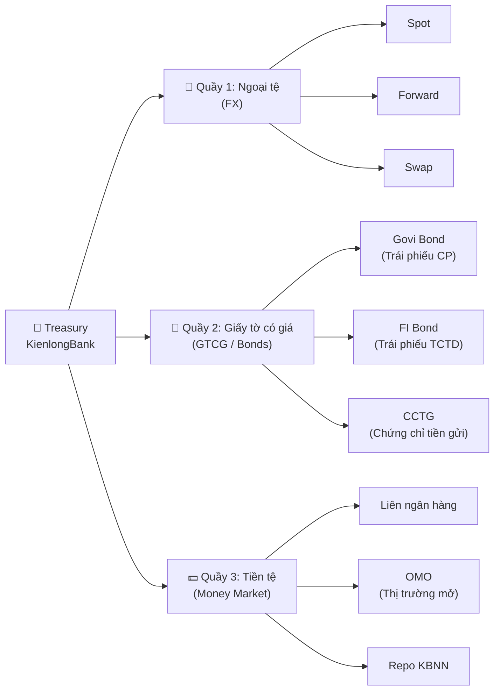
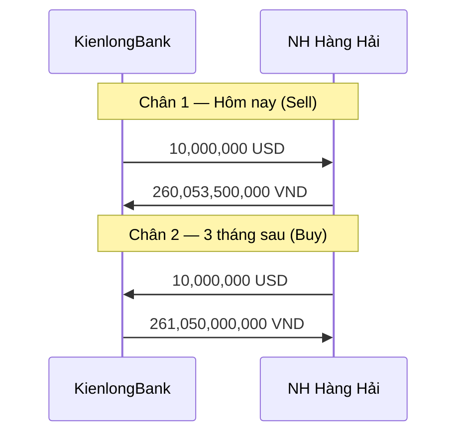
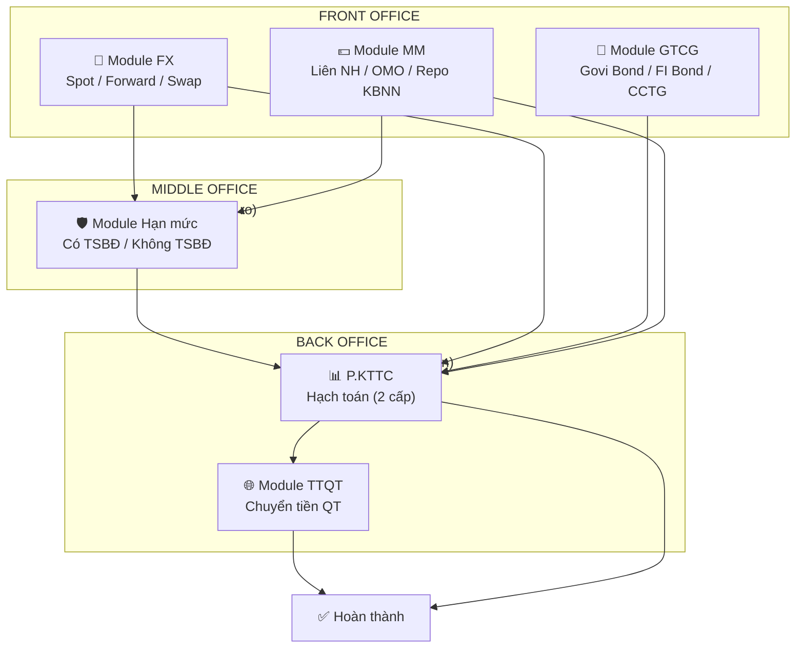

# 🏦 Treasury 101 — Dành cho Dev, Tester & BA "Ngoại đạo"

> **"Đọc xong cái này, bạn sẵn sàng nhảy vào kinh doanh vốn, tỷ giá như thường!"**
> — Phó TGĐ Minh Nguyen

| Thông tin | Chi tiết |
|-----------|----------|
| **Phiên bản** | 1.0 |
| **Ngày** | 02/04/2026 |
| **Đối tượng** | Developer, Tester, BA không có background Treasury |
| **Dự án** | Treasury Management System — KienlongBank |
| **Tác giả** | KAI (AI Banking Assistant) theo yêu cầu Phó TGĐ Minh Nguyen |

---

## 📖 Mục lục

- [Phần 1: Treasury là gì?](#phần-1-treasury-là-gì---bức-tranh-toàn-cảnh)
- [Phần 2: Các "món hàng" Treasury giao dịch](#phần-2-các-món-hàng-treasury-giao-dịch)
- [Phần 3: Quy trình giao dịch — Từ deal đến tiền](#phần-3-quy-trình-giao-dịch--từ-deal-đến-tiền)
- [Phần 4: Thuật ngữ "đáng sợ" — Giải mã](#phần-4-thuật-ngữ-đáng-sợ--giải-mã)
- [Phần 5: Tại sao cần hệ thống Treasury?](#phần-5-tại-sao-cần-hệ-thống-treasury)
- [Phần 6: Tips cho Dev & Tester](#phần-6-tips-cho-dev--tester)

---

## Phần 1: Treasury là gì? — Bức tranh toàn cảnh

### 🏠 Hãy tưởng tượng bạn là... "phòng tài chính" của gia đình

Mỗi gia đình đều cần ai đó lo chuyện tiền bạc:
- Lương về tháng này bao nhiêu? Trả nợ bao nhiêu? Còn dư bao nhiêu?
- Tiền nhàn rỗi thì gửi tiết kiệm hay mua vàng?
- Sắp tới cần mua nhà, vay ở đâu lãi thấp nhất?
- Tháng sau đi Mỹ, nên đổi USD giá nào cho lời?

**Treasury (Khối Nguồn vốn) chính là "phòng tài chính" của ngân hàng** — nhưng thay vì quản lý vài chục triệu, họ quản lý hàng **nghìn tỷ đồng** mỗi ngày. 😱

### 🏛️ Khối Nguồn vốn & Định chế Tài chính (K.NV&ĐCTC) làm gì?

Tên đầy đủ nghe đã đáng sợ rồi, nhưng bản chất họ làm 3 việc chính:

```
┌──────────────────────────────────────────────────────────┐
│                  TREASURY = 3 VIỆC CHÍNH                 │
├──────────────────────────────────────────────────────────┤
│                                                          │
│  💰 1. QUẢN LÝ THANH KHOẢN                              │
│     → Đảm bảo ngân hàng luôn có đủ tiền mặt            │
│     → Giống như đảm bảo ví luôn có tiền để xài          │
│                                                          │
│  📈 2. KIẾM LỢI NHUẬN                                   │
│     → Mua bán ngoại tệ, trái phiếu, gửi tiền liên NH  │
│     → Giống đầu tư chứng khoán, nhưng quy mô ngân hàng │
│                                                          │
│  🛡️ 3. QUẢN LÝ RỦI RO                                  │
│     → Không để ngân hàng lỗ vì tỷ giá biến động        │
│     → Giống mua bảo hiểm cho "danh mục đầu tư"         │
│                                                          │
└──────────────────────────────────────────────────────────┘
```

### 🤔 Tại sao ngân hàng cần trade (giao dịch)?

**Ví dụ thực tế:** Hôm nay khách hàng gửi tiền vào KienlongBank 500 tỷ VND, nhưng chỉ có 200 tỷ cho vay ra. Vậy 300 tỷ còn lại **ngồi không** à? Không! Treasury sẽ:

1. **Gửi liên ngân hàng** — Cho ngân hàng khác "mượn" 300 tỷ, lấy lãi
2. **Mua trái phiếu** — Cho nhà nước vay, nhận lãi coupon
3. **Trade FX** — Nếu thấy USD sắp lên, mua USD bán VND kiếm lời

Ngược lại, nếu khách hàng rút tiền nhiều quá mà ngân hàng hết tiền thì sao? Treasury phải **đi vay** từ ngân hàng khác hoặc từ Ngân hàng Nhà nước (NHNN) để có tiền trả khách.

> 💡 **Tóm lại:** Treasury là bộ phận **kiếm tiền từ tiền**. Tiền nhàn rỗi → đầu tư sinh lời. Thiếu tiền → đi vay bù đắp. Tất cả diễn ra mỗi ngày, liên tục, nhanh chóng.

---

## Phần 2: Các "món hàng" Treasury giao dịch

Treasury có 3 "quầy hàng" chính, mỗi quầy bán một loại "hàng hóa" khác nhau:



---

### 💱 Quầy 1: Ngoại tệ (FX — Foreign Exchange)

**Bản chất:** Mua bán ngoại tệ. Giống như bạn ra tiệm vàng đổi USD, nhưng quy mô hàng triệu đô.

#### 🛫 Spot — Mua ngay bán ngay

**Ví dụ đời thường:** Bạn ra sân bay, cần đổi 1,000 USD sang VND để xài. Bạn đưa tiền, họ đưa lại VND theo tỷ giá hôm nay. Xong. Đơn giản vậy thôi.

**Trong ngân hàng:** KienlongBank bán 10 triệu USD cho Ngân hàng Hàng Hải (MSB) theo tỷ giá 26,005.35 VND/USD. Tiền giao nhận trong ngày hoặc T+2 (2 ngày làm việc).

```
Spot = "Đổi tiền tại chỗ"
┌──────────────────────────────────────────┐
│  KienlongBank  ──── 10,000,000 USD ────► MSB           │
│  KienlongBank  ◄── 260,053,500,000 VND ── MSB          │
│  Tỷ giá: 26,005.35 | Ngày: Hôm nay                     │
└──────────────────────────────────────────┘
```

#### 📅 Forward — Đặt trước tỷ giá cho tương lai

**Ví dụ đời thường:** Bạn biết 3 tháng nữa sẽ đi Mỹ. Sợ USD tăng giá, bạn gọi tiệm vàng: *"Anh ơi, cho em book giá 26,000 đồng/USD, 3 tháng nữa em tới lấy nhé!"*. Dù lúc đó USD có lên 27,000, bạn vẫn mua giá 26,000. Ngược lại nếu USD xuống 25,000, bạn vẫn phải mua giá 26,000.

**Trong ngân hàng:** Tương tự nhưng quy mô lớn hơn. KienlongBank thỏa thuận hôm nay: *"3 tháng nữa, tôi sẽ mua 5 triệu USD từ Vietcombank với tỷ giá 26,105.00"*.

> 💡 **Dev lưu ý:** Forward giống Spot nhưng **Ngày Giá trị** ở tương lai (không phải hôm nay). Trên hệ thống, cùng màn hình nhập, chỉ khác **Loại giao dịch = "FORWARD"** và ngày giá trị xa hơn.

#### 🔄 Swap — Đổi qua đổi lại

**Ví dụ đời thường:** Bạn cần USD tuần này nhưng tuần sau lại cần VND. Bạn nói với bạn: *"Cho mình mượn 1,000 USD, mình đưa bạn 26 triệu VND. Tuần sau mình trả lại 1,000 USD, bạn trả lại 26.1 triệu VND nhé!"*

**Trong ngân hàng:** Swap = 2 giao dịch ngược chiều nhau:
- **Chân 1:** Hôm nay, KLB bán 10 triệu USD cho MSB (tỷ giá 26,005.35)
- **Chân 2:** 3 tháng sau, KLB mua lại 10 triệu USD từ MSB (tỷ giá 26,105.00)



> 💡 **Dev lưu ý:** Swap trên hệ thống có **2 chân (Leg 1 & Leg 2)**, mỗi chân có tỷ giá riêng, ngày giá trị riêng, pay code riêng. Chiều giao dịch là "Sell - Buy" hoặc "Buy - Sell" (ngược nhau).

#### 📊 Cặp tiền & Tỷ giá — Giải thích cho người mới

**Cặp tiền (Currency Pair):** Luôn viết dạng `XXX/YYY` — ví dụ `USD/VND`.
- `XXX` = **Base currency** (tiền cơ sở) — "hàng hóa" đang mua/bán
- `YYY` = **Quote currency** (tiền định giá) — "tiền trả" 

Khi tỷ giá `USD/VND = 26,005.35`, nghĩa là: **1 USD = 26,005.35 VND**

**Các cặp tiền phổ biến tại KLB:**

| Cặp tiền | Base | Quote | Ví dụ tỷ giá | Cách đọc |
|----------|------|-------|-------------|----------|
| USD/VND | USD | VND | 26,005.35 | 1 USD = 26,005.35 VND |
| EUR/USD | EUR | USD | 1.1550 | 1 EUR = 1.1550 USD |
| AUD/USD | AUD | USD | 0.6780 | 1 AUD = 0.6780 USD |
| USD/JPY | USD | JPY | 150.25 | 1 USD = 150.25 JPY |
| EUR/GBP | EUR | GBP | 0.8650 | 1 EUR = 0.8650 GBP (cặp chéo!) |

**Công thức tính Thành tiền:** (Quan trọng cho dev!)

| Trường hợp | Công thức | Ví dụ |
|-------------|-----------|-------|
| USD/VND | Khối lượng × Tỷ giá = **VND** | 10,000,000 × 26,005.35 = 260,053,500,000 VND |
| USD/... (USD là base) | Khối lượng ÷ Tỷ giá = **USD** | 10,000,000 AUD ÷ 0.6780 = 14,749,262.54 USD |
| .../USD (USD là quote) | Khối lượng × Tỷ giá = **USD** | 10,000,000 EUR × 1.1550 = 11,550,000.00 USD |
| Cặp chéo (X/Y, không có USD) | Khối lượng × Tỷ giá = **Y** | 10,000,000 EUR × 0.8650 = 8,650,000.00 GBP |

> ⚠️ **Chú ý cho dev:** Số chữ số thập phân của tỷ giá **khác nhau** tùy cặp tiền! USD/VND, USD/JPY, USD/KRW → **2 số thập phân**. Các cặp còn lại → **4 số thập phân**.

---

### 📜 Quầy 2: Giấy tờ có giá (GTCG / Bonds)

**Bản chất:** Mua bán "giấy nợ". Ai đó cần tiền, họ phát hành giấy tờ cam kết trả lại tiền + lãi.

#### 🏛️ Trái phiếu Chính phủ (Govi Bond — Government Bond)

**Ví dụ đời thường:** Nhà nước cần tiền xây cầu đường. Họ phát hành "giấy nợ" nói rằng: *"Cho tôi mượn 100,000 đồng, 5 năm sau tôi trả lại, mỗi năm tôi trả thêm 5,000 đồng tiền lãi"*. Đó chính là trái phiếu.

**Trong ngân hàng:**
- **Mệnh giá** = số tiền ghi trên "giấy nợ" (thường 100,000 VND/trái phiếu)
- **Coupon** = lãi suất hàng năm (ví dụ 2.51%/năm)
- **Ngày đáo hạn** = ngày nhà nước trả lại tiền gốc

#### 🏢 FI Bond & CCTG — Trái phiếu ngân hàng khác

- **FI Bond (Financial Institution Bond):** Trái phiếu do ngân hàng/tổ chức tài chính phát hành. Tương tự Govi Bond nhưng người vay là ngân hàng, không phải nhà nước.
- **CCTG (Chứng chỉ tiền gửi):** Gửi tiền vào ngân hàng khác nhưng dưới dạng "chứng chỉ" có thể mua bán. Giống sổ tiết kiệm nhưng có thể chuyển nhượng.

#### 📦 Các loại giao dịch GTCG

| Loại | Ví dụ đời thường | Giải thích |
|------|-----------------|------------|
| **Outright** | Mua đứt bán đoạn | Mua trái phiếu → sở hữu hẳn. Bán trái phiếu → chuyển quyền hoàn toàn |
| **Repo** | Cầm đồ | KLB "cầm" trái phiếu cho đối tác để nhận tiền, hẹn ngày chuộc lại. KLB = **bên bán** (cần tiền) |
| **Reverse Repo** | Cho vay cầm đồ | Đối tác "cầm" trái phiếu cho KLB, KLB đưa tiền, hẹn ngày trả. KLB = **bên mua** (cho vay tiền, nhận trái phiếu làm tài sản đảm bảo) |

```
Repo (Cầm đồ):
┌───────────┐          Trái phiếu           ┌───────────┐
│    KLB    │  ──────────────────────────►   │  Đối tác  │
│ (cần tiền)│  ◄──────────────────────────   │ (có tiền) │
└───────────┘          Tiền mặt              └───────────┘
                 ↓ Hẹn ngày sau ↓
              KLB trả tiền + lãi ← → Đối tác trả lại trái phiếu
```

#### 📊 HTM, AFS, HFT — 3 cách hạch toán khi MUA trái phiếu

Khi mua trái phiếu, kế toán cần biết: *"Mua để làm gì?"* — vì cách ghi sổ khác nhau:

| Viết tắt | Tên đầy đủ | Nghĩa dân dã | Khi nào dùng |
|----------|-----------|--------------|-------------|
| **HTM** | Hold to Maturity | "Mua rồi giữ đến khi đáo hạn, ăn lãi coupon đều đều" | Đầu tư dài hạn, an toàn |
| **AFS** | Available for Sale | "Mua rồi để đó, có giá tốt thì bán" | Linh hoạt, vừa ăn lãi vừa có thể bán |
| **HFT** | Held for Trading | "Mua để lướt sóng, kiếm chênh lệch giá" | Trading ngắn hạn |

> 💡 **Dev lưu ý:** Trường "Hạch toán" (HTM/AFS/HFT) **CHỈ hiển thị khi mua** (Chiều GD = "Bên mua"). Khi bán thì không cần — vì bán là bán thôi, không cần phân loại.

---

### 💵 Quầy 3: Kinh doanh tiền tệ (MM — Money Market)

**Bản chất:** Ngân hàng vay mượn tiền lẫn nhau, thường ngắn hạn (1 ngày đến vài tháng).

#### 🏦 Giao dịch Liên ngân hàng — Tại sao NH vay mượn nhau?

**Ví dụ đời thường:** Cuối tháng bạn hết tiền, hỏi mượn bạn bè 5 triệu, đầu tháng sau trả. Ngân hàng cũng vậy!

**Tại sao?** Mỗi ngày, ngân hàng phải đảm bảo:
- Đủ tiền trả khách rút tiền
- Đủ dự trữ bắt buộc theo quy định NHNN
- Không để tiền "ngồi không" (phải kiếm lãi)

**Ví dụ:** Cuối ngày, KLB thừa 100 tỷ VND (khách gửi nhiều hơn cho vay). Thay vì để không, KLB **gửi tiền** cho ACB qua đêm (overnight), lấy lãi 4.5%/năm. Sáng hôm sau, ACB trả lại tiền gốc + lãi 1 ngày.

**4 chiều giao dịch Liên ngân hàng:**

| Chiều | KLB là... | Tiền đi đâu | Khi nào |
|-------|----------|-------------|---------|
| **Gửi tiền** | Bên cho vay | KLB → Đối tác | KLB thừa tiền |
| **Nhận tiền gửi** | Bên đi vay | Đối tác → KLB | KLB thiếu tiền |
| **Cho vay** | Bên cho vay | KLB → Đối tác | Tương tự "Gửi tiền" nhưng tính chất tín dụng |
| **Vay** | Bên đi vay | Đối tác → KLB | Tương tự "Nhận tiền gửi" |

**Công thức tính tiền lãi:** (Quan trọng cho dev!)

```
Số tiền lãi = Gốc × (Lãi suất / 100) × (Số ngày / Day count base)
Số tiền đáo hạn = Gốc + Tiền lãi
```

**Ví dụ:** Gửi 100 tỷ VND, lãi suất 4.50%/năm, kỳ hạn 90 ngày, Actual/365:
```
Tiền lãi = 100,000,000,000 × 4.50/100 × 90/365 = 1,109,589,041 VND
Tiền đáo hạn = 100,000,000,000 + 1,109,589,041 = 101,109,589,041 VND
```

#### 🏛️ OMO — Nghiệp vụ thị trường mở

**Ví dụ đời thường:** Khi kinh tế khó khăn, Chính phủ muốn "bơm tiền" vào nền kinh tế. Ngân hàng Nhà nước sẽ "mua" trái phiếu từ các ngân hàng → trả tiền cho ngân hàng → ngân hàng có tiền cho vay → kinh tế quay vòng.

**Trong thực tế:**
- **OMO (Open Market Operations)** = NHNN tổ chức phiên đấu thầu
- Ngân hàng đem trái phiếu Chính phủ đến "cầm" cho NHNN
- NHNN cho mượn tiền, lãi suất theo đấu thầu
- Hết hạn → ngân hàng trả tiền + lãi, lấy lại trái phiếu

> 💡 **Dev lưu ý:** OMO **đối tác luôn là "Sở giao dịch NHNN"**, KHÔNG qua QLRR, KHÔNG qua TTQT, KHÔNG chiếm hạn mức. Luồng phê duyệt đơn giản hơn nhiều.

#### 🏛️ Repo KBNN — Cầm cố trái phiếu vay tiền Kho bạc

Tương tự OMO nhưng đối tác là **Kho bạc Nhà nước**. Cùng cơ chế "cầm trái phiếu lấy tiền", có kỳ hạn, có haircut.

> 💡 **"Haircut" là gì?** Không phải cắt tóc 😄. Khi bạn cầm trái phiếu trị giá 100 tỷ, NHNN chỉ cho vay 95 tỷ (giảm 5%). Con số 5% đó gọi là **Haircut** — tỷ lệ khấu trừ giá trị tài sản, phòng trường hợp trái phiếu mất giá.

---

### 🛡️ Hạn mức liên ngân hàng — Tại sao cần?

#### Ví dụ dễ hiểu

Bạn có 10 triệu tiết kiệm. Bạn không nên cho **1 người** mượn hết 10 triệu (lỡ họ không trả thì sao?). Bạn nên rải ra: cho A mượn 3 triệu, B mượn 3 triệu, C mượn 4 triệu. Như vậy nếu A "bùng", bạn chỉ mất 3 triệu thay vì 10 triệu.

**Ngân hàng cũng vậy!** Mỗi đối tác được cấp một **hạn mức (limit)** — số tiền tối đa KLB được phép giao dịch với đối tác đó.

#### 2 loại hạn mức

| Loại | Có TSBĐ | Không TSBĐ |
|------|---------|-----------|
| Nghĩa | Đối tác thế chấp tài sản (VND, USD...) | Không thế chấp, chỉ tin tưởng |
| Hạn mức | Thường "Không giới hạn" | Có số cụ thể (VD: 500 tỷ VND) |
| Rủi ro | Thấp (có tài sản đảm bảo) | Cao hơn |

> 💡 **Dev lưu ý:** Hạn mức áp dụng cho cả **MM Liên ngân hàng** và **FX** (một số đối tác FX cũng chiếm hạn mức). OMO và Repo KBNN **KHÔNG chiếm hạn mức**.

---

## Phần 3: Quy trình giao dịch — Từ deal đến tiền

### 📅 Một ngày làm việc của Chuyên viên K.NV

```
08:00  ☕ Check thị trường, tỷ giá, tin kinh tế
08:30  📞 Gọi điện các đối tác, hỏi giá, thương lượng
09:00  💱 Deal FX: Bán 5 triệu USD cho MSB, tỷ giá 26,005.35
09:15  📝 Nhập giao dịch lên hệ thống Treasury
09:30  ⏳ Chờ TP K.NV duyệt cấp 1
10:00  ⏳ Chờ GĐ duyệt cấp 2
10:30  📊 Tạo thêm giao dịch MM: Gửi 100 tỷ cho ACB, 90 ngày
11:00  📋 Theo dõi trạng thái các GD trong ngày
14:00  📞 Tiếp tục deal FX buổi chiều
15:00  🔔 Check GD nào đáo hạn hôm nay (MM)
16:00  📦 Tổng hợp, kiểm tra lại tất cả GD
17:00  🏠 Xong việc (hoặc overtime nếu deal lớn 😅)
```

### 🔄 Luồng giao dịch tổng quát

Dù là FX, GTCG hay MM, luồng giao dịch đều đi qua các bước cơ bản sau:

```mermaid
flowchart LR
    A["👤 CV K.NV<br/>Tạo giao dịch"] --> B["👨‍💼 TP K.NV<br/>Duyệt cấp 1"]
    B --> C["🤵 GĐ/PGĐ<br/>Duyệt cấp 2"]
    C --> D{"🛡️ Cần duyệt<br/>hạn mức?"}
    D -->|Có<br/>(MM Liên NH)| E["📋 P.QLRR<br/>Duyệt hạn mức"]
    E --> F["📊 P.KTTC<br/>Hạch toán"]
    D -->|Không<br/>(FX, GTCG,<br/>OMO, Repo)| F
    F --> G{"💸 Cần chuyển<br/>tiền QT?"}
    G -->|Có| H["🌐 BP.TTQT<br/>Chuyển tiền"]
    H --> I["✅ Hoàn thành"]
    G -->|Không| I
```

### 🔐 Tại sao cần nhiều cấp duyệt? (Nguyên tắc 4 mắt)

Tưởng tượng bạn làm việc ở ngân hàng, một ngày bạn tạo giao dịch bán 10 triệu USD cho công ty "ma" với tỷ giá rẻ hơn thị trường. Nếu không ai kiểm tra, ngân hàng mất hàng trăm tỷ!

**Nguyên tắc Maker-Checker (4 mắt):**
- **Maker** (CV K.NV) = Người tạo giao dịch
- **Checker** (TP, GĐ, QLRR, KTTC) = Người kiểm tra và phê duyệt
- Luôn cần **ít nhất 2 người** kiểm tra trước khi tiền được chuyển đi

| Bước | Ai | Kiểm tra gì |
|------|-----|-------------|
| Tạo GD | CV K.NV | Nhập đúng thông tin deal |
| Duyệt cấp 1 | TP K.NV | Tỷ giá/lãi suất có hợp lý không? Đối tác đúng không? |
| Duyệt cấp 2 | GĐ/PGĐ | Tổng quan, rủi ro chấp nhận được không? |
| Duyệt hạn mức | P.QLRR | Hạn mức còn đủ không? Rủi ro tín dụng đối tác? |
| Hạch toán | P.KTTC (2 cấp) | Bút toán đúng không? Số liệu khớp không? |
| Chuyển tiền QT | BP.TTQT | SSI đúng không? Tiền gửi đúng chỗ không? |

### 🔄 Luồng phê duyệt chi tiết — Khác nhau giữa các module

| Module | Luồng phê duyệt |
|--------|-----------------|
| **FX** | CV → TP → GĐ → KTTC (2 cấp) → TTQT (nếu có) → ✅ |
| **GTCG** | CV → TP → GĐ → KTTC (2 cấp) → ✅ *(không qua QLRR, không qua TTQT)* |
| **MM Liên NH** | CV → TP → GĐ → **QLRR (2 cấp)** → KTTC (2 cấp) → TTQT (nếu có) → ✅ |
| **OMO** | CV → TP → GĐ → KTTC (2 cấp) → ✅ *(không qua QLRR, không qua TTQT)* |
| **Repo KBNN** | CV → TP → GĐ → KTTC (2 cấp) → ✅ *(không qua QLRR, không qua TTQT)* |

> ⚡ **Điểm khác biệt quan trọng:** Chỉ **MM Liên ngân hàng** mới qua **QLRR duyệt hạn mức**. Các module khác không cần (vì OMO/Repo KBNN đối tác là NHNN — không cần đánh giá rủi ro, còn GTCG có cơ chế quản lý riêng).

### 👥 Các bộ phận liên quan — Ai làm gì?

| Bộ phận | Vai trò | Dân dã |
|---------|---------|--------|
| **K.NV&ĐCTC** | Tạo & duyệt giao dịch | "Người đi chợ" — tìm deal, đàm phán, nhập hệ thống |
| **P.QLRR** | Duyệt hạn mức | "Bảo vệ" — kiểm tra xem deal có vượt hạn mức không |
| **P.KTTC** | Hạch toán (2 cấp) | "Kế toán" — ghi sổ, đảm bảo số liệu đúng |
| **BP.TTQT** | Chuyển tiền quốc tế | "Thủ quỹ quốc tế" — thực hiện chuyển tiền ra nước ngoài |
| **Admin** | Quản trị hệ thống | "IT" — quản lý user, master data |

### 🔄 Luồng đặc biệt: Recall, Hủy, Clone

| Luồng | Khi nào | Ai làm | Kết quả |
|-------|---------|--------|---------|
| **Recall** | GD đã submit nhưng GĐ chưa duyệt → phát hiện sai | CV hoặc TP | GD quay về trạng thái "Open", sửa lại |
| **Hủy** | GD đã hoàn thành hoặc chờ TTQT → cần hủy bỏ | CV yêu cầu → TP duyệt → GĐ/PGĐ Khối duyệt | GD chuyển "Đã hủy", email thông báo KTTC (+ TTQT nếu có) |
| **Clone** | GD bị từ chối → muốn tạo lại | CV | Tạo GD mới copy dữ liệu cũ, sửa rồi submit lại |

---

## Phần 4: Thuật ngữ "đáng sợ" — Giải mã

> Đây là bảng "từ điển sống còn" cho dev/tester. Bookmark lại nhé! 📚

### A

| Thuật ngữ | Viết tắt | Giải thích bằng tiếng người | Ví dụ |
|-----------|---------|---------------------------|-------|
| **Actual/365** | — | Cách tính lãi: lấy số ngày thực tế chia cho 365 | Gửi 90 ngày → tính lãi = Gốc × LS × 90/365 |
| **Actual/360** | — | Tương tự nhưng chia 360 (chuẩn quốc tế cho USD) | Gửi USD 90 ngày → Gốc × LS × 90/360 |
| **AFS** | Available for Sale | Mua trái phiếu để đó, có giá tốt thì bán | Phân loại hạch toán |
| **Audit trail** | — | "Nhật ký hành động" — ai làm gì, lúc nào, thay đổi gì | Mọi thao tác trên hệ thống đều được ghi lại |

### B

| Thuật ngữ | Viết tắt | Giải thích bằng tiếng người | Ví dụ |
|-----------|---------|---------------------------|-------|
| **Base currency** | — | Tiền đứng trước trong cặp tiền | USD trong USD/VND |
| **BIC code** | Bank Identifier Code | "Số CMND" của ngân hàng trên thế giới (= SWIFT code) | IRVTUS3N (Bank of NY Mellon) |
| **Bond** | — | Trái phiếu — giấy nợ có lãi suất và ngày đáo hạn | Govi Bond, FI Bond |

### C

| Thuật ngữ | Viết tắt | Giải thích bằng tiếng người | Ví dụ |
|-----------|---------|---------------------------|-------|
| **CCTG** | Chứng chỉ tiền gửi | "Sổ tiết kiệm" nhưng có thể mua bán | CCTG.022.24 |
| **CIF** | Customer Information File | Mã khách hàng trong hệ thống core banking | 123456789 |
| **Citad** | — | Hệ thống thanh toán trong nước (VND) của NHNN | Tự động trên Core, KHÔNG đi qua Treasury |
| **Coupon rate** | — | Lãi suất trái phiếu trả hàng năm | 2.51%/năm |
| **Cross currency pair** | Cặp tiền chéo | Cặp tiền KHÔNG có USD | EUR/GBP, EUR/JPY |

### D

| Thuật ngữ | Viết tắt | Giải thích bằng tiếng người | Ví dụ |
|-----------|---------|---------------------------|-------|
| **Day count convention** | — | Quy ước đếm ngày để tính lãi | Actual/365, Actual/360, Actual/Actual |
| **Deal** | — | Một giao dịch | "Hôm nay deal FX lớn quá" |
| **Direct quote** | — | Tỷ giá dạng: 1 ngoại tệ = bao nhiêu nội tệ | USD/VND = 26,005 (1 USD = 26,005 VND) |

### F–G

| Thuật ngữ | Viết tắt | Giải thích bằng tiếng người | Ví dụ |
|-----------|---------|---------------------------|-------|
| **Forward** | — | Giao dịch FX hẹn ngày tương lai | Mua USD sau 3 tháng với giá thỏa thuận hôm nay |
| **FX** | Foreign Exchange | Kinh doanh ngoại tệ | Mua bán USD, EUR, JPY... |
| **Govi Bond** | Government Bond | Trái phiếu Chính phủ | TD2135068 |
| **GTCG** | Giấy tờ có giá | Tên chung cho trái phiếu, CCTG | Govi Bond + FI Bond + CCTG |

### H

| Thuật ngữ | Viết tắt | Giải thích bằng tiếng người | Ví dụ |
|-----------|---------|---------------------------|-------|
| **Haircut** | — | Tỷ lệ "cắt giảm" giá trị tài sản thế chấp. KHÔNG phải cắt tóc 😄 | Trái phiếu 100 tỷ, haircut 5% → chỉ vay được 95 tỷ |
| **HFT** | Held for Trading | Mua để lướt sóng, kiếm chênh lệch giá | Phân loại hạch toán |
| **HTM** | Hold to Maturity | Mua giữ đến đáo hạn, ăn lãi đều đều | Phân loại hạch toán |

### I–K

| Thuật ngữ | Viết tắt | Giải thích bằng tiếng người | Ví dụ |
|-----------|---------|---------------------------|-------|
| **Indirect quote** | — | Tỷ giá dạng: 1 nội tệ = bao nhiêu ngoại tệ | VND/USD = 0.0000385 (ngược của direct) |
| **KBNN** | Kho bạc Nhà nước | "Ngân hàng" của Chính phủ | Đối tác trong Repo KBNN |
| **K.NV** | Khối Nguồn vốn | Bộ phận Treasury của KienlongBank | K.NV&ĐCTC |

### L–M

| Thuật ngữ | Viết tắt | Giải thích bằng tiếng người | Ví dụ |
|-----------|---------|---------------------------|-------|
| **Maker-Checker** | — | Nguyên tắc: người tạo ≠ người duyệt | CV tạo → TP/GĐ duyệt |
| **MM** | Money Market | Thị trường tiền tệ — vay mượn ngắn hạn giữa các NH | Gửi/nhận liên ngân hàng |
| **MT300** | SWIFT Message Type 300 | Điện SWIFT xác nhận giao dịch FX | Phase 2 mới tự động sinh |
| **MT320** | SWIFT Message Type 320 | Điện SWIFT xác nhận giao dịch MM | Phase 2 mới tự động sinh |

### N–O

| Thuật ngữ | Viết tắt | Giải thích bằng tiếng người | Ví dụ |
|-----------|---------|---------------------------|-------|
| **NHNN** | Ngân hàng Nhà nước | "Siêu ngân hàng" quản lý tất cả ngân hàng VN | Đối tác trong OMO |
| **Nostro account** | — | Tài khoản của KLB mở tại ngân hàng nước ngoài | KLB có TK USD tại Bank of NY Mellon |
| **OMO** | Open Market Operations | NHNN mua/bán trái phiếu để bơm/hút tiền thị trường | Phiên đấu thầu NHNN |
| **Outright** | — | Mua đứt bán đoạn trái phiếu | Mua Govi Bond, sở hữu hẳn |
| **Overnight (O/N)** | — | Gửi/vay qua đêm — kỳ hạn 1 ngày | Gửi 100 tỷ O/N tại ACB |

### P–Q

| Thuật ngữ | Viết tắt | Giải thích bằng tiếng người | Ví dụ |
|-----------|---------|---------------------------|-------|
| **Pay code** | — | Thông tin tài khoản thanh toán (giống số tài khoản + SWIFT) | "Số 8901358797 tại BANK OF NY MELLON" |
| **Position** | Vị thế | Tổng số lượng nắm giữ của 1 loại tài sản | Vị thế USD: +5 triệu (đang nắm) |
| **Quote currency** | — | Tiền đứng sau trong cặp tiền | VND trong USD/VND |

### R–S

| Thuật ngữ | Viết tắt | Giải thích bằng tiếng người | Ví dụ |
|-----------|---------|---------------------------|-------|
| **Recall** | — | Rút lại giao dịch (trước khi GĐ duyệt) | CV phát hiện nhập sai → recall về sửa |
| **Repo** | Repurchase Agreement | "Cầm đồ" trái phiếu lấy tiền, hẹn ngày chuộc | KLB repo trái phiếu cho NHNN |
| **Reverse Repo** | — | Ngược lại: cho vay tiền, nhận trái phiếu làm đảm bảo | KLB cho đối tác "cầm" TP, nhận tiền |
| **Spot** | — | Giao dịch FX giao nhận ngay (T+0 hoặc T+2) | Bán 10 triệu USD hôm nay |
| **SSI** | Standing Settlement Instruction | Chỉ dẫn thanh toán cố định | Tài khoản + SWIFT code đối tác |
| **Swap** | — | Giao dịch FX 2 chân ngược chiều | Chân 1: Sell USD → Chân 2: Buy USD |
| **SWIFT** | Society for Worldwide Interbank Financial Telecommunication | Hệ thống nhắn tin liên ngân hàng toàn cầu | Gửi MT300, MT320 |

### T

| Thuật ngữ | Viết tắt | Giải thích bằng tiếng người | Ví dụ |
|-----------|---------|---------------------------|-------|
| **T+0, T+1, T+2** | — | T = Trade date. T+2 = 2 ngày làm việc sau ngày giao dịch | Spot thường là T+0 hoặc T+2 |
| **TCPH** | Tổ chức phát hành | Ai phát hành trái phiếu/CCTG | Kho bạc Nhà nước, MB Bank |
| **Ticket** | — | Số xác nhận giao dịch (từ Reuters hoặc nội bộ) | 925508281 |
| **TSBĐ** | Tài sản bảo đảm | Tài sản thế chấp khi vay mượn | VND, USD, trái phiếu |
| **TTQT** | Thanh toán Quốc tế | Bộ phận thực hiện chuyển tiền ra nước ngoài | Chuyển USD qua SWIFT |

### V

| Thuật ngữ | Viết tắt | Giải thích bằng tiếng người | Ví dụ |
|-----------|---------|---------------------------|-------|
| **Value date** | Ngày giá trị | Ngày tiền thực sự được giao nhận | Spot: T+0 hoặc T+2; Forward: tương lai |
| **Vostro account** | — | Tài khoản ngân hàng nước ngoài mở tại KLB | NH Nhật mở TK JPY tại KLB |

---

## Phần 5: Tại sao cần hệ thống Treasury?

### 😱 Hiện trạng: Email + Excel + Giấy = Rủi ro

Trước khi có hệ thống, Treasury hoạt động thế nào?

```
┌─────────────────────────────────────────────────────────────┐
│  TRƯỚC ĐÂY (THỦ CÔNG)                                      │
│                                                             │
│  1. CV gọi điện deal → ghi tay lên giấy ✍️                 │
│  2. Nhập vào Excel → gửi email cho TP duyệt 📧             │
│  3. TP in ra → ký tay → scan → gửi email cho GĐ 📝         │
│  4. GĐ ký → scan → gửi tiếp cho KTTC và TTQT 🔄           │
│  5. Mỗi phòng tự lưu email, file Excel riêng 📁            │
│  6. Cần tra cứu GD 3 tháng trước? Lật email 1 tiếng 😩     │
│                                                             │
│  RỦI RO:                                                    │
│  ❌ Email mất → mất luôn bằng chứng giao dịch              │
│  ❌ Excel không version control → ai sửa ai không biết     │
│  ❌ Chữ ký giấy có thể bị giả mạo                         │
│  ❌ Không có audit trail → không biết ai duyệt lúc nào     │
│  ❌ Kiểm tra hạn mức bằng tay → dễ vượt hạn mức           │
│  ❌ Chậm trễ → mất cơ hội deal tốt                        │
└─────────────────────────────────────────────────────────────┘
```

### ✅ Hệ thống mới giải quyết được gì?

```
┌─────────────────────────────────────────────────────────────┐
│  SAU KHI CÓ HỆ THỐNG (SỐ HÓA)                             │
│                                                             │
│  ✅ Tạo GD trên hệ thống → duyệt online → xong trong phút │
│  ✅ Audit trail tự động → ai, khi nào, làm gì đều có log   │
│  ✅ Hạn mức tự tính → không thể vượt hạn mức bằng "mắt"   │
│  ✅ Tìm kiếm GD trong 3 giây thay vì 3 tiếng              │
│  ✅ Mọi dữ liệu tập trung 1 nơi → không mất mát          │
│  ✅ Notification tự động → không ai bị "quên" duyệt        │
│  ✅ Xuất PDF chứng từ → lưu trữ vĩnh viễn                 │
└─────────────────────────────────────────────────────────────┘
```

### 🗺️ Mapping: Nghiệp vụ → Tính năng phần mềm

> Đây là bảng để dev hiểu **"tại sao mình code cái này"**:

| Nghiệp vụ | Tính năng phần mềm | Tại sao |
|-----------|-------------------|---------|
| CV tạo deal FX/MM/GTCG | Form tạo giao dịch (nhiều trường!) | Thay thế giấy đề nghị giao dịch |
| TP, GĐ ký duyệt | Workflow phê duyệt đa cấp | Thay thế chữ ký trên giấy |
| QLRR kiểm tra hạn mức | Module hạn mức tự động tính | Thay thế check bằng Excel |
| KTTC ghi sổ | Bước hạch toán trong luồng (2 cấp) | Thay thế phiếu hạch toán giấy |
| TTQT chuyển tiền | Module TTQT tự lọc GD đến hạn | Thay thế email yêu cầu chuyển tiền |
| Lưu trữ chứng từ | Upload file, xuất PDF | Thay thế tủ hồ sơ |
| Tra cứu GD cũ | Search, filter, danh sách | Thay thế lật email |
| Theo dõi ai duyệt | Audit trail | Thay thế sổ ghi chép |
| Phát hiện nhập sai | Recall, Clone | Giảm thiểu sai sót |
| Hủy GD đã hoàn thành | Luồng hủy + email tự động | Quy trình chặt chẽ, có kiểm soát |

---

## Phần 6: Tips cho Dev & Tester

### ⚠️ Lỗi dễ mắc #1: Format số — Coi chừng dấu . và dấu ,

**Đây là "bẫy" lớn nhất!** Module FX/MM và module GTCG dùng **quy ước ngược nhau**:

| | FX & MM (Quốc tế) | GTCG / Bond (Kế toán VN) |
|---|---|---|
| Dấu ngăn hàng nghìn | `,` (dấu phẩy) | `.` (dấu chấm) |
| Dấu ngăn thập phân | `.` (dấu chấm) | `,` (dấu phẩy) |
| Ví dụ: 10 triệu | 10,000,000.00 | 10.000.000,00 |
| Ví dụ: lãi suất | 4.50% | 2,51% |

> 🚨 **Test case quan trọng:** Nhập `10.000` ở module FX → phải hiểu là 10 (mười). Nhập `10.000` ở module GTCG → phải hiểu là 10,000 (mười nghìn)!

### ⚠️ Lỗi dễ mắc #2: Số thập phân tỷ giá FX

Không phải tất cả tỷ giá đều có cùng số chữ số thập phân!

| Cặp tiền | Số thập phân | Ví dụ |
|----------|-------------|-------|
| USD/VND | 2 | 26,005.35 |
| USD/JPY | 2 | 150.25 |
| USD/KRW | 2 | 1,350.50 |
| EUR/USD | 4 | 1.1550 |
| AUD/USD | 4 | 0.6780 |
| Tất cả cặp còn lại | 4 | — |

> 🚨 **Test case:** Nhập tỷ giá EUR/USD = 1.155000 → hệ thống chỉ lưu 4 chữ số: 1.1550

### ⚠️ Lỗi dễ mắc #3: T+0, T+1, T+2 — Ngày giá trị

| Ký hiệu | Nghĩa | Ví dụ |
|---------|-------|-------|
| **T** | Trade date — ngày giao dịch | Thứ Hai 13/03 |
| **T+0** | Giao nhận cùng ngày | Giao tiền ngày 13/03 |
| **T+1** | Giao nhận sau 1 ngày **làm việc** | Giao tiền ngày 14/03 (Thứ Ba) |
| **T+2** | Giao nhận sau 2 ngày **làm việc** | Giao tiền ngày 15/03 (Thứ Tư) |

> 🚨 **Chú ý:** Ngày **làm việc** — không tính thứ 7, CN, lễ! Deal vào thứ Sáu, T+2 = thứ Ba tuần sau.

### ⚠️ Lỗi dễ mắc #4: Công thức tính Thành tiền FX

**Bẫy kinh điển:** Công thức khác nhau tùy vào vị trí USD trong cặp tiền!

```
USD/VND → Khối lượng × Tỷ giá    ← NHÂN
USD/... → Khối lượng ÷ Tỷ giá    ← CHIA (dễ quên!)
.../USD → Khối lượng × Tỷ giá    ← NHÂN
Cặp chéo → Khối lượng × Tỷ giá   ← NHÂN
```

> 🚨 **Test case:** Bán 10,000,000 AUD, cặp AUD/USD = 0.6780
> - ❌ Sai: 10,000,000 × 0.6780 = 6,780,000 USD (đây là cho .../USD!)
> - ✅ Đúng: Cần xem AUD/USD — USD là quote → Khối lượng × Tỷ giá = 6,780,000 USD ✓
>
> Bán 10,000,000 AUD, cặp USD/AUD:
> - ✅ Đúng: USD là base → Khối lượng ÷ Tỷ giá

### ⚠️ Lỗi dễ mắc #5: Swap có 2 chân — Mỗi chân có tỷ giá riêng

```
Swap Chân 1: Tỷ giá chân 1 = 26,005.35 → Thành tiền = KL × 26,005.35
Swap Chân 2: Tỷ giá chân 2 = 26,105.00 → Thành tiền = KL × 26,105.00

❌ SAI: Chân 2 dùng tỷ giá chân 1 (đây là bug trong BRD v1, đã sửa!)
✅ ĐÚNG: Mỗi chân dùng tỷ giá của chính nó
```

### ⚠️ Lỗi dễ mắc #6: Công thức lãi suất MM

```
❌ SAI (BRD v1):   Gốc × [(1 + LS/100) × Kỳ hạn] / 365  ← Lỗi dấu ngoặc!
✅ ĐÚNG:           Gốc + (Gốc × LS/100 × Kỳ hạn / Day count base)
```

### 📋 Checklist Test Case quan trọng

#### Hạn mức

| # | Test case | Mong đợi |
|---|-----------|----------|
| 1 | Tạo GD MM, đối tác có hạn mức 500 tỷ, đã sử dụng 490 tỷ, GD mới = 20 tỷ | QLRR phải thấy **vượt hạn mức** (490 + 20 = 510 > 500) |
| 2 | Đối tác có hạn mức "Không giới hạn" (có TSBĐ) | Giá trị còn lại hiển thị "Không giới hạn", không báo vượt |
| 3 | Đối tác có GD FX + MM cùng chiếm hạn mức | Hạn mức đã sử dụng phải **cộng cả FX và MM** |
| 4 | GD MM đáo hạn trong ngày → hạn mức đầu ngày | GD đáo hạn **tại** ngày GD → KHÔNG tính vào hạn mức đầu ngày |

#### Tồn kho GTCG

| # | Test case | Mong đợi |
|---|-----------|----------|
| 1 | Bán Govi Bond, số lượng > tồn kho | **Block cứng** — không cho tạo GD |
| 2 | Bán Govi Bond, số lượng = tồn kho | Cho phép tạo |
| 3 | 2 CV cùng bán 1 mã trái phiếu, tổng > tồn kho | GD nào submit sau phải bị block |

#### Đáo hạn MM

| # | Test case | Mong đợi |
|---|-----------|----------|
| 1 | GD MM liên NH đến ngày đáo hạn | Hiển thị trên danh sách, CV theo dõi |
| 2 | GD MM "Nhận tiền gửi" đáo hạn + có TTQT | Tự động xuất hiện trên màn hình TTQT |

#### Swap TTQT

| # | Test case | Mong đợi |
|---|-----------|----------|
| 1 | Swap có TTQT chân 2, ngày thực hiện chân 2 = hôm nay | Chân 2 **tự động** xuất hiện trên danh sách TTQT |
| 2 | Swap chân 1 xong, chân 2 chưa đến ngày | Chân 2 chưa xuất hiện trên TTQT |

#### Recall / Hủy / Clone

| # | Test case | Mong đợi |
|---|-----------|----------|
| 1 | CV recall GD đang "Chờ K.NV duyệt" | GD quay về "Open", CV sửa được |
| 2 | CV recall GD đã "Chờ hạch toán" | **Không cho phép** — chỉ recall khi chưa qua GĐ |
| 3 | Hủy GD "Hoàn thành" có TTQT | Email gửi cho **cả KTTC và TTQT** |
| 4 | Clone GD bị từ chối | Tạo GD mới, copy dữ liệu, trạng thái "Open" |

---

## 🎯 Tổng kết — Sơ đồ toàn cảnh hệ thống



> **Phase 1 (Hiện tại):** Số hóa toàn bộ giao dịch, phê duyệt điện tử, quản lý hạn mức, lưu trữ tập trung.
>
> **Phase 2 (Tương lai):** Tích hợp Core Banking (Flexcube), tự động sinh SWIFT MT300/MT320, kết nối Reuters/Bloomberg lấy tỷ giá tự động.

---

> 📝 **Tài liệu tham khảo:**
> - BRD Treasury System v3.0 (02/04/2026)
> - Nghiên cứu thị trường TMS (31/03/2026)
>
> **Có thắc mắc gì? Hỏi ngay!** Đừng ngại — không có câu hỏi nào "ngu" cả. Trong Treasury, hỏi sai tốt hơn code sai. Code sai có thể mất hàng trăm tỷ 💸

---

*Tài liệu được viết bởi KAI (AI Banking Assistant) — KienlongBank © 2026*
