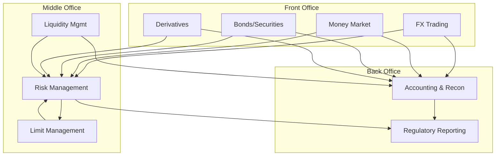
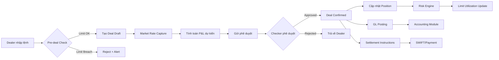
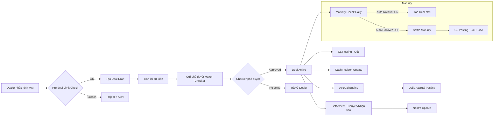
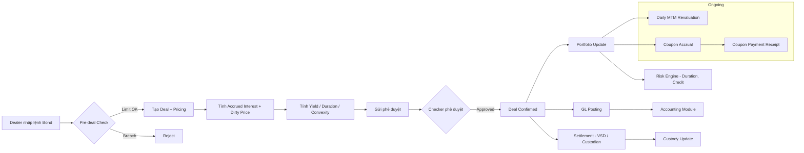
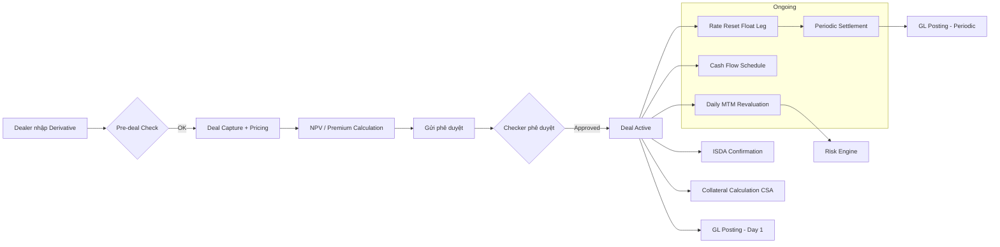
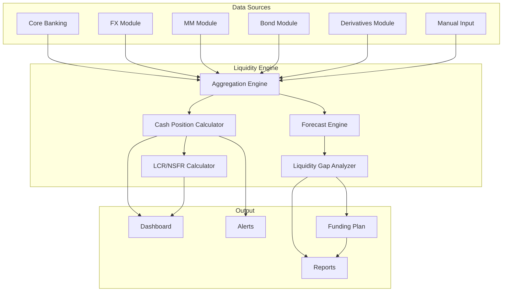
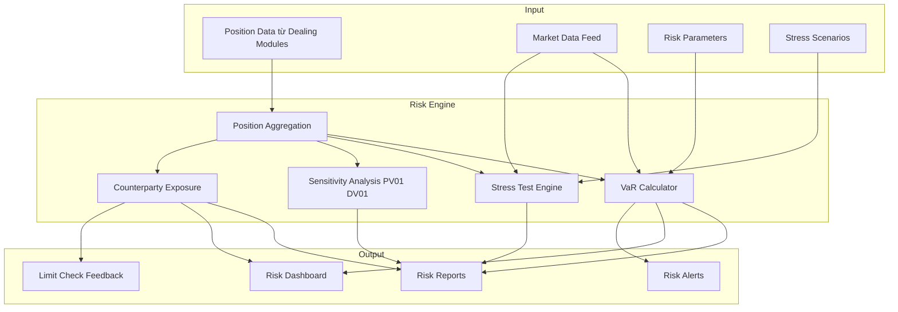
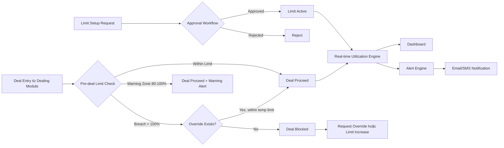
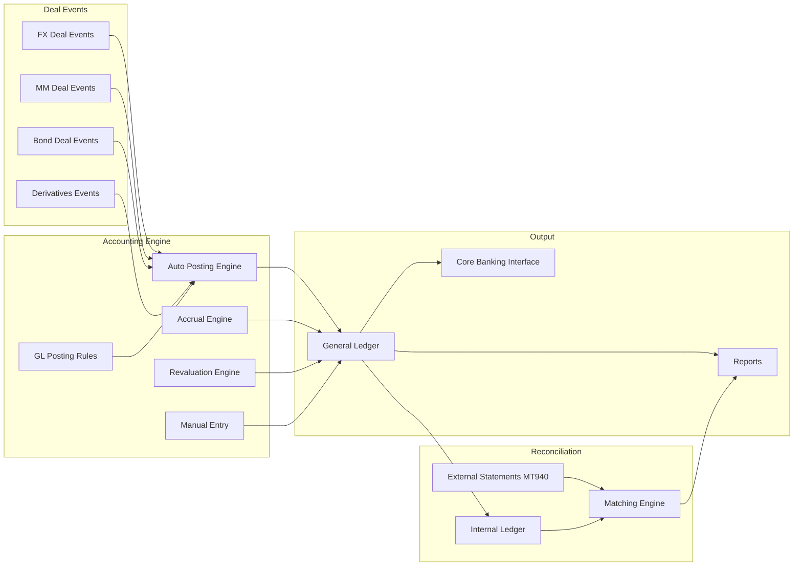
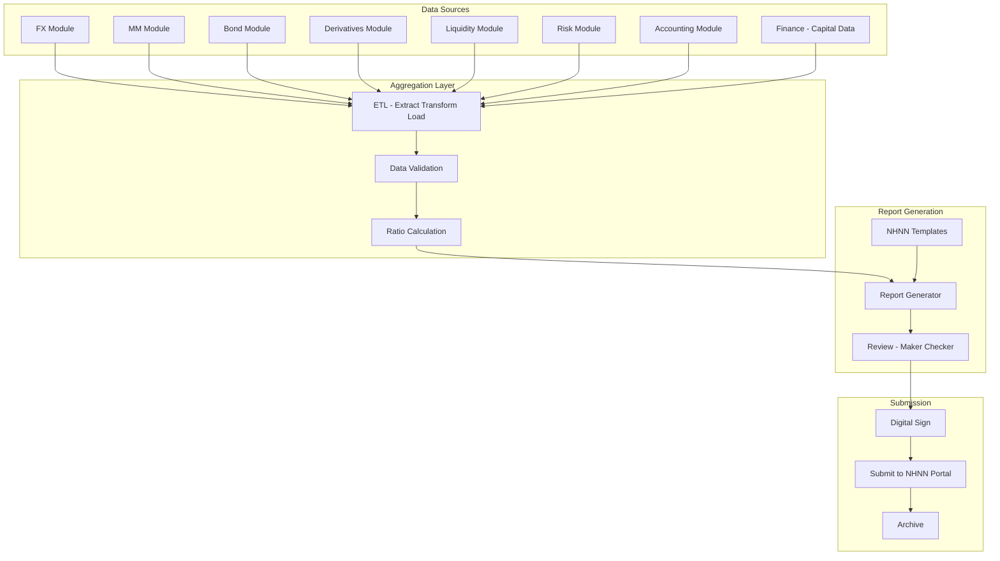

---
pdf_options:
  format: A4
  margin: 20mm
  printBackground: true
---

<script src="https://cdn.jsdelivr.net/npm/mermaid/dist/mermaid.min.js"></script>
<script>mermaid.initialize({startOnLoad:true, theme:'default'});</script>

<style>
  body { font-family: 'Helvetica Neue', Arial, sans-serif; font-size: 10.5px; line-height: 1.5; }
  h1 { color: #1a365d; border-bottom: 2px solid #2b6cb0; padding-bottom: 8px; page-break-before: always; }
  h1:first-of-type { page-break-before: avoid; }
  h2 { color: #2b6cb0; margin-top: 20px; }
  h3 { color: #4a5568; }
  h4 { color: #718096; }
  table { border-collapse: collapse; width: 100%; margin: 10px 0; font-size: 9.5px; }
  th, td { border: 1px solid #cbd5e0; padding: 5px 7px; text-align: left; }
  th { background-color: #2b6cb0; color: white; }
  tr:nth-child(even) { background-color: #f7fafc; }
  .mermaid { text-align: center; margin: 14px 0; page-break-inside: avoid; }
  pre { page-break-inside: avoid; font-size: 9px; }
  blockquote { border-left: 3px solid #e65100; padding-left: 12px; color: #4a5568; background: #fff8e1; margin: 10px 0; padding: 8px 12px; }
</style>

# Treasury Management System — Functional Blueprint

**Ngân hàng TMCP Kiên Long (KienlongBank)**
**Phiên bản:** 1.0 | **Ngày:** 31/03/2026
**Phân loại:** Nội bộ — Tài liệu kỹ thuật chức năng

---

## Mục lục

1. [Giao dịch Ngoại hối (Foreign Exchange)](#1-giao-dịch-ngoại-hối-foreign-exchange)
2. [Giao dịch Thị trường Tiền tệ (Money Market)](#2-giao-dịch-thị-trường-tiền-tệ-money-market)
3. [Giao dịch Trái phiếu (Bonds / Securities)](#3-giao-dịch-trái-phiếu-bonds--securities)
4. [Giao dịch Phái sinh (Derivatives)](#4-giao-dịch-phái-sinh-derivatives)
5. [Quản lý Thanh khoản (Liquidity Management)](#5-quản-lý-thanh-khoản-liquidity-management)
6. [Quản lý Rủi ro (Risk Management)](#6-quản-lý-rủi-ro-risk-management)
7. [Quản lý Hạn mức (Limit Management)](#7-quản-lý-hạn-mức-limit-management)
8. [Hạch toán & Đối chiếu (Accounting & Reconciliation)](#8-hạch-toán--đối-chiếu-accounting--reconciliation)
9. [Báo cáo NHNN & Tuân thủ (Regulatory Reporting & Compliance)](#9-báo-cáo-nhnn--tuân-thủ-regulatory-reporting--compliance)

---

## Tổng quan kiến trúc



---

# 1. Giao dịch Ngoại hối (Foreign Exchange)

Mô-đun quản lý toàn bộ giao dịch ngoại hối bao gồm: FX Spot, FX Forward, FX Swap và NDF (Non-Deliverable Forward).

## A. Chỉ tiêu đầu vào (Input Fields)

### A.1. Thông tin chung giao dịch FX

| Field | Type | Required | Description | Validation |
|-------|------|----------|-------------|------------|
| `deal_id` | VARCHAR(20) | Auto | Mã giao dịch tự sinh | Format: FX-YYYYMMDD-NNNNN |
| `deal_type` | ENUM | ✅ | Loại giao dịch | `SPOT`, `FORWARD`, `SWAP`, `NDF` |
| `trade_date` | DATE | ✅ | Ngày giao dịch | ≤ ngày hiện tại |
| `value_date` | DATE | ✅ | Ngày thanh toán | Spot: T+2; Forward: > T+2; tuân thủ lịch ngày lễ |
| `maturity_date` | DATE | Cond. | Ngày đáo hạn (cho Swap/NDF) | > `value_date` |
| `currency_pair` | VARCHAR(7) | ✅ | Cặp tiền tệ | Format: CCY1/CCY2 (VD: USD/VND) |
| `buy_currency` | CHAR(3) | ✅ | Đồng tiền mua | ISO 4217 |
| `sell_currency` | CHAR(3) | ✅ | Đồng tiền bán | ISO 4217 |
| `buy_amount` | DECIMAL(18,2) | ✅ | Số tiền mua | > 0 |
| `sell_amount` | DECIMAL(18,2) | ✅ | Số tiền bán | > 0; = `buy_amount` × `deal_rate` |
| `deal_rate` | DECIMAL(18,8) | ✅ | Tỷ giá giao dịch | > 0; trong biên độ cho phép |
| `market_rate` | DECIMAL(18,8) | Auto | Tỷ giá thị trường tại thời điểm | Feed từ Reuters/Bloomberg |
| `forward_points` | DECIMAL(12,4) | Cond. | Điểm kỳ hạn (Forward/Swap) | Áp dụng khi `deal_type` ∈ {FORWARD, SWAP} |
| `swap_points_near` | DECIMAL(12,4) | Cond. | Swap points chân gần | Khi `deal_type` = SWAP |
| `swap_points_far` | DECIMAL(12,4) | Cond. | Swap points chân xa | Khi `deal_type` = SWAP |
| `counterparty_id` | VARCHAR(20) | ✅ | Mã đối tác | Phải tồn tại trong danh mục counterparty |
| `counterparty_name` | VARCHAR(100) | Auto | Tên đối tác | Lookup từ `counterparty_id` |
| `dealer_id` | VARCHAR(20) | ✅ | Mã dealer thực hiện | Phải có quyền giao dịch FX |
| `portfolio_id` | VARCHAR(20) | ✅ | Sổ giao dịch (Trading/Banking book) | `TRADING`, `BANKING` |
| `purpose` | ENUM | ✅ | Mục đích giao dịch | `PROPRIETARY`, `CLIENT`, `HEDGING` |
| `settlement_method` | ENUM | ✅ | Phương thức thanh toán | `GROSS`, `NET`, `PVP` |
| `nostro_account_buy` | VARCHAR(30) | ✅ | TK Nostro nhận tiền mua | Phải tồn tại, đúng currency |
| `nostro_account_sell` | VARCHAR(30) | ✅ | TK Nostro chuyển tiền bán | Phải tồn tại, đúng currency |
| `broker_id` | VARCHAR(20) | ❌ | Mã broker (nếu qua môi giới) | Phải tồn tại nếu có |
| `brokerage_amount` | DECIMAL(18,2) | ❌ | Phí môi giới | ≥ 0 |
| `remarks` | TEXT | ❌ | Ghi chú | Max 500 ký tự |
| `status` | ENUM | Auto | Trạng thái giao dịch | `DRAFT`, `PENDING_APPROVAL`, `APPROVED`, `SETTLED`, `CANCELLED`, `AMENDED` |

### A.2. Thông tin bổ sung cho FX Swap

| Field | Type | Required | Description | Validation |
|-------|------|----------|-------------|------------|
| `near_leg_rate` | DECIMAL(18,8) | ✅ | Tỷ giá chân gần | > 0 |
| `far_leg_rate` | DECIMAL(18,8) | ✅ | Tỷ giá chân xa | > 0 |
| `near_leg_value_date` | DATE | ✅ | Ngày thanh toán chân gần | ≥ T+0 |
| `far_leg_value_date` | DATE | ✅ | Ngày thanh toán chân xa | > `near_leg_value_date` |
| `near_leg_buy_amount` | DECIMAL(18,2) | ✅ | Số tiền mua chân gần | > 0 |
| `far_leg_buy_amount` | DECIMAL(18,2) | ✅ | Số tiền mua chân xa | > 0 |

### A.3. Thông tin bổ sung cho NDF

| Field | Type | Required | Description | Validation |
|-------|------|----------|-------------|------------|
| `fixing_date` | DATE | ✅ | Ngày xác định tỷ giá tham chiếu | < `settlement_date` (thường T-2) |
| `fixing_source` | VARCHAR(50) | ✅ | Nguồn tỷ giá tham chiếu | VD: `VIETCOMBANK`, `SBV`, `REUTERS` |
| `notional_amount` | DECIMAL(18,2) | ✅ | Giá trị danh nghĩa | > 0 |
| `agreed_rate` | DECIMAL(18,8) | ✅ | Tỷ giá thỏa thuận | > 0 |
| `settlement_currency` | CHAR(3) | ✅ | Đồng tiền thanh toán chênh lệch | Thường VND hoặc USD |

## B. Luồng Data Flow



**Source:** Dealer nhập trên giao diện Front Office hoặc nhận từ API (Bloomberg, Reuters).
**Process:** Pre-deal limit check → Rate validation → Approval workflow → Confirmation.
**Store:** Bảng `fx_deals`, `fx_deal_legs` (cho Swap), `fx_ndf_details`, `fx_positions`, `fx_settlement`.
**Output:** Confirmation slip, SWIFT MT300/MT304, GL entries, Position updates.

## C. Business Logic / Rules

### C.1. Tính Cross Rate

Khi giao dịch cặp tiền tệ không có tỷ giá trực tiếp (VD: EUR/JPY qua USD):

```
Cross Rate (EUR/JPY) = EUR/USD × USD/JPY
```

Quy tắc:
- Nếu cả hai cặp đều quote qua USD → nhân trực tiếp
- Nếu một cặp nghịch đảo → chia tỷ giá tương ứng

### C.2. Tính Forward Points

```
Forward Points = Spot Rate × (Interest Rate CCY2 - Interest Rate CCY1) × Days / (360 × 10000)
Forward Rate = Spot Rate + Forward Points
```

### C.3. Tính Swap Points

```
Swap Points = Far Leg Rate - Near Leg Rate
Near Leg Rate = Spot Rate + Near Forward Points
Far Leg Rate = Spot Rate + Far Forward Points
```

### C.4. Tính P&L

**Realized P&L (khi thanh toán):**
```
P&L = (Deal Rate - Market Rate at booking) × Amount × Direction
```
Trong đó Direction = +1 (Buy base currency) hoặc -1 (Sell base currency).

**Unrealized P&L (MTM):**
```
MTM P&L = (Current Market Rate - Deal Rate) × Outstanding Amount × Direction
```

Đối với Forward/NDF, chiết khấu về giá trị hiện tại:
```
MTM = Notional × (Forward Rate_new - Forward Rate_deal) / (1 + r × days/360)
```

### C.5. Quy tắc phê duyệt

| Giá trị giao dịch (USD tương đương) | Cấp phê duyệt |
|--------------------------------------|---------------|
| ≤ 500,000 | Trưởng phòng Dealing |
| 500,001 – 2,000,000 | Phó Giám đốc Khối Treasury |
| 2,000,001 – 5,000,000 | Giám đốc Khối Treasury |
| > 5,000,000 | Tổng Giám đốc hoặc Ủy quyền |

### C.6. Biên độ tỷ giá cho phép

- FX Spot USD/VND: trong biên độ ±5% so với tỷ giá trung tâm NHNN (hoặc theo quy định hiện hành)
- Các cặp khác: ±2% so với tỷ giá tham chiếu trên Reuters/Bloomberg
- Ngoài biên độ → cần phê duyệt bổ sung từ Head of Trading

### C.7. Exception Handling

- **Rate stale > 30s:** Cảnh báo dealer, yêu cầu refresh rate
- **Counterparty không active:** Từ chối giao dịch
- **Value date rơi vào ngày lễ:** Tự động điều chỉnh theo Modified Following convention
- **Settlement fail:** Tự động tạo alert, escalation sau 1 giờ

## D. Output — Báo cáo & Phân tích

### D.1. Báo cáo vị thế ngoại hối (FX Position Report)

| Chỉ số | Mô tả | Tần suất |
|--------|--------|----------|
| Net Open Position (NOP) theo từng cặp tiền | Tổng mua - Tổng bán (spot + forward) | Real-time |
| NOP tổng hợp quy đổi USD | Tổng giá trị tuyệt đối NOP các cặp | Real-time |
| NOP / Vốn tự có | Tỷ lệ NOP so với vốn | Cuối ngày |

### D.2. Báo cáo lãi/lỗ (P&L Report)

- **Daily P&L:** Realized + Unrealized, chi tiết theo deal, trader, counterparty
- **MTD/YTD P&L:** Tích lũy theo tháng/năm
- **P&L Attribution:** Phân tích nguồn lãi/lỗ (rate movement, volume, spread)

### D.3. Dashboard Items

- Biểu đồ NOP theo currency (bar chart)
- P&L trend (line chart, 30 ngày)
- Top 10 counterparty theo volume
- Maturity profile của Forward outstanding (histogram)

### D.4. Export

- Excel (.xlsx), PDF, CSV
- SWIFT MT300 (FX Confirmation), MT304 (Advice of deal)

## E. Kiểm soát, Giám sát & Tuân thủ

### E.1. Kiểm soát nội bộ

- **Nguyên tắc 4 mắt (Maker-Checker):** Mọi giao dịch phải có ít nhất 2 người — Dealer nhập + Approver phê duyệt
- **Phân quyền:** Dealer chỉ xem/nhập deal; Approver chỉ duyệt; Back-office xử lý settlement
- **Audit trail:** Ghi log mọi thao tác (tạo, sửa, duyệt, hủy) với timestamp, user_id, IP, old/new values

### E.2. Giám sát Real-time

| Alert | Điều kiện | Hành động |
|-------|-----------|-----------|
| NOP Breach | NOP vượt 20% vốn tự có | Thông báo Head of Treasury + Risk |
| Rate Deviation | Deal rate lệch > 0.5% so với market | Hold deal, yêu cầu giải trình |
| Counterparty Limit | Sử dụng > 80% hạn mức | Warning; > 100% → Block |
| Large Deal | > 5M USD equivalent | Thông báo Ban điều hành |
| Settlement Overdue | Chưa settle sau value date | Escalation tự động |

### E.3. Tuân thủ quy định

- **Thông tư 15/2015/TT-NHNN:** Quy định về trạng thái ngoại hối — NOP ≤ 20% vốn tự có
- **Thông tư 07/2012/TT-NHNN:** Quy định giao dịch FX trên thị trường liên ngân hàng
- **Báo cáo bắt buộc:** Báo cáo trạng thái ngoại hối hàng ngày gửi NHNN (format theo quy định)
- **Lưu trữ:** Toàn bộ giao dịch lưu tối thiểu 10 năm theo quy định pháp luật

---

# 2. Giao dịch Thị trường Tiền tệ (Money Market)

Mô-đun quản lý giao dịch tiền gửi/vay liên ngân hàng bao gồm: Placement (gửi tiền), Borrowing (vay tiền), Call/Notice Money và Term Deposit/Loan.

## A. Chỉ tiêu đầu vào (Input Fields)

### A.1. Thông tin chung giao dịch MM

| Field | Type | Required | Description | Validation |
|-------|------|----------|-------------|------------|
| `deal_id` | VARCHAR(20) | Auto | Mã giao dịch tự sinh | Format: MM-YYYYMMDD-NNNNN |
| `deal_type` | ENUM | ✅ | Loại giao dịch | `PLACEMENT`, `BORROWING` |
| `term_type` | ENUM | ✅ | Loại kỳ hạn | `OVERNIGHT`, `TOM_NEXT`, `CALL_NOTICE`, `TERM` |
| `trade_date` | DATE | ✅ | Ngày giao dịch | ≤ ngày hiện tại |
| `start_date` | DATE | ✅ | Ngày giá trị bắt đầu | ≥ `trade_date` |
| `maturity_date` | DATE | ✅ | Ngày đáo hạn | > `start_date` |
| `notice_days` | INT | Cond. | Số ngày báo trước (Call/Notice) | Bắt buộc khi `term_type` = CALL_NOTICE; 1–7 |
| `currency` | CHAR(3) | ✅ | Đồng tiền giao dịch | ISO 4217, phải có trong danh mục |
| `principal_amount` | DECIMAL(18,2) | ✅ | Số tiền gốc | > 0; bội số 1,000,000 cho VND |
| `interest_rate` | DECIMAL(8,6) | ✅ | Lãi suất (%/năm) | > 0; ≤ lãi suất trần (nếu có) |
| `day_count_convention` | ENUM | ✅ | Quy ước tính ngày | `ACT_360`, `ACT_365`, `30_360` |
| `interest_payment` | ENUM | ✅ | Cách trả lãi | `MATURITY`, `MONTHLY`, `QUARTERLY`, `UPFRONT` |
| `counterparty_id` | VARCHAR(20) | ✅ | Mã đối tác | Phải là TCTD/NHNN đã được phê duyệt |
| `counterparty_name` | VARCHAR(100) | Auto | Tên đối tác | Lookup từ `counterparty_id` |
| `dealer_id` | VARCHAR(20) | ✅ | Mã dealer | Phải có quyền giao dịch MM |
| `portfolio_id` | VARCHAR(20) | ✅ | Sổ giao dịch | `TRADING`, `BANKING` |
| `auto_rollover` | BOOLEAN | ✅ | Tự động gia hạn | `true` / `false` |
| `rollover_rate_type` | ENUM | Cond. | Loại lãi suất gia hạn | `FIXED`, `MARKET`; bắt buộc khi `auto_rollover` = true |
| `rollover_spread` | DECIMAL(8,6) | ❌ | Spread khi gia hạn | VD: +0.05% |
| `nostro_account` | VARCHAR(30) | ✅ | Tài khoản Nostro | Phải tồn tại, đúng currency |
| `settlement_instructions` | TEXT | ❌ | Hướng dẫn thanh toán | SWIFT code, account number |
| `withholding_tax_rate` | DECIMAL(5,2) | ❌ | Thuế khấu trừ tại nguồn (%) | 0–30; áp dụng cho placement ở nước ngoài |
| `remarks` | TEXT | ❌ | Ghi chú | Max 500 ký tự |
| `status` | ENUM | Auto | Trạng thái | `DRAFT`, `PENDING_APPROVAL`, `APPROVED`, `ACTIVE`, `MATURED`, `ROLLED`, `CANCELLED` |

## B. Luồng Data Flow



**Source:** Dealer nhập trên giao diện; hoặc import từ file (bulk deals).
**Process:** Limit check → Rate validation → Approval → Settlement → Daily accrual → Maturity processing.
**Store:** Bảng `mm_deals`, `mm_accruals`, `mm_cashflows`, `mm_rollovers`.
**Output:** Confirmation letter, SWIFT MT320, GL entries, Cash flow schedule.

## C. Business Logic / Rules

### C.1. Tính lãi (Interest Calculation)

**ACT/360:**
```
Interest = Principal × Rate × Actual_Days / 360
```

**ACT/365:**
```
Interest = Principal × Rate × Actual_Days / 365
```

**30/360:**
```
Interest = Principal × Rate × (360×(Y2-Y1) + 30×(M2-M1) + (D2-D1)) / 360
```

Trong đó: `Actual_Days` = số ngày thực tế từ start_date đến maturity_date.

### C.2. Tính Accrued Interest (Lãi dồn tích)

```
Accrued_Interest = Principal × Rate × Days_Accrued / Day_Count_Basis
```

Hạch toán accrual cuối mỗi ngày làm việc vào tài khoản "Lãi phải thu" (Placement) hoặc "Lãi phải trả" (Borrowing).

### C.3. Tính Maturity Proceeds

**Trả lãi cuối kỳ:**
```
Maturity_Proceeds = Principal + Interest
```

**Trả lãi trước (Upfront):**
```
Net_Disbursement = Principal - Interest
Maturity_Proceeds = Principal
```

**Trả lãi theo kỳ (Monthly/Quarterly):**
```
Periodic_Interest = Principal × Rate × Period_Days / Day_Count_Basis
Maturity_Proceeds = Principal + Last_Period_Interest
```

### C.4. Auto-Rollover Logic

```
IF maturity_date = today AND auto_rollover = true THEN
    IF rollover_rate_type = 'FIXED' THEN
        new_rate = current_rate + rollover_spread
    ELSE
        new_rate = market_rate(term_type, currency) + rollover_spread
    END IF
    CREATE new_deal(same parameters, new_rate, new_start = maturity_date)
    SETTLE old_deal(interest only)
END IF
```

### C.5. Quy tắc phê duyệt

| Giá trị giao dịch (VND tương đương) | Cấp phê duyệt |
|--------------------------------------|---------------|
| ≤ 50 tỷ | Trưởng phòng MM |
| 50 – 200 tỷ | Phó GĐ Khối Treasury |
| 200 – 500 tỷ | Giám đốc Khối Treasury |
| > 500 tỷ | Tổng Giám đốc |

### C.6. Exception Handling

- **Lãi suất vượt trần NHNN:** Từ chối giao dịch, ghi log
- **Counterparty bị hạ xếp hạng:** Cảnh báo, yêu cầu review hạn mức
- **Settlement fail:** Retry 3 lần, escalation nếu vẫn fail
- **Maturity rơi vào ngày lễ:** Điều chỉnh Modified Following

## D. Output — Báo cáo & Phân tích

### D.1. Báo cáo danh mục MM (MM Portfolio Report)

| Chỉ số | Mô tả | Tần suất |
|--------|--------|----------|
| Tổng dư nợ Placement | Theo currency, counterparty, kỳ hạn | Real-time |
| Tổng dư nợ Borrowing | Theo currency, counterparty, kỳ hạn | Real-time |
| Net interbank position | Placement - Borrowing | Real-time |
| Weighted Average Rate | Lãi suất bình quân gia quyền | Cuối ngày |

### D.2. Maturity Ladder

- Bảng phân bổ đáo hạn theo bucket: O/N, 1W, 2W, 1M, 2M, 3M, 6M, 9M, 12M, >12M
- Tách riêng Placement vs Borrowing
- Hiển thị gap (Placement - Borrowing) mỗi bucket

### D.3. Cash Flow Projection

- Dòng tiền dự kiến 30/60/90 ngày
- Bao gồm: gốc đáo hạn + lãi dự thu/dự trả
- Phân theo currency

### D.4. Dashboard Items

- Pie chart: Phân bổ theo counterparty
- Bar chart: Maturity ladder
- Line chart: Trend lãi suất liên ngân hàng 30 ngày
- Gauge: Net interbank position / giới hạn

### D.5. Export

- Excel (.xlsx), PDF, CSV
- SWIFT MT320 (Money Market Confirmation)

## E. Kiểm soát, Giám sát & Tuân thủ

### E.1. Kiểm soát nội bộ

- **Maker-Checker:** Bắt buộc cho mọi giao dịch MM
- **Phân quyền:** Dealer nhập; Approver duyệt (khác user); Settlement officer xử lý thanh toán
- **Audit trail:** Ghi log toàn bộ lifecycle (tạo → duyệt → active → accrual → maturity)
- **Tách biệt chức năng:** Front-office không truy cập settlement; Back-office không sửa deal

### E.2. Giám sát Real-time

| Alert | Điều kiện | Hành động |
|-------|-----------|-----------|
| Counterparty Concentration | Exposure > 15% tổng portfolio | Warning to Risk Manager |
| Maturity Mismatch | Gap > 20% tổng portfolio ở bất kỳ bucket nào | Alert Head of ALM |
| Rate Anomaly | Rate lệch > 50bps so với thị trường | Hold deal, yêu cầu giải trình |
| Large Exposure | > 200 tỷ VND single counterparty | Thông báo Ban điều hành |
| Rollover Failure | Auto-rollover fail do limit/rate | Alert dealer + supervisor |

### E.3. Tuân thủ quy định

- **Thông tư 21/2012/TT-NHNN:** Quy định hoạt động cho vay, đi vay giữa các TCTD
- **Thông tư 36/2014/TT-NHNN (sửa đổi):** Giới hạn tỷ lệ vốn ngắn hạn cho vay trung dài hạn
- **Trần lãi suất:** Tuân thủ quy định lãi suất tối đa của NHNN (nếu áp dụng)
- **Báo cáo bắt buộc:** Báo cáo doanh số và dư nợ liên ngân hàng hàng ngày/tuần cho NHNN

---

# 3. Giao dịch Trái phiếu (Bonds / Securities)

Mô-đun quản lý giao dịch mua/bán trái phiếu và chứng khoán nợ: Government Bonds, Corporate Bonds, T-Bills, Certificates of Deposit (CDs).

## A. Chỉ tiêu đầu vào (Input Fields)

### A.1. Thông tin chung giao dịch Bond

| Field | Type | Required | Description | Validation |
|-------|------|----------|-------------|------------|
| `deal_id` | VARCHAR(20) | Auto | Mã giao dịch tự sinh | Format: BD-YYYYMMDD-NNNNN |
| `deal_type` | ENUM | ✅ | Loại giao dịch | `BUY`, `SELL`, `REPO`, `REVERSE_REPO` |
| `bond_type` | ENUM | ✅ | Loại trái phiếu | `GOVT_BOND`, `CORP_BOND`, `TBILL`, `CD`, `MUNICIPAL` |
| `trade_date` | DATE | ✅ | Ngày giao dịch | ≤ ngày hiện tại |
| `settlement_date` | DATE | ✅ | Ngày thanh toán | ≥ `trade_date`; thường T+1 (TPCP) hoặc T+2 |
| `isin` | VARCHAR(12) | ✅ | Mã ISIN trái phiếu | Format chuẩn ISIN 12 ký tự |
| `bond_code` | VARCHAR(20) | ✅ | Mã trái phiếu nội bộ/HNX | Lookup từ danh mục bond |
| `issuer_id` | VARCHAR(20) | Auto | Mã tổ chức phát hành | Lookup từ ISIN |
| `issuer_name` | VARCHAR(100) | Auto | Tên tổ chức phát hành | Lookup |
| `face_value` | DECIMAL(18,2) | ✅ | Mệnh giá | Thường 100,000 VND hoặc 1,000 USD |
| `quantity` | INT | ✅ | Số lượng trái phiếu | > 0 |
| `total_face_value` | DECIMAL(18,2) | Auto | Tổng mệnh giá | = `face_value` × `quantity` |
| `coupon_rate` | DECIMAL(8,6) | ✅ | Lãi suất coupon (%/năm) | ≥ 0 (= 0 cho T-Bill) |
| `coupon_frequency` | ENUM | ✅ | Tần suất trả coupon | `ANNUAL`, `SEMI_ANNUAL`, `QUARTERLY`, `ZERO` |
| `coupon_day_count` | ENUM | ✅ | Quy ước tính ngày coupon | `ACT_ACT`, `ACT_365`, `30_360` |
| `maturity_date` | DATE | ✅ | Ngày đáo hạn trái phiếu | > `settlement_date` |
| `yield_to_maturity` | DECIMAL(8,6) | ✅ | Lợi suất đáo hạn | > 0 |
| `clean_price` | DECIMAL(12,6) | ✅ | Giá sạch (% mệnh giá) | > 0; thường 80–120 |
| `accrued_interest` | DECIMAL(18,2) | Auto | Lãi cộng dồn tính đến settlement | Tự tính theo coupon schedule |
| `dirty_price` | DECIMAL(12,6) | Auto | Giá bẩn = Clean + Accrued | = `clean_price` + accrued% |
| `total_consideration` | DECIMAL(18,2) | Auto | Tổng giá trị thanh toán | = `dirty_price` × `total_face_value` / 100 |
| `counterparty_id` | VARCHAR(20) | ✅ | Mã đối tác | Phải tồn tại |
| `dealer_id` | VARCHAR(20) | ✅ | Mã dealer | Phải có quyền giao dịch Bond |
| `portfolio_id` | VARCHAR(20) | ✅ | Sổ giao dịch | `TRADING`, `BANKING`, `HTM`, `AFS`, `FVTPL` |
| `custody_account` | VARCHAR(30) | ✅ | Tài khoản lưu ký | VSD hoặc custodian bank |
| `trading_venue` | ENUM | ✅ | Sàn giao dịch | `HNX`, `OTC`, `PRIMARY_AUCTION` |
| `credit_rating` | VARCHAR(10) | ❌ | Xếp hạng tín nhiệm | VD: AAA, AA+, BBB |
| `broker_id` | VARCHAR(20) | ❌ | Mã broker | Nếu giao dịch qua broker |
| `brokerage_fee` | DECIMAL(18,2) | ❌ | Phí môi giới | ≥ 0 |
| `remarks` | TEXT | ❌ | Ghi chú | Max 500 ký tự |
| `status` | ENUM | Auto | Trạng thái | `DRAFT`, `PENDING_APPROVAL`, `APPROVED`, `SETTLED`, `CANCELLED` |

### A.2. Thông tin bổ sung cho Repo/Reverse Repo

| Field | Type | Required | Description | Validation |
|-------|------|----------|-------------|------------|
| `repo_rate` | DECIMAL(8,6) | ✅ | Lãi suất repo | > 0 |
| `repo_term` | INT | ✅ | Kỳ hạn repo (ngày) | > 0 |
| `repo_maturity_date` | DATE | ✅ | Ngày đáo hạn repo | = `settlement_date` + `repo_term` |
| `repo_purchase_price` | DECIMAL(18,2) | ✅ | Giá mua lại | > 0 |
| `haircut_pct` | DECIMAL(5,2) | ✅ | Tỷ lệ haircut (%) | 0–50 |
| `collateral_value` | DECIMAL(18,2) | Auto | Giá trị tài sản đảm bảo | = market_value × (1 - haircut) |

## B. Luồng Data Flow



**Source:** HNX (TPCP), OTC, Primary auction, Bloomberg/Reuters pricing.
**Process:** Deal capture → Pricing → Approval → Settlement → Ongoing MTM & Accrual.
**Store:** `bond_deals`, `bond_holdings`, `bond_coupons`, `bond_mtm`, `bond_repo`.
**Output:** Trade confirmation, VSD instructions, GL entries, Portfolio valuation.

## C. Business Logic / Rules

### C.1. Tính giá trái phiếu (Price-Yield)

**Trái phiếu coupon cố định:**
```
Clean Price = Σ [C / (1+y)^t] + [FV / (1+y)^n]
```
Trong đó:
- C = Coupon payment = Face Value × Coupon Rate / Frequency
- y = Yield per period = YTM / Frequency
- t = Thời gian đến mỗi kỳ trả coupon (tính bằng period)
- n = Tổng số kỳ còn lại
- FV = Face Value (mệnh giá)

**T-Bill (Zero coupon):**
```
Price = Face Value / (1 + Yield × Days_to_Maturity / 360)
```

### C.2. Tính Lãi cộng dồn (Accrued Interest)

```
Accrued Interest = Face Value × Coupon Rate × Days_Since_Last_Coupon / Day_Count_Basis
```

### C.3. Tính Duration (Thời gian đáo hạn bình quân)

**Macaulay Duration:**
```
D_mac = Σ [t × PV(CF_t)] / Bond_Price
```

**Modified Duration:**
```
D_mod = D_mac / (1 + y/freq)
```

**Dollar Duration (DV01):**
```
DV01 = D_mod × Bond_Price × 0.0001
```

### C.4. Tính Convexity (Độ lồi)

```
Convexity = Σ [t × (t+1) × PV(CF_t)] / (Bond_Price × (1+y)^2)
```

### C.5. Mark-to-Market (MTM)

```
MTM_Value = Current_Market_Price × Face_Value × Quantity / 100
Unrealized_P&L = MTM_Value - Book_Value
```

Nguồn giá MTM:
- TPCP: Giá tham chiếu HNX hoặc đường cong lợi suất NHNN
- Corporate Bond: Mô hình định giá nội bộ + spread

### C.6. Quy tắc phê duyệt

| Tổng mệnh giá (VND) | Cấp phê duyệt |
|----------------------|---------------|
| ≤ 100 tỷ | Trưởng phòng Fixed Income |
| 100 – 500 tỷ | Phó GĐ Khối Treasury |
| 500 tỷ – 1,000 tỷ | Giám đốc Khối Treasury |
| > 1,000 tỷ | Tổng Giám đốc / HĐQT |

### C.7. Exception Handling

- **Bond không có giá thị trường:** Sử dụng mô hình định giá nội bộ, đánh dấu "Level 3 fair value"
- **Credit rating downgrade:** Tự động cảnh báo, trigger limit review
- **Coupon payment delay:** Alert, theo dõi default risk
- **VSD settlement fail:** Retry, escalation

## D. Output — Báo cáo & Phân tích

### D.1. Báo cáo danh mục trái phiếu (Bond Portfolio Report)

| Chỉ số | Mô tả | Tần suất |
|--------|--------|----------|
| Total AUM | Tổng giá trị danh mục (market value) | Real-time |
| Portfolio Duration | Duration bình quân gia quyền | Cuối ngày |
| Portfolio Yield | YTM bình quân gia quyền | Cuối ngày |
| Unrealized P&L | Tổng lãi/lỗ chưa thực hiện | Cuối ngày |
| Realized P&L | Lãi/lỗ đã thực hiện (từ bán) | Cộng dồn |
| Coupon Income | Thu nhập coupon tích lũy | MTD/YTD |

### D.2. Báo cáo chuyên sâu

- **Duration Report:** Phân bổ duration theo bucket, duration gap
- **Credit Exposure Report:** Exposure theo issuer, rating, ngành
- **Maturity Profile:** Phân bổ đáo hạn bond
- **MTM Report:** Chi tiết định giá từng bond

### D.3. Dashboard Items

- Pie chart: Phân bổ theo loại bond (GOVT/CORP/TBILL)
- Bar chart: Duration profile
- Line chart: Portfolio value trend
- Heatmap: Credit exposure by issuer × rating

### D.4. Export

- Excel, PDF, CSV
- VSD settlement instructions
- Báo cáo NHNN theo mẫu

## E. Kiểm soát, Giám sát & Tuân thủ

### E.1. Kiểm soát nội bộ

- **Maker-Checker:** Bắt buộc; deal > 500 tỷ cần thêm Senior Approval (3 mắt)
- **Phân quyền:** Trader (nhập deal), Risk (approve limit), Settlement (custody), Accounting (GL)
- **Audit trail:** Mọi thay đổi giá, số lượng, counterparty đều được log
- **Reconciliation:** Đối chiếu số dư custody với VSD/custodian hàng ngày

### E.2. Giám sát Real-time

| Alert | Điều kiện | Hành động |
|-------|-----------|-----------|
| Duration Limit | Portfolio duration > limit (VD: 3.5 năm) | Alert Risk Manager |
| Issuer Concentration | Exposure 1 issuer > 10% portfolio | Warning |
| Rating Breach | Bond bị hạ dưới investment grade | Review & escalation |
| MTM Loss | Unrealized loss > threshold | Alert Head of Treasury |
| Large Trade | > 500 tỷ VND | Notify Ban điều hành |

### E.3. Tuân thủ quy định

- **Thông tư 22/2019/TT-NHNN:** Tỷ lệ an toàn vốn (CAR), quy đổi RWA cho bond
- **Thông tư 16/2021/TT-NHNN:** Quy định mua bán trái phiếu doanh nghiệp
- **Chuẩn IFRS 9:** Phân loại tài sản tài chính (FVTPL, AFS/FVOCI, HTM/Amortised Cost)
- **Báo cáo bắt buộc:** Báo cáo đầu tư trái phiếu, tỷ lệ đầu tư TPCP/tổng tài sản

---

# 4. Giao dịch Phái sinh (Derivatives)

Mô-đun quản lý giao dịch phái sinh lãi suất và tiền tệ: IRS (Interest Rate Swap), CCS (Cross Currency Swap), FRA (Forward Rate Agreement), Options (Cap, Floor, Swaption).

## A. Chỉ tiêu đầu vào (Input Fields)

### A.1. Thông tin chung Derivatives

| Field | Type | Required | Description | Validation |
|-------|------|----------|-------------|------------|
| `deal_id` | VARCHAR(20) | Auto | Mã giao dịch tự sinh | Format: DV-YYYYMMDD-NNNNN |
| `deal_type` | ENUM | ✅ | Loại phái sinh | `IRS`, `CCS`, `FRA`, `CAP`, `FLOOR`, `SWAPTION`, `FX_OPTION` |
| `trade_date` | DATE | ✅ | Ngày giao dịch | ≤ ngày hiện tại |
| `effective_date` | DATE | ✅ | Ngày hiệu lực | ≥ `trade_date` |
| `termination_date` | DATE | ✅ | Ngày kết thúc | > `effective_date` |
| `notional_amount` | DECIMAL(18,2) | ✅ | Giá trị danh nghĩa | > 0 |
| `notional_currency` | CHAR(3) | ✅ | Đồng tiền danh nghĩa | ISO 4217 |
| `counterparty_id` | VARCHAR(20) | ✅ | Mã đối tác | Phải có ISDA/GMRA |
| `dealer_id` | VARCHAR(20) | ✅ | Mã dealer | Phải có quyền Derivatives |
| `portfolio_id` | VARCHAR(20) | ✅ | Sổ giao dịch | `TRADING`, `HEDGING` |
| `hedge_designation` | ENUM | Cond. | Chỉ định hedge accounting | `FAIR_VALUE`, `CASH_FLOW`, `NET_INVESTMENT`, `NONE` |
| `hedged_item_id` | VARCHAR(20) | Cond. | Mã tài sản/nợ được hedge | Bắt buộc khi hedge_designation ≠ NONE |
| `isda_agreement_id` | VARCHAR(20) | ✅ | Mã hợp đồng ISDA | Phải tồn tại và còn hiệu lực |
| `csa_agreement_id` | VARCHAR(20) | ❌ | Mã CSA (Credit Support Annex) | Nếu có thỏa thuận ký quỹ |
| `remarks` | TEXT | ❌ | Ghi chú | Max 500 ký tự |
| `status` | ENUM | Auto | Trạng thái | `DRAFT`, `PENDING`, `ACTIVE`, `MATURED`, `TERMINATED`, `NOVATED` |

### A.2. IRS / CCS — Thông tin chân cố định (Fixed Leg)

| Field | Type | Required | Description | Validation |
|-------|------|----------|-------------|------------|
| `fixed_rate` | DECIMAL(8,6) | ✅ | Lãi suất cố định (%/năm) | > 0 |
| `fixed_pay_receive` | ENUM | ✅ | Pay hoặc Receive fixed | `PAY`, `RECEIVE` |
| `fixed_day_count` | ENUM | ✅ | Quy ước tính ngày | `ACT_360`, `ACT_365`, `30_360` |
| `fixed_payment_freq` | ENUM | ✅ | Tần suất thanh toán | `MONTHLY`, `QUARTERLY`, `SEMI_ANNUAL`, `ANNUAL` |
| `fixed_currency` | CHAR(3) | Cond. | Đồng tiền chân fixed (CCS) | ISO 4217; bắt buộc cho CCS |
| `fixed_notional` | DECIMAL(18,2) | Cond. | Notional chân fixed (CCS) | Bắt buộc cho CCS nếu khác notional chính |

### A.3. IRS / CCS — Thông tin chân thả nổi (Float Leg)

| Field | Type | Required | Description | Validation |
|-------|------|----------|-------------|------------|
| `float_reference_rate` | ENUM | ✅ | Lãi suất tham chiếu | `VNIBOR_1M`, `VNIBOR_3M`, `SOFR`, `EURIBOR_3M`, `LIBOR_3M` |
| `float_spread` | DECIMAL(8,6) | ✅ | Spread trên reference rate | Có thể âm hoặc dương |
| `float_pay_receive` | ENUM | Auto | Pay hoặc Receive float | Nghịch với `fixed_pay_receive` |
| `float_day_count` | ENUM | ✅ | Quy ước tính ngày | `ACT_360`, `ACT_365` |
| `float_payment_freq` | ENUM | ✅ | Tần suất thanh toán | `MONTHLY`, `QUARTERLY`, `SEMI_ANNUAL` |
| `float_reset_freq` | ENUM | ✅ | Tần suất reset rate | `DAILY`, `MONTHLY`, `QUARTERLY` |
| `float_currency` | CHAR(3) | Cond. | Đồng tiền chân float (CCS) | ISO 4217 |
| `float_notional` | DECIMAL(18,2) | Cond. | Notional chân float (CCS) | Bắt buộc cho CCS |

### A.4. FRA — Thông tin riêng

| Field | Type | Required | Description | Validation |
|-------|------|----------|-------------|------------|
| `fra_rate` | DECIMAL(8,6) | ✅ | Lãi suất FRA thỏa thuận | > 0 |
| `fra_period_start` | DATE | ✅ | Ngày bắt đầu kỳ tính lãi | > `trade_date` |
| `fra_period_end` | DATE | ✅ | Ngày kết thúc kỳ | > `fra_period_start` |
| `fra_settlement_date` | DATE | ✅ | Ngày thanh toán | = `fra_period_start` |
| `fra_reference_rate` | ENUM | ✅ | Lãi suất tham chiếu | `VNIBOR`, `SOFR` |

### A.5. Options — Thông tin riêng

| Field | Type | Required | Description | Validation |
|-------|------|----------|-------------|------------|
| `option_type` | ENUM | ✅ | Loại quyền chọn | `CALL`, `PUT` |
| `option_style` | ENUM | ✅ | Kiểu thực hiện | `EUROPEAN`, `AMERICAN` |
| `strike_price` | DECIMAL(18,8) | ✅ | Giá thực hiện | > 0 |
| `premium_amount` | DECIMAL(18,2) | ✅ | Phí quyền chọn | ≥ 0 |
| `premium_currency` | CHAR(3) | ✅ | Đồng tiền phí | ISO 4217 |
| `premium_date` | DATE | ✅ | Ngày thanh toán phí | ≥ `trade_date` |
| `expiry_date` | DATE | ✅ | Ngày hết hạn | > `trade_date` |
| `buyer_seller` | ENUM | ✅ | Mua/Bán quyền | `BUYER`, `SELLER` |
| `underlying` | VARCHAR(20) | ✅ | Tài sản cơ sở | VD: USD/VND, VNIBOR_3M |

## B. Luồng Data Flow



**Source:** Dealer nhập; Bloomberg/Reuters pricing; Rate fixing sources.
**Process:** Deal entry → Pricing → Approval → ISDA confirm → Ongoing MTM & settlements.
**Store:** `deriv_deals`, `deriv_legs`, `deriv_cashflows`, `deriv_mtm`, `deriv_collateral`.
**Output:** ISDA confirmation, MTM valuations, Cash flow schedule, Collateral calls.

## C. Business Logic / Rules

### C.1. NPV Calculation (IRS)

```
NPV = PV(Fixed Leg) - PV(Float Leg)
PV(Fixed Leg) = Σ [Notional × Fixed_Rate × Period_Days / DCB × DF(t)]
PV(Float Leg) = Σ [Notional × (Forward_Rate + Spread) × Period_Days / DCB × DF(t)]
```
Trong đó: DF(t) = Discount Factor tại thời điểm t, lấy từ đường cong lãi suất.

### C.2. CCS — Cash Flow

Tương tự IRS nhưng 2 chân ở 2 đồng tiền khác nhau:
```
Fixed Leg (VND): Pay/Receive = Notional_VND × Fixed_Rate × days / 365
Float Leg (USD): Pay/Receive = Notional_USD × (SOFR + Spread) × days / 360
Principal Exchange: Tại effective date và termination date
```

### C.3. FRA Settlement

```
Settlement_Amount = Notional × (Reference_Rate - FRA_Rate) × Days / DCB
                    / (1 + Reference_Rate × Days / DCB)
```
Nếu Reference_Rate > FRA_Rate → Seller trả Buyer (và ngược lại).

### C.4. Option Greeks

| Greek | Công thức (Black-Scholes) | Ý nghĩa |
|-------|--------------------------|---------|
| **Delta (Δ)** | `N(d1)` cho Call; `N(d1)-1` cho Put | Độ nhạy giá theo underlying |
| **Gamma (Γ)** | `n(d1) / (S × σ × √T)` | Tốc độ thay đổi Delta |
| **Vega (ν)** | `S × n(d1) × √T` | Độ nhạy theo volatility |
| **Theta (Θ)** | `-S×n(d1)×σ/(2√T) - r×K×e^(-rT)×N(d2)` | Time decay |
| **Rho (ρ)** | `K×T×e^(-rT)×N(d2)` | Độ nhạy theo lãi suất |

Trong đó:
```
d1 = [ln(S/K) + (r + σ²/2)×T] / (σ×√T)
d2 = d1 - σ×√T
```

### C.5. Hedge Effectiveness Test

Theo IFRS 9, hedge accounting yêu cầu:
```
Effectiveness Ratio = Δ Fair Value of Hedging Instrument / Δ Fair Value of Hedged Item
```
- Prospective test: Kỳ vọng 80% – 125%
- Retrospective test: Đo lường thực tế mỗi kỳ báo cáo

### C.6. Quy tắc phê duyệt

| Notional (USD equivalent) | Cấp phê duyệt |
|---------------------------|---------------|
| ≤ 5M | Trưởng phòng Derivatives |
| 5M – 20M | Phó GĐ Khối Treasury |
| 20M – 50M | Giám đốc Khối Treasury |
| > 50M | Tổng Giám đốc / HĐQT |

### C.7. Exception Handling

- **ISDA chưa ký:** Không cho phép giao dịch với counterparty
- **Reference rate không khả dụng:** Sử dụng fallback rate (theo ISDA 2021 Fallback Protocol)
- **MTM vượt threshold:** Trigger collateral call theo CSA
- **Early termination request:** Tính breakage cost, cần approval đặc biệt

## D. Output — Báo cáo & Phân tích

### D.1. Derivatives Portfolio Report

| Chỉ số | Mô tả | Tần suất |
|--------|--------|----------|
| Total Notional Outstanding | Tổng notional theo loại | Real-time |
| Net MTM | Tổng MTM (positive - negative) | Cuối ngày |
| Gross Positive MTM | Tổng MTM dương (credit exposure) | Cuối ngày |
| Gross Negative MTM | Tổng MTM âm (liability) | Cuối ngày |
| Collateral Posted/Received | Ký quỹ đã giao/nhận | Real-time |

### D.2. Cash Flow Schedule

- Lịch thanh toán chi tiết cho từng deal
- Dòng tiền dự kiến 30/90/180/360 ngày
- Net cash flow theo currency

### D.3. Dashboard Items

- Waterfall chart: MTM by deal type
- Line chart: Total notional trend
- Bar chart: Cash flow schedule (next 12 months)
- Table: Top counterparty exposure

### D.4. Export

- Excel, PDF, CSV
- ISDA Confirmation (template)
- Regulatory reporting (Derivatives activity report)

## E. Kiểm soát, Giám sát & Tuân thủ

### E.1. Kiểm soát nội bộ

- **Maker-Checker:** Bắt buộc; deal > 20M USD cần Senior + Risk Approval
- **Independent Valuation:** MTM phải được Risk team kiểm tra độc lập hàng ngày
- **ISDA/CSA Management:** Theo dõi hiệu lực hợp đồng, threshold, minimum transfer amount
- **Audit trail:** Đầy đủ cho mọi deal, amendment, novation, termination

### E.2. Giám sát Real-time

| Alert | Điều kiện | Hành động |
|-------|-----------|-----------|
| MTM Threshold Breach | MTM > CSA threshold | Trigger collateral call |
| Counterparty Exposure | Total exposure > limit | Block new deals |
| Hedge Ineffectiveness | Ratio ngoài 80-125% | De-designate hedge |
| Large Notional | > 50M USD | Notify Ban điều hành |
| Rate Fixing Missing | Reference rate chưa có | Alert, use fallback |

### E.3. Tuân thủ quy định

- **Thông tư 01/2015/TT-NHNN:** Quy định hoạt động phái sinh lãi suất, tiền tệ
- **ISDA Master Agreement:** Tuân thủ đầy đủ điều khoản ISDA 2002
- **IFRS 9 / VAS:** Hedge accounting requirements, fair value measurement
- **Báo cáo bắt buộc:** Báo cáo hoạt động phái sinh cho NHNN theo quý

---

# 5. Quản lý Thanh khoản (Liquidity Management)

Mô-đun quản lý vị thế tiền mặt, dự báo dòng tiền và lập kế hoạch huy động vốn.

## A. Chỉ tiêu đầu vào (Input Fields)

### A.1. Vị thế tiền mặt (Cash Position)

| Field | Type | Required | Description | Validation |
|-------|------|----------|-------------|------------|
| `position_date` | DATE | ✅ | Ngày tính position | ≤ ngày hiện tại |
| `currency` | CHAR(3) | ✅ | Đồng tiền | ISO 4217 |
| `account_id` | VARCHAR(30) | ✅ | Mã tài khoản | Nostro/Vostro/Internal |
| `account_type` | ENUM | ✅ | Loại tài khoản | `NOSTRO`, `VOSTRO`, `CENTRAL_BANK`, `INTERNAL` |
| `opening_balance` | DECIMAL(18,2) | Auto | Số dư đầu ngày | Từ closing ngày trước |
| `expected_inflows` | DECIMAL(18,2) | Auto | Dòng tiền vào dự kiến | Tổng hợp từ deals settling |
| `expected_outflows` | DECIMAL(18,2) | Auto | Dòng tiền ra dự kiến | Tổng hợp từ deals settling |
| `actual_inflows` | DECIMAL(18,2) | Auto | Dòng tiền vào thực tế | Cập nhật real-time từ Core Banking |
| `actual_outflows` | DECIMAL(18,2) | Auto | Dòng tiền ra thực tế | Cập nhật real-time |
| `net_position` | DECIMAL(18,2) | Auto | Vị thế ròng | = opening + inflows - outflows |
| `minimum_balance` | DECIMAL(18,2) | Config | Số dư tối thiểu yêu cầu | Theo quy định nội bộ/NHNN |

### A.2. Dự báo dòng tiền (Cash Flow Forecasting)

| Field | Type | Required | Description | Validation |
|-------|------|----------|-------------|------------|
| `forecast_id` | VARCHAR(20) | Auto | Mã dự báo | Format: CF-YYYYMMDD-NNN |
| `forecast_date` | DATE | ✅ | Ngày tạo dự báo | = ngày hiện tại |
| `horizon_days` | INT | ✅ | Tầm dự báo (ngày) | 1–365 |
| `currency` | CHAR(3) | ✅ | Đồng tiền | ISO 4217 |
| `source_module` | ENUM | ✅ | Nguồn dữ liệu | `FX`, `MM`, `BOND`, `DERIVATIVES`, `MANUAL`, `CORE_BANKING` |
| `flow_type` | ENUM | ✅ | Loại dòng tiền | `INFLOW`, `OUTFLOW` |
| `flow_category` | ENUM | ✅ | Phân loại chi tiết | `PRINCIPAL`, `INTEREST`, `FEE`, `SETTLEMENT`, `COLLATERAL`, `OTHER` |
| `expected_date` | DATE | ✅ | Ngày dự kiến phát sinh | Trong horizon |
| `expected_amount` | DECIMAL(18,2) | ✅ | Số tiền dự kiến | > 0 |
| `probability` | DECIMAL(5,2) | ❌ | Xác suất xảy ra (%) | 0–100; mặc định 100 |
| `deal_id` | VARCHAR(20) | ❌ | Mã giao dịch liên quan | Nếu từ deal cụ thể |

### A.3. Dự trữ bắt buộc (Reserve Requirements)

| Field | Type | Required | Description | Validation |
|-------|------|----------|-------------|------------|
| `reserve_period_start` | DATE | ✅ | Ngày bắt đầu kỳ dự trữ | Theo quy định NHNN |
| `reserve_period_end` | DATE | ✅ | Ngày kết thúc kỳ | Thường 1 tháng |
| `currency` | CHAR(3) | ✅ | Đồng tiền | VND, USD |
| `deposit_base` | DECIMAL(18,2) | ✅ | Cơ sở tiền gửi phải dự trữ | Từ Core Banking |
| `reserve_ratio` | DECIMAL(5,2) | ✅ | Tỷ lệ dự trữ bắt buộc (%) | Theo NHNN (hiện 3% VND, 8% USD) |
| `required_reserve` | DECIMAL(18,2) | Auto | Số dự trữ bắt buộc | = `deposit_base` × `reserve_ratio` |
| `actual_reserve` | DECIMAL(18,2) | Auto | Số dự trữ thực tế | Từ TK tại NHNN |
| `excess_deficit` | DECIMAL(18,2) | Auto | Thừa/thiếu | = `actual_reserve` - `required_reserve` |

### A.4. LCR/NSFR Parameters

| Field | Type | Required | Description | Validation |
|-------|------|----------|-------------|------------|
| `report_date` | DATE | ✅ | Ngày báo cáo | Cuối tháng |
| `hqla_level1` | DECIMAL(18,2) | ✅ | HQLA Level 1 (tiền mặt, TPCP) | ≥ 0 |
| `hqla_level2a` | DECIMAL(18,2) | ✅ | HQLA Level 2A | ≥ 0 |
| `hqla_level2b` | DECIMAL(18,2) | ✅ | HQLA Level 2B | ≥ 0 |
| `total_net_cash_outflow_30d` | DECIMAL(18,2) | Auto | Tổng dòng tiền ra ròng 30 ngày | Tính theo trọng số Basel III |
| `available_stable_funding` | DECIMAL(18,2) | ✅ | Nguồn vốn ổn định khả dụng | Theo trọng số NSFR |
| `required_stable_funding` | DECIMAL(18,2) | ✅ | Nguồn vốn ổn định yêu cầu | Theo trọng số NSFR |

## B. Luồng Data Flow



**Source:** Core Banking (số dư thời gian thực), tất cả dealing modules (cash flows), Manual input (ad-hoc flows).
**Process:** Aggregation → Position calculation → Gap analysis → LCR/NSFR → Funding plan.
**Store:** `liq_cash_position`, `liq_cash_forecast`, `liq_reserve`, `liq_lcr_nsfr`, `liq_gap_analysis`.
**Output:** Cash position report, Gap report, LCR/NSFR report, Funding plan, Alerts.

## C. Business Logic / Rules

### C.1. Net Cash Position

```
Net_Position(ccy, date) = Opening_Balance
    + Σ Confirmed_Inflows(ccy, date)
    + Σ Expected_Inflows(ccy, date) × Probability
    - Σ Confirmed_Outflows(ccy, date)
    - Σ Expected_Outflows(ccy, date) × Probability
```

### C.2. Liquidity Gap Analysis

Phân bổ dòng tiền theo bucket thời gian:

| Bucket | Mô tả |
|--------|--------|
| Overnight | Trong ngày |
| 2–7 days | 2 đến 7 ngày |
| 8–30 days | 8 đến 30 ngày |
| 31–90 days | 1 đến 3 tháng |
| 91–180 days | 3 đến 6 tháng |
| 181–365 days | 6 đến 12 tháng |
| > 1 year | Trên 1 năm |

```
Gap(bucket) = Total_Inflows(bucket) - Total_Outflows(bucket)
Cumulative_Gap(bucket) = Σ Gap(all buckets up to current)
```

### C.3. LCR (Liquidity Coverage Ratio)

```
LCR = Stock of HQLA / Total Net Cash Outflows over 30 days × 100%
```

**HQLA Calculation:**
```
Total HQLA = Level 1 + min(Level 2A × 0.85, 40% × Total HQLA)
           + min(Level 2B × haircut, 15% × Total HQLA)
```

**Yêu cầu:** LCR ≥ 100% (theo lộ trình NHNN)

### C.4. NSFR (Net Stable Funding Ratio)

```
NSFR = Available Stable Funding (ASF) / Required Stable Funding (RSF) × 100%
```

**Yêu cầu:** NSFR ≥ 100%

### C.5. Stress Testing

| Kịch bản | Giả định |
|-----------|----------|
| Run-off tiền gửi | 10–30% tiền gửi không kỳ hạn rút |
| Thị trường đóng băng | Không vay được liên ngân hàng 7 ngày |
| FX stress | VND mất giá 5–10%, Nostro ngoại tệ bị phong tỏa |
| Combined | Kết hợp tất cả kịch bản trên |

### C.6. Quy tắc phê duyệt Funding Plan

| Hành động | Cấp phê duyệt |
|-----------|---------------|
| Vay liên ngân hàng ≤ 200 tỷ | Trưởng phòng Liquidity |
| Vay 200 – 1,000 tỷ | GĐ Khối Treasury |
| Repo TPCP ≤ 500 tỷ | Phó GĐ Khối Treasury |
| Vay NHNN (OMO, SLF) | Tổng Giám đốc |

### C.7. Exception Handling

- **Net position âm:** Alert ngay lập tức, kích hoạt Contingency Funding Plan
- **Dự trữ bắt buộc thiếu:** Alert + auto-initiate OMO bid
- **LCR < 100%:** Escalation lên ALCO
- **Core Banking data delay > 15 phút:** Cảnh báo, sử dụng last known data

## D. Output — Báo cáo & Phân tích

### D.1. Daily Cash Position Report

| Chỉ số | Mô tả | Tần suất |
|--------|--------|----------|
| Net Cash Position by CCY | Vị thế ròng theo đồng tiền | Real-time (cập nhật 15 phút) |
| Projected Position T+1 to T+7 | Dự báo vị thế 7 ngày tới | Cuối ngày |
| Reserve Compliance | Thừa/thiếu dự trữ bắt buộc | Real-time |
| Available Funding Capacity | Khả năng huy động thêm | Cuối ngày |

### D.2. Liquidity Gap Report

- Bảng gap theo bucket thời gian, tách riêng VND và ngoại tệ
- Cumulative gap chart
- Sensitivity analysis (thay đổi gap nếu delay settlement 1 ngày)

### D.3. LCR/NSFR Report

- Chi tiết thành phần HQLA
- Chi tiết net cash outflow (theo hạng mục Basel III)
- LCR/NSFR trend 12 tháng
- Buffer analysis (headroom trên minimum)

### D.4. Dashboard Items

- Gauge: LCR, NSFR (so với minimum 100%)
- Stacked bar: Cash position by currency
- Area chart: Liquidity gap profile
- Traffic light: Reserve compliance (Green/Yellow/Red)
- Line chart: LCR/NSFR 12-month trend

### D.5. Export

- Excel, PDF, CSV
- NHNN reporting format (mẫu quy định)

## E. Kiểm soát, Giám sát & Tuân thủ

### E.1. Kiểm soát nội bộ

- **Maker-Checker:** Cho manual cash flow input và funding plan
- **Phân quyền:** Liquidity Manager (nhập/duyệt forecast); ALM Head (duyệt funding plan); CFO (duyệt stress test)
- **Audit trail:** Ghi log mọi thay đổi dự báo, manual adjustment
- **Data Quality:** Reconcile cash position với Core Banking cuối ngày

### E.2. Giám sát Real-time

| Alert | Điều kiện | Hành động |
|-------|-----------|-----------|
| Cash Position Low | Net position < minimum buffer | Alert Liquidity Manager |
| LCR Warning | LCR < 110% | Alert ALM Head |
| LCR Breach | LCR < 100% | Escalate to ALCO + NHNN notification |
| Reserve Deficit | Actual < Required reserve | Alert + auto-OMO consideration |
| Large Outflow | Single outflow > 50 tỷ VND unexpected | Notify Liquidity Manager |
| Forecast Deviation | Actual vs Forecast > 20% | Review forecast model |

### E.3. Tuân thủ quy định

- **Thông tư 22/2019/TT-NHNN:** Tỷ lệ LCR, NSFR tối thiểu
- **Quyết định 1041/QĐ-NHNN:** Quy chế dự trữ bắt buộc
- **Basel III:** Khung thanh khoản quốc tế
- **Báo cáo bắt buộc:** Báo cáo thanh khoản hàng ngày/tuần/tháng cho NHNN
- **Contingency Funding Plan (CFP):** Cập nhật hàng quý, drill test hàng năm

---

# 6. Quản lý Rủi ro (Risk Management)

Mô-đun quản lý rủi ro thị trường (Market Risk), rủi ro tín dụng đối tác (Counterparty Credit Risk) và rủi ro lãi suất (Interest Rate Risk).

## A. Chỉ tiêu đầu vào (Input Fields)

### A.1. Dữ liệu vị thế (Position Data)

| Field | Type | Required | Description | Validation |
|-------|------|----------|-------------|------------|
| `position_date` | DATE | ✅ | Ngày tính position | ≤ ngày hiện tại |
| `portfolio_id` | VARCHAR(20) | ✅ | Sổ giao dịch | Phải tồn tại |
| `asset_class` | ENUM | ✅ | Lớp tài sản | `FX`, `MM`, `BOND`, `DERIVATIVES` |
| `instrument_id` | VARCHAR(20) | ✅ | Mã công cụ | Deal ID hoặc Bond ISIN |
| `quantity` | DECIMAL(18,4) | ✅ | Số lượng/notional | Tùy loại |
| `market_value` | DECIMAL(18,2) | Auto | Giá trị thị trường | MTM từ dealing modules |
| `book_value` | DECIMAL(18,2) | Auto | Giá trị sổ sách | Từ Accounting module |
| `currency` | CHAR(3) | ✅ | Đồng tiền | ISO 4217 |

### A.2. Dữ liệu thị trường (Market Data)

| Field | Type | Required | Description | Validation |
|-------|------|----------|-------------|------------|
| `data_date` | DATE | ✅ | Ngày dữ liệu | ≤ ngày hiện tại |
| `data_type` | ENUM | ✅ | Loại dữ liệu | `FX_RATE`, `INTEREST_RATE`, `YIELD_CURVE`, `VOLATILITY`, `CREDIT_SPREAD` |
| `instrument` | VARCHAR(50) | ✅ | Công cụ/chỉ số | VD: USD/VND, VNIBOR_3M |
| `tenor` | VARCHAR(10) | Cond. | Kỳ hạn | VD: 1M, 3M, 6M, 1Y |
| `value` | DECIMAL(18,8) | ✅ | Giá trị | > 0 |
| `source` | ENUM | ✅ | Nguồn | `REUTERS`, `BLOOMBERG`, `SBV`, `HNX`, `INTERNAL` |

### A.3. Tham số rủi ro (Risk Parameters)

| Field | Type | Required | Description | Validation |
|-------|------|----------|-------------|------------|
| `param_id` | VARCHAR(20) | Auto | Mã tham số | Auto-gen |
| `confidence_level` | DECIMAL(5,2) | ✅ | Mức tin cậy VaR (%) | 95 hoặc 99 |
| `holding_period` | INT | ✅ | Kỳ nắm giữ (ngày) | 1, 10, hoặc custom |
| `lookback_period` | INT | ✅ | Kỳ quan sát lịch sử (ngày) | 250, 500, 1000 |
| `var_method` | ENUM | ✅ | Phương pháp VaR | `HISTORICAL`, `PARAMETRIC`, `MONTE_CARLO` |
| `decay_factor` | DECIMAL(5,4) | ❌ | Hệ số suy giảm (EWMA) | 0.94–0.99 |
| `num_simulations` | INT | Cond. | Số lần mô phỏng Monte Carlo | 1,000–100,000 |

### A.4. Kịch bản stress test

| Field | Type | Required | Description | Validation |
|-------|------|----------|-------------|------------|
| `scenario_id` | VARCHAR(20) | Auto | Mã kịch bản | Auto-gen |
| `scenario_name` | VARCHAR(100) | ✅ | Tên kịch bản | Max 100 ký tự |
| `scenario_type` | ENUM | ✅ | Loại kịch bản | `HISTORICAL`, `HYPOTHETICAL`, `REVERSE` |
| `fx_shock_pct` | DECIMAL(8,4) | ❌ | Cú sốc tỷ giá (%) | VD: -5%, +10% |
| `ir_shock_bps` | INT | ❌ | Cú sốc lãi suất (bps) | VD: +200, -100 |
| `credit_spread_bps` | INT | ❌ | Cú sốc credit spread | VD: +100, +300 |
| `equity_shock_pct` | DECIMAL(8,4) | ❌ | Cú sốc vốn cổ phần (%) | Nếu có exposure |
| `combined_scenario` | JSON | ❌ | Kịch bản kết hợp | Nhiều yếu tố cùng lúc |

## B. Luồng Data Flow



**Source:** Position data (tất cả dealing modules), Market data (Reuters, Bloomberg, NHNN), Risk parameters (cấu hình).
**Process:** Aggregation → VaR calculation → Stress testing → Sensitivity analysis → Limit monitoring.
**Store:** `risk_positions`, `risk_market_data`, `risk_var_results`, `risk_stress_results`, `risk_exposure`.
**Output:** VaR report, Stress test report, Risk dashboard, Limit utilization feedback.

## C. Business Logic / Rules

### C.1. VaR — Historical Simulation

```
1. Lấy 250 ngày lịch sử returns cho mỗi risk factor
2. Áp dụng historical returns lên portfolio hiện tại
3. Tính P&L cho mỗi scenario (250 scenarios)
4. Sắp xếp P&L từ loss lớn nhất → gain lớn nhất
5. VaR (95%) = P&L tại percentile thứ 5 (scenario #13 nếu 250 ngày)
6. VaR (99%) = P&L tại percentile thứ 1 (scenario #3)
```

### C.2. VaR — Parametric (Variance-Covariance)

```
VaR = Z_α × σ_portfolio × √(holding_period)
```
Trong đó:
- Z_α = 1.645 (95%) hoặc 2.326 (99%)
- σ_portfolio = √(w' × Σ × w)
- w = vector trọng số portfolio
- Σ = ma trận hiệp phương sai

### C.3. VaR — Monte Carlo

```
1. Ước lượng phân phối returns cho mỗi risk factor
2. Mô phỏng N paths (N = 10,000–100,000)
3. Revalue portfolio cho mỗi scenario
4. Tính P&L distribution
5. VaR = percentile tương ứng
```

### C.4. PV01 (Price Value of 01)

```
PV01 = (Price_down - Price_up) / 2
```
Khi lãi suất thay đổi ±1 basis point.

### C.5. DV01 (Dollar Value of 01)

```
DV01 = Modified_Duration × Market_Value × 0.0001
```

### C.6. Counterparty Credit Exposure

```
Current Exposure (CE) = max(MTM, 0)
Potential Future Exposure (PFE) = Notional × Add-on Factor
Total Exposure = CE + PFE
```

Add-on factors theo Basel:

| Loại | ≤ 1Y | 1–5Y | > 5Y |
|------|------|------|------|
| FX | 1% | 5% | 7.5% |
| Interest Rate | 0% | 0.5% | 1.5% |
| Credit | 5% | 5% | 5% |

### C.7. Stress Test P&L

```
Stressed_P&L = Σ [Sensitivity_i × Shock_i]
             = PV01 × IR_shock + FX_delta × FX_shock + ...
```

### C.8. Backtesting VaR

```
Number of exceptions = Count(Actual_Loss > VaR) trong 250 ngày
```

| Zone | Exceptions (99% VaR) | Hành động |
|------|----------------------|-----------|
| Green | 0–4 | OK |
| Yellow | 5–9 | Review model |
| Red | ≥ 10 | Tăng capital charge, review methodology |

### C.9. Exception Handling

- **Market data gap:** Sử dụng last available, đánh dấu "estimated"
- **VaR spike:** Auto-investigate top contributors, alert Risk Head
- **Model validation fail:** Escalate to Model Validation team

## D. Output — Báo cáo & Phân tích

### D.1. Daily Risk Report

| Chỉ số | Mô tả | Tần suất |
|--------|--------|----------|
| VaR (95%, 1-day) | Tổng và theo asset class | Cuối ngày |
| VaR (99%, 10-day) | Cho tính toán vốn | Cuối ngày |
| Stressed VaR | VaR trong kịch bản stress | Cuối ngày |
| PV01 | Tổng và theo currency | Cuối ngày |
| DV01 | Dollar Value per bp | Cuối ngày |
| NOP | Net Open Position ngoại hối | Real-time |

### D.2. Stress Test Report

- Kết quả P&L cho mỗi kịch bản
- Phân tích đóng góp (contribution) từng risk factor
- So sánh với vốn chịu rủi ro (risk capital)

### D.3. Counterparty Exposure Report

- Exposure theo counterparty (CE + PFE)
- Netting benefit analysis
- Collateral coverage
- Wrong-way risk analysis

### D.4. Dashboard Items

- Heatmap: VaR by asset class × portfolio
- Line chart: VaR trend + actual P&L (backtesting visual)
- Bar chart: Top 10 counterparty exposure
- Gauge: VaR utilization vs limit
- Scatter: Backtesting plot (P&L vs VaR)

### D.5. Export

- Excel, PDF, CSV
- NHNN risk reporting format
- Basel III Pillar 3 disclosure format

## E. Kiểm soát, Giám sát & Tuân thủ

### E.1. Kiểm soát nội bộ

- **Independent Risk Function:** Risk Management tách biệt khỏi Trading
- **Model Validation:** Mô hình VaR phải được validate độc lập hàng năm
- **Daily P&L Attribution:** Giải thích chênh lệch P&L actual vs predicted
- **Audit trail:** Ghi log mọi thay đổi tham số, kịch bản, override

### E.2. Giám sát Real-time

| Alert | Điều kiện | Hành động |
|-------|-----------|-----------|
| VaR Limit Breach | VaR > limit (VD: 50 tỷ VND) | Alert CRO, freeze new positions |
| Stop-loss Trigger | Cumulative loss > threshold | Close positions |
| Counterparty Breach | Exposure > limit | Block new deals |
| Backtest Exception | Actual loss > VaR | Log, investigate |
| Market Data Stale | Data > 1 giờ | Alert Risk IT |

### E.3. Tuân thủ quy định

- **Thông tư 41/2016/TT-NHNN:** Quy định tỷ lệ an toàn vốn (Basel II)
- **Thông tư 22/2019/TT-NHNN:** Giới hạn, tỷ lệ đảm bảo an toàn
- **Basel III:** Market risk capital (FRTB khi áp dụng)
- **Báo cáo bắt buộc:** Báo cáo rủi ro thị trường, ICAAP cho NHNN

---

# 7. Quản lý Hạn mức (Limit Management)

Mô-đun quản lý toàn bộ hạn mức giao dịch: Counterparty Limits, Product Limits, Dealer Limits, Currency Limits, Stop-Loss Limits.

## A. Chỉ tiêu đầu vào (Input Fields)

### A.1. Thiết lập hạn mức (Limit Setup)

| Field | Type | Required | Description | Validation |
|-------|------|----------|-------------|------------|
| `limit_id` | VARCHAR(20) | Auto | Mã hạn mức | Format: LIM-NNNNN |
| `limit_type` | ENUM | ✅ | Loại hạn mức | `COUNTERPARTY`, `PRODUCT`, `DEALER`, `CURRENCY`, `STOP_LOSS`, `SETTLEMENT`, `COUNTRY`, `SECTOR` |
| `entity_type` | ENUM | ✅ | Loại đối tượng | `COUNTERPARTY`, `DEALER`, `CURRENCY`, `PRODUCT`, `PORTFOLIO` |
| `entity_id` | VARCHAR(20) | ✅ | Mã đối tượng | Phải tồn tại trong master data |
| `entity_name` | VARCHAR(100) | Auto | Tên đối tượng | Lookup |
| `product_scope` | ENUM | ❌ | Phạm vi sản phẩm | `ALL`, `FX`, `MM`, `BOND`, `DERIVATIVES`; mặc định ALL |
| `currency` | CHAR(3) | ❌ | Đồng tiền hạn mức | ISO 4217; nếu null → tất cả currencies |
| `limit_amount` | DECIMAL(18,2) | ✅ | Giá trị hạn mức | > 0 |
| `limit_currency` | CHAR(3) | ✅ | Đồng tiền quy đổi hạn mức | Thường VND hoặc USD |
| `warning_threshold_pct` | DECIMAL(5,2) | ✅ | Ngưỡng cảnh báo (%) | 50–95; mặc định 80 |
| `effective_date` | DATE | ✅ | Ngày hiệu lực | ≥ ngày hiện tại (hoặc = cho backdate có phê duyệt) |
| `expiry_date` | DATE | ✅ | Ngày hết hạn | > `effective_date` |
| `approved_by` | VARCHAR(20) | ✅ | Người phê duyệt | Phải có quyền approve limit |
| `approval_date` | DATE | Auto | Ngày phê duyệt | Timestamp khi approve |
| `limit_basis` | ENUM | ✅ | Cơ sở tính hạn mức | `OUTSTANDING`, `INTRADAY`, `SETTLEMENT`, `MTM` |
| `netting_allowed` | BOOLEAN | ✅ | Cho phép netting | `true` / `false` |
| `sub_limits` | JSON | ❌ | Hạn mức phụ | VD: FX sub-limit 50%, MM sub-limit 30% |
| `remarks` | TEXT | ❌ | Ghi chú | Max 500 ký tự |
| `status` | ENUM | Auto | Trạng thái | `PENDING`, `ACTIVE`, `SUSPENDED`, `EXPIRED`, `CANCELLED` |

### A.2. Temporary Limit Override

| Field | Type | Required | Description | Validation |
|-------|------|----------|-------------|------------|
| `override_id` | VARCHAR(20) | Auto | Mã override | Format: OVR-NNNNN |
| `limit_id` | VARCHAR(20) | ✅ | Hạn mức gốc | Phải đang ACTIVE |
| `temp_limit_amount` | DECIMAL(18,2) | ✅ | Hạn mức tạm thời | > `limit_amount` |
| `override_reason` | TEXT | ✅ | Lý do | Max 500 ký tự, bắt buộc |
| `override_start` | DATETIME | ✅ | Thời điểm bắt đầu | ≥ now |
| `override_end` | DATETIME | ✅ | Thời điểm kết thúc | > start; max 5 ngày |
| `approved_by` | VARCHAR(20) | ✅ | Người duyệt (cấp cao hơn) | Phải cao hơn original approver |

## B. Luồng Data Flow



**Source:** Limit setup (manual); Deal data (all dealing modules); Market data (for MTM limits).
**Process:** Limit approval → Activation → Real-time utilization tracking → Pre-deal check → Alert/Block.
**Store:** `limits_master`, `limits_utilization`, `limits_overrides`, `limits_breaches`, `limits_history`.
**Output:** Utilization reports, Breach alerts, Limit history, Pre-deal check results.

## C. Business Logic / Rules

### C.1. Utilization Calculation

```
Utilization(limit_id) = Σ Exposure(all deals within scope)
Utilization_Pct = Utilization / Limit_Amount × 100%
```

**Exposure tính theo `limit_basis`:**
- **OUTSTANDING:** Tổng dư nợ outstanding (notional cho MM/Derivatives, market value cho Bond)
- **INTRADAY:** Peak exposure trong ngày
- **SETTLEMENT:** Tổng giá trị settlement chưa hoàn tất
- **MTM:** Mark-to-Market exposure (cho Derivatives)

### C.2. Pre-deal Check Logic

```
IF deal.counterparty = limit.entity AND deal.product ∈ limit.scope THEN
    current_util = get_utilization(limit_id)
    projected_util = current_util + deal.exposure
    
    IF projected_util ≤ limit_amount × warning_threshold THEN
        RETURN "APPROVED" — trong vùng an toàn
    ELSE IF projected_util ≤ limit_amount THEN
        RETURN "APPROVED_WITH_WARNING" — trong vùng cảnh báo
    ELSE IF temp_override EXISTS AND projected_util ≤ temp_limit THEN
        RETURN "APPROVED_OVERRIDE" — sử dụng hạn mức tạm
    ELSE
        RETURN "BLOCKED" — vượt hạn mức
    END IF
END IF
```

### C.3. Netting Logic

Khi `netting_allowed = true`:
```
Net_Exposure = max(Gross_Positive_MTM - Gross_Negative_MTM, 0)
```
Áp dụng cho counterparty limits với deals có ISDA netting agreement.

### C.4. Stop-Loss Logic

```
IF cumulative_loss(dealer, period) ≥ stop_loss_limit THEN
    CLOSE all open positions of dealer
    BLOCK new deal entry
    ALERT Risk Manager + Head of Treasury
END IF
```

Tính cumulative loss:
```
Cumulative_Loss = Σ Realized_Loss(period) + Σ Unrealized_Loss(current)
```

### C.5. Limit Approval Workflow

| Loại hạn mức | Cấp phê duyệt |
|--------------|---------------|
| Dealer limit (cá nhân) | Trưởng phòng Trading |
| Counterparty limit ≤ 500 tỷ | GĐ Khối Treasury + CRO |
| Counterparty limit > 500 tỷ | Tổng Giám đốc |
| Country limit | HĐQT (Ủy ban Rủi ro) |
| Temporary override | Cấp cao hơn người approve limit gốc |

### C.6. Exception Handling

- **Limit expired:** Auto-block new deals, alert limit owner
- **Market data unavailable (cho MTM limit):** Sử dụng last known MTM + buffer 10%
- **Multiple limit breach:** Report all breached limits, không chỉ limit đầu tiên
- **Retroactive deal (backdate):** Kiểm tra limit tại ngày giao dịch thực tế

## D. Output — Báo cáo & Phân tích

### D.1. Limit Utilization Report

| Chỉ số | Mô tả | Tần suất |
|--------|--------|----------|
| Utilization by Entity | % sử dụng theo đối tác/dealer/sản phẩm | Real-time |
| Top 10 Utilized Limits | Hạn mức sử dụng cao nhất | Real-time |
| Available Headroom | Dư địa còn lại | Real-time |
| Utilization Trend | Xu hướng sử dụng 30 ngày | Cuối ngày |

### D.2. Breach Report

- Tổng hợp vi phạm hạn mức theo loại, entity, thời gian
- Root cause analysis: deal nào gây breach
- Duration of breach, resolution action

### D.3. Limit History & Audit

- Lịch sử thay đổi: increase, decrease, suspend, reinstate
- Override history
- Approval chain

### D.4. Dashboard Items

- Heatmap: Utilization by entity × product
- Bar chart: Top breached limits
- Traffic light: Limit status (Green < 80%, Yellow 80-100%, Red > 100%)
- Timeline: Limit changes & breaches

### D.5. Export

- Excel, PDF, CSV
- Internal audit format

## E. Kiểm soát, Giám sát & Tuân thủ

### E.1. Kiểm soát nội bộ

- **Maker-Checker:** Mọi limit setup/change cần 2 người
- **Tách biệt:** Người thiết lập limit ≠ Người sử dụng limit (Dealer)
- **Review định kỳ:** Tất cả limits review hàng quý
- **Audit trail:** Ghi log đầy đủ mọi thay đổi, override, breach

### E.2. Giám sát Real-time

| Alert | Điều kiện | Hành động |
|-------|-----------|-----------|
| Warning | Utilization > warning threshold | Email to limit owner |
| Breach | Utilization > 100% | Email + SMS to Risk + Treasury Head |
| Repeated Breach | ≥ 3 breaches trong 30 ngày | Auto-suspend limit, review required |
| Override Expiry | Override hết hạn trong 1 giờ | Alert limit owner |
| Limit Expiry | Limit hết hạn trong 7 ngày | Alert for renewal |

### E.3. Tuân thủ quy định

- **Thông tư 22/2019/TT-NHNN:** Giới hạn cấp tín dụng cho 1 khách hàng/nhóm (single name 15%, group 25% vốn tự có)
- **Thông tư 36/2014/TT-NHNN:** Giới hạn cho vay liên ngân hàng
- **Basel III:** Large exposure framework
- **Báo cáo bắt buộc:** Báo cáo giới hạn cấp tín dụng cho NHNN

---

# 8. Hạch toán & Đối chiếu (Accounting & Reconciliation)

Mô-đun quản lý hạch toán kế toán tự động từ giao dịch treasury, đối chiếu Nostro/Vostro, tính dồn tích lãi (Accrual) và định giá lại (Revaluation).

## A. Chỉ tiêu đầu vào (Input Fields)

### A.1. GL Posting Rules

| Field | Type | Required | Description | Validation |
|-------|------|----------|-------------|------------|
| `rule_id` | VARCHAR(20) | Auto | Mã quy tắc hạch toán | Format: GLR-NNNNN |
| `deal_type` | ENUM | ✅ | Loại giao dịch | `FX_SPOT`, `FX_FORWARD`, `MM_PLACEMENT`, `MM_BORROWING`, `BOND_BUY`, `BOND_SELL`, `IRS`, `CCS`, ... |
| `event_type` | ENUM | ✅ | Sự kiện kế toán | `TRADE`, `SETTLEMENT`, `ACCRUAL`, `REVALUATION`, `MATURITY`, `COUPON`, `AMENDMENT`, `REVERSAL` |
| `debit_gl_account` | VARCHAR(20) | ✅ | TK Nợ | Phải tồn tại trong COA |
| `credit_gl_account` | VARCHAR(20) | ✅ | TK Có | Phải tồn tại trong COA |
| `amount_source` | ENUM | ✅ | Nguồn giá trị | `DEAL_AMOUNT`, `INTEREST`, `P&L`, `REVALUATION_DIFF`, `FEE` |
| `currency_source` | ENUM | ✅ | Nguồn currency | `DEAL_CCY`, `BASE_CCY`, `COUNTER_CCY` |
| `auto_post` | BOOLEAN | ✅ | Tự động hạch toán | `true` / `false` |
| `effective_date` | DATE | ✅ | Ngày hiệu lực rule | ≥ ngày hiện tại |
| `status` | ENUM | Auto | Trạng thái | `ACTIVE`, `INACTIVE` |

### A.2. GL Entry (Bút toán)

| Field | Type | Required | Description | Validation |
|-------|------|----------|-------------|------------|
| `entry_id` | VARCHAR(20) | Auto | Mã bút toán | Format: GLE-YYYYMMDD-NNNNNNN |
| `posting_date` | DATE | ✅ | Ngày hạch toán | ≤ ngày hiện tại; trong kỳ kế toán mở |
| `value_date` | DATE | ✅ | Ngày giá trị | Theo deal value date |
| `deal_id` | VARCHAR(20) | ✅ | Mã giao dịch nguồn | Phải tồn tại |
| `event_type` | ENUM | ✅ | Sự kiện | Theo GL rule |
| `debit_account` | VARCHAR(20) | ✅ | TK Nợ | Trong COA |
| `credit_account` | VARCHAR(20) | ✅ | TK Có | Trong COA |
| `amount` | DECIMAL(18,2) | ✅ | Số tiền | > 0 |
| `currency` | CHAR(3) | ✅ | Đồng tiền | ISO 4217 |
| `exchange_rate` | DECIMAL(18,8) | Cond. | Tỷ giá quy đổi | Bắt buộc khi CCY ≠ VND |
| `amount_vnd` | DECIMAL(18,2) | Auto | Quy đổi VND | = `amount` × `exchange_rate` |
| `description` | VARCHAR(200) | ✅ | Diễn giải | Auto-generate từ deal info |
| `source` | ENUM | ✅ | Nguồn | `AUTO`, `MANUAL` |
| `reversal_of` | VARCHAR(20) | ❌ | Bút toán bị đảo | Nếu là reversal entry |
| `status` | ENUM | Auto | Trạng thái | `POSTED`, `REVERSED`, `PENDING` |

### A.3. Nostro/Vostro Reconciliation

| Field | Type | Required | Description | Validation |
|-------|------|----------|-------------|------------|
| `recon_id` | VARCHAR(20) | Auto | Mã đối chiếu | Format: REC-YYYYMMDD-NNN |
| `recon_date` | DATE | ✅ | Ngày đối chiếu | ≤ ngày hiện tại |
| `account_id` | VARCHAR(30) | ✅ | Mã tài khoản Nostro/Vostro | Phải tồn tại |
| `currency` | CHAR(3) | ✅ | Đồng tiền | ISO 4217 |
| `internal_balance` | DECIMAL(18,2) | Auto | Số dư nội bộ (sổ sách) | Từ GL |
| `external_balance` | DECIMAL(18,2) | ✅ | Số dư bên ngoài (statement) | Từ SWIFT MT940/950 |
| `difference` | DECIMAL(18,2) | Auto | Chênh lệch | = internal - external |
| `unmatched_items` | INT | Auto | Số mục chưa khớp | ≥ 0 |
| `matched_items` | INT | Auto | Số mục đã khớp | ≥ 0 |
| `status` | ENUM | Auto | Trạng thái | `MATCHED`, `PARTIAL_MATCH`, `UNMATCHED`, `RESOLVED` |

### A.4. Accrual Parameters

| Field | Type | Required | Description | Validation |
|-------|------|----------|-------------|------------|
| `accrual_id` | VARCHAR(20) | Auto | Mã dồn tích | Format: ACC-NNNNN |
| `deal_id` | VARCHAR(20) | ✅ | Mã giao dịch | Phải active |
| `accrual_type` | ENUM | ✅ | Loại dồn tích | `INTEREST_RECEIVABLE`, `INTEREST_PAYABLE`, `PREMIUM_AMORT`, `DISCOUNT_ACCRETION` |
| `accrual_method` | ENUM | ✅ | Phương pháp | `STRAIGHT_LINE`, `EFFECTIVE_INTEREST` |
| `start_date` | DATE | ✅ | Ngày bắt đầu tính | ≥ deal start date |
| `end_date` | DATE | ✅ | Ngày kết thúc | ≤ deal maturity |
| `day_count` | ENUM | ✅ | Quy ước tính ngày | `ACT_360`, `ACT_365`, `30_360` |
| `total_amount` | DECIMAL(18,2) | ✅ | Tổng số cần dồn tích | > 0 |
| `accrued_to_date` | DECIMAL(18,2) | Auto | Đã dồn tích đến ngày | ≥ 0 |
| `remaining` | DECIMAL(18,2) | Auto | Còn lại | = total - accrued |

## B. Luồng Data Flow



**Source:** Deal events (all modules), SWIFT MT940/950 (bank statements), Manual entries.
**Process:** Event → GL rule lookup → Auto posting → Daily accrual → MTM revaluation → Reconciliation.
**Store:** `gl_entries`, `gl_rules`, `nostro_recon`, `accruals`, `revaluation_results`.
**Output:** GL entries to Core Banking, Reconciliation reports, Accrual reports, Revaluation reports.

## C. Business Logic / Rules

### C.1. Auto GL Posting Rules

**VD: FX Spot Buy USD/Sell VND (trade date)**

| Event | Debit | Credit | Amount |
|-------|-------|--------|--------|
| Trade (commitment) | TK Cam kết mua ngoại tệ | TK Cam kết bán ngoại tệ | Notional |
| Settlement | TK Nostro USD | TK Nostro VND | Buy amount / Sell amount |
| Settlement (reverse commitment) | TK Cam kết bán ngoại tệ | TK Cam kết mua ngoại tệ | Notional |
| P&L (nếu có) | TK Chi phí hoặc TK Nostro | TK Thu nhập từ KD ngoại tệ | P&L amount |

**VD: MM Placement**

| Event | Debit | Credit | Amount |
|-------|-------|--------|--------|
| Disbursement | TK Cho vay LNH | TK Nostro | Principal |
| Daily Accrual | TK Lãi phải thu | TK Thu nhập lãi LNH | Daily accrued interest |
| Maturity Receipt | TK Nostro | TK Cho vay LNH + TK Lãi phải thu | Principal + Interest |

### C.2. Accrual Calculation

**Straight-line:**
```
Daily_Accrual = Total_Interest / Total_Days
Monthly_Accrual = Daily_Accrual × Days_in_Month
```

**Effective Interest Rate Method (IFRS 9):**
```
Accrual = Amortized_Cost × EIR × Days / Day_Count_Basis
```
Trong đó EIR (Effective Interest Rate) tính sao cho:
```
PV(all future cash flows, discounted at EIR) = Initial_Carrying_Amount
```

### C.3. Revaluation (Định giá lại)

**FX Revaluation:**
```
Revaluation_P&L = (Closing_Rate - Booking_Rate) × Outstanding_Amount
```

**Bond Revaluation (FVTPL):**
```
Revaluation_P&L = Current_Market_Price × Quantity - Book_Value
```

**Derivatives Revaluation:**
```
Revaluation_P&L = Current_NPV - Previous_NPV
```

### C.4. Nostro Reconciliation Matching

Matching rules (theo thứ tự ưu tiên):
1. **Exact match:** Amount + Value date + Reference number
2. **Amount + Date match:** Amount + Value date (±1 ngày)
3. **Partial match:** Amount match nhưng date khác → manual review
4. **Unmatched:** Không tìm được match → aging tracking

### C.5. Month-end Close Process

```
1. Run tất cả accrual postings
2. Run FX revaluation
3. Run Bond/Derivatives MTM revaluation
4. Reconcile all Nostro accounts
5. Resolve outstanding breaks
6. Generate trial balance
7. Maker-Checker sign-off
8. Close accounting period
```

### C.6. Exception Handling

- **GL rule not found:** Queue entry for manual posting, alert Accounting
- **Debit ≠ Credit:** Reject posting, log error
- **Reconciliation break > threshold:** Auto-escalate to Operations Manager
- **Accrual reversal on maturity:** Auto-reverse all accrued entries, post actual

## D. Output — Báo cáo & Phân tích

### D.1. GL Reports

| Báo cáo | Mô tả | Tần suất |
|---------|--------|----------|
| GL Detail Report | Chi tiết bút toán theo TK, ngày, deal | Theo yêu cầu |
| Trial Balance (Treasury) | Bảng cân đối thử Treasury | Cuối ngày/tháng |
| P&L Statement (Treasury) | Báo cáo lãi lỗ Treasury | Cuối ngày/tháng |
| Journal Entries Log | Nhật ký bút toán | Real-time |

### D.2. Reconciliation Reports

- **Nostro Reconciliation Report:** Matched/Unmatched items, aging
- **Nostro Balance Report:** Số dư theo TK, currency
- **Break Aging Report:** Unmatched items theo thời gian (< 3 ngày, 3-7, 7-30, > 30)

### D.3. Accrual & Revaluation Reports

- **Accrual Report:** Chi tiết dồn tích theo deal, TK
- **Revaluation Report:** Lãi/lỗ tái đánh giá theo loại tài sản
- **Amortization Schedule:** Lịch phân bổ premium/discount (bonds)

### D.4. Dashboard Items

- Bar chart: Daily GL volume
- Pie chart: Unmatched items by currency
- Line chart: Revaluation P&L trend
- KPI: Straight-through processing (STP) rate

### D.5. Export

- Excel, PDF, CSV
- Core Banking interface (API/file)
- Auditor-ready format

## E. Kiểm soát, Giám sát & Tuân thủ

### E.1. Kiểm soát nội bộ

- **Maker-Checker:** Bắt buộc cho manual GL entries; Auto-posted entries cần rule approval
- **4 mắt cho Manual Entries:** Người tạo ≠ Người duyệt bút toán thủ công
- **Period Close Control:** Chỉ Kế toán trưởng mới được đóng/mở kỳ kế toán
- **Audit trail:** Ghi log toàn bộ: posting, reversal, amendment, rule change

### E.2. Giám sát Real-time

| Alert | Điều kiện | Hành động |
|-------|-----------|-----------|
| Posting Failure | Auto-post fail | Queue + Alert Accounting |
| Large Manual Entry | > 10 tỷ VND | Require Senior Approval |
| Recon Break | Unmatched > 3 ngày | Escalate Operations Manager |
| Recon Break Value | Chênh lệch > 500 triệu | Immediate escalation |
| STP Rate Low | STP < 95% | Alert IT + Operations |
| Accrual Anomaly | Accrual deviation > 5% | Alert Accounting Manager |

### E.3. Tuân thủ quy định

- **VAS (Vietnamese Accounting Standards):** Hạch toán theo chuẩn kế toán Việt Nam
- **IFRS 9:** Phân loại tài sản tài chính, impairment, hedge accounting
- **Thông tư 200/2014/TT-BTC:** Hệ thống tài khoản kế toán doanh nghiệp
- **Quyết định 479/2004/QĐ-NHNN:** Hệ thống tài khoản kế toán TCTD
- **Kiểm toán:** Dữ liệu sẵn sàng cho kiểm toán nội bộ và kiểm toán độc lập

---

# 9. Báo cáo NHNN & Tuân thủ (Regulatory Reporting & Compliance)

Mô-đun tổng hợp dữ liệu từ tất cả modules để tạo báo cáo bắt buộc gửi Ngân hàng Nhà nước (NHNN) và đảm bảo tuân thủ quy định.

## A. Chỉ tiêu đầu vào (Input Fields)

### A.1. Báo cáo Trạng thái Ngoại hối

| Field | Type | Required | Description | Validation |
|-------|------|----------|-------------|------------|
| `report_date` | DATE | ✅ | Ngày báo cáo | = ngày làm việc |
| `currency` | CHAR(3) | ✅ | Đồng tiền | Tất cả ngoại tệ đang có position |
| `spot_buy` | DECIMAL(18,2) | Auto | Tổng mua spot | Từ FX module |
| `spot_sell` | DECIMAL(18,2) | Auto | Tổng bán spot | Từ FX module |
| `forward_buy` | DECIMAL(18,2) | Auto | Tổng mua forward | Từ FX module |
| `forward_sell` | DECIMAL(18,2) | Auto | Tổng bán forward | Từ FX module |
| `option_buy` | DECIMAL(18,2) | Auto | Tổng mua option (delta-adjusted) | Từ Derivatives module |
| `option_sell` | DECIMAL(18,2) | Auto | Tổng bán option (delta-adjusted) | Từ Derivatives module |
| `balance_sheet_assets` | DECIMAL(18,2) | Auto | Tài sản ngoại tệ trên CĐKT | Từ Accounting |
| `balance_sheet_liabilities` | DECIMAL(18,2) | Auto | Nợ ngoại tệ trên CĐKT | Từ Accounting |
| `nop_per_currency` | DECIMAL(18,2) | Auto | NOP từng đồng tiền | Tính toán |
| `nop_total_usd` | DECIMAL(18,2) | Auto | NOP tổng quy USD | Tính toán |
| `equity_capital` | DECIMAL(18,2) | ✅ | Vốn tự có | Từ Finance/Accounting |
| `nop_ratio` | DECIMAL(5,2) | Auto | NOP/Vốn tự có (%) | ≤ 20% |

### A.2. Báo cáo Thanh khoản

| Field | Type | Required | Description | Validation |
|-------|------|----------|-------------|------------|
| `report_date` | DATE | ✅ | Ngày báo cáo | Cuối tháng |
| `lcr_ratio` | DECIMAL(8,2) | Auto | Tỷ lệ LCR (%) | Từ Liquidity module |
| `nsfr_ratio` | DECIMAL(8,2) | Auto | Tỷ lệ NSFR (%) | Từ Liquidity module |
| `reserve_compliance` | BOOLEAN | Auto | Tuân thủ dự trữ bắt buộc | Từ Liquidity module |
| `short_term_ratio` | DECIMAL(8,2) | Auto | Tỷ lệ vốn ngắn hạn cho vay trung dài hạn (%) | Tính toán |
| `max_short_term_ratio` | DECIMAL(5,2) | Config | Ngưỡng tối đa | Theo NHNN (30%) |

### A.3. Báo cáo Tỷ lệ An toàn Vốn (CAR)

| Field | Type | Required | Description | Validation |
|-------|------|----------|-------------|------------|
| `report_date` | DATE | ✅ | Ngày báo cáo | Cuối quý |
| `tier1_capital` | DECIMAL(18,2) | ✅ | Vốn cấp 1 | Từ Finance |
| `tier2_capital` | DECIMAL(18,2) | ✅ | Vốn cấp 2 | Từ Finance |
| `total_capital` | DECIMAL(18,2) | Auto | Tổng vốn | = Tier 1 + Tier 2 |
| `rwa_credit` | DECIMAL(18,2) | Auto | RWA rủi ro tín dụng | Tính theo SA |
| `rwa_market` | DECIMAL(18,2) | Auto | RWA rủi ro thị trường | Từ Risk module |
| `rwa_operational` | DECIMAL(18,2) | Auto | RWA rủi ro hoạt động | BIA hoặc TSA |
| `total_rwa` | DECIMAL(18,2) | Auto | Tổng RWA | = credit + market + operational |
| `car_ratio` | DECIMAL(8,2) | Auto | Tỷ lệ CAR (%) | ≥ 8% |

### A.4. Báo cáo Lãi suất

| Field | Type | Required | Description | Validation |
|-------|------|----------|-------------|------------|
| `report_date` | DATE | ✅ | Ngày báo cáo | Hàng tháng |
| `product_type` | ENUM | ✅ | Loại sản phẩm | `DEPOSIT`, `LOAN`, `INTERBANK_DEPOSIT`, `INTERBANK_LOAN`, `BOND` |
| `tenor_bucket` | ENUM | ✅ | Bucket kỳ hạn | `ON`, `1W`, `1M`, `3M`, `6M`, `12M`, `>12M` |
| `currency` | CHAR(3) | ✅ | Đồng tiền | ISO 4217 |
| `weighted_avg_rate` | DECIMAL(8,6) | Auto | Lãi suất bình quân gia quyền | Tính toán |
| `total_volume` | DECIMAL(18,2) | Auto | Tổng doanh số | Từ dealing modules |
| `outstanding_balance` | DECIMAL(18,2) | Auto | Dư nợ cuối kỳ | Từ dealing modules |

## B. Luồng Data Flow



**Source:** Tất cả dealing modules, Risk module, Liquidity module, Accounting module, Finance.
**Process:** Data extraction → Validation → Aggregation → Ratio calculation → Report generation → Review → Submission.
**Store:** `reg_report_data`, `reg_report_submissions`, `reg_report_archive`, `reg_compliance_log`.
**Output:** NHNN formatted reports (XML/Excel), Internal compliance reports, Submission confirmation.

## C. Business Logic / Rules

### C.1. NOP Calculation (Trạng thái ngoại hối)

```
NOP(ccy) = On-BS Assets(ccy) - On-BS Liabilities(ccy)
         + Net Spot Buy/Sell(ccy)
         + Net Forward Buy/Sell(ccy)
         + Net Option Delta(ccy)

NOP_Total = Σ |NOP(ccy)| converted to USD

NOP_Ratio = NOP_Total / Equity_Capital × 100%
```

**Quy tắc:** NOP_Ratio ≤ 20% vốn tự có (Thông tư 15/2015/TT-NHNN)

### C.2. CAR Calculation

```
CAR = Total Capital / Total RWA × 100%
    = (Tier1 + Tier2) / (RWA_Credit + RWA_Market + RWA_Operational) × 100%
```

**RWA Market Risk (Standardized Approach):**
```
RWA_Market = 12.5 × Capital_Charge_Market
Capital_Charge_Market = IR_Risk + FX_Risk + Equity_Risk + Commodity_Risk + Option_Risk
```

**FX Risk Capital:**
```
FX_Capital = 8% × max(Σ Net Long Positions, Σ Net Short Positions) converted to VND
```

### C.3. LCR Reporting

```
LCR = HQLA / Net_Cash_Outflow_30d × 100%
```
Chi tiết components theo Basel III / NHNN template.

### C.4. Tỷ lệ vốn ngắn hạn cho vay trung dài hạn

```
Ratio = Nguồn vốn ngắn hạn sử dụng cho vay trung dài hạn / Tổng nguồn vốn ngắn hạn × 100%
```
**Ngưỡng:** ≤ 30% (theo lộ trình NHNN)

### C.5. Aggregation Rules

| Nguồn | Quy tắc tổng hợp |
|-------|------------------|
| FX positions | Tổng hợp theo currency, settlement date bucket |
| MM exposures | Tổng hợp theo counterparty type, tenor bucket |
| Bond holdings | Phân loại theo issuer type, risk weight |
| Derivatives | Notional, MTM, add-on theo Basel SA |

### C.6. Deadline Management

| Báo cáo | Tần suất | Deadline | Penalty |
|---------|----------|----------|---------|
| Trạng thái ngoại hối | Hàng ngày | T+1 09:00 | Cảnh cáo, phạt |
| Thanh khoản LCR | Hàng tháng | Ngày 15 tháng sau | Cảnh cáo |
| CAR | Hàng quý | 45 ngày sau quý | Phạt hành chính |
| Lãi suất | Hàng tháng | Ngày 10 tháng sau | Cảnh cáo |

### C.7. Exception Handling

- **Data gap:** Sử dụng best estimate, đánh dấu "Provisional", submit revised report sau
- **Ratio breach:** Immediate notification to NHNN (nếu luật yêu cầu), kèm corrective action plan
- **Template change:** Hệ thống phải flexible để adapt new NHNN templates
- **Deadline miss risk:** Alert 48h trước deadline

## D. Output — Báo cáo & Phân tích

### D.1. Báo cáo NHNN bắt buộc

| Báo cáo | Mã mẫu | Tần suất | Format |
|---------|--------|----------|--------|
| Trạng thái ngoại hối | Theo TT 15/2015 | Hàng ngày | Excel/XML |
| Tỷ lệ an toàn vốn (CAR) | Theo TT 41/2016 | Hàng quý | Excel/XML |
| Tỷ lệ thanh khoản (LCR/NSFR) | Theo TT 22/2019 | Hàng tháng | Excel/XML |
| Hoạt động liên ngân hàng | Theo TT 21/2012 | Hàng tuần | Excel |
| Lãi suất cho vay/huy động | Theo yêu cầu NHNN | Hàng tháng | Excel |
| Giao dịch phái sinh | Theo TT 01/2015 | Hàng quý | Excel |
| Đầu tư trái phiếu | Theo TT 16/2021 | Hàng quý | Excel |
| Giới hạn cấp tín dụng | Theo TT 22/2019 | Hàng quý | Excel |

### D.2. Internal Compliance Reports

- **Daily Compliance Dashboard:** NOP ratio, reserve status, limit breaches
- **Monthly Compliance Summary:** Tổng hợp tất cả tỷ lệ, trend, violations
- **Quarterly Risk & Compliance Report:** Báo cáo cho HĐQT/Ủy ban Rủi ro

### D.3. Dashboard Items

- Traffic light: Trạng thái compliance từng tỷ lệ (Green/Yellow/Red)
- Calendar: Deadline tracker với countdown
- Bar chart: CAR components breakdown
- Trend line: LCR, NSFR, NOP ratio 12 tháng
- Table: Outstanding regulatory issues

### D.4. Export

- NHNN portal upload format (XML/Excel)
- PDF for internal distribution
- Archived copies with digital signature

## E. Kiểm soát, Giám sát & Tuân thủ

### E.1. Kiểm soát nội bộ

- **Maker-Checker:** Bắt buộc cho mọi báo cáo trước khi submit
- **Data Completeness Check:** Validate đầy đủ data trước khi generate report
- **Cross-validation:** Đối chiếu số liệu giữa các báo cáo (NOP vs FX position, CAR vs Risk report)
- **Digital Signature:** Report phải được ký điện tử bởi người có thẩm quyền
- **Version Control:** Lưu mọi version report (draft, final, revised)

### E.2. Giám sát Real-time

| Alert | Điều kiện | Hành động |
|-------|-----------|-----------|
| Deadline Approaching | ≤ 48h trước deadline | Alert Compliance team |
| Deadline Imminent | ≤ 4h trước deadline | Escalate to Head of Compliance |
| Ratio Breach | Bất kỳ tỷ lệ nào breach | Immediate alert + Corrective action |
| Data Quality Issue | Chênh lệch > 1% giữa modules | Alert Data team |
| Submission Failure | NHNN portal reject | Retry + Alert IT |

### E.3. Tuân thủ quy định

- **Toàn bộ Thông tư NHNN liên quan:** TT 15, 21, 22, 36, 41, 01, 16 (và sửa đổi bổ sung)
- **Basel II/III:** Pillar 3 Disclosure, ICAAP
- **Luật Ngân hàng Nhà nước (2010):** Điều 28-30 về giám sát ngân hàng
- **Luật Các TCTD (2010, sửa đổi 2017):** Yêu cầu báo cáo và tuân thủ
- **Archive:** Lưu trữ tối thiểu 10 năm, sẵn sàng cho thanh tra NHNN

---

# Phụ lục

## A. Danh mục mã đồng tiền chính

| Mã | Đồng tiền | Ghi chú |
|----|-----------|---------|
| VND | Việt Nam Đồng | Đồng tiền cơ sở |
| USD | US Dollar | Đồng tiền chính ngoại tệ |
| EUR | Euro | |
| JPY | Japanese Yen | Decimal 0 |
| GBP | British Pound | |
| CNY | Chinese Yuan | |
| SGD | Singapore Dollar | |
| THB | Thai Baht | |
| KRW | Korean Won | Decimal 0 |
| AUD | Australian Dollar | |

## B. Danh mục quy ước tính ngày (Day Count Convention)

| Mã | Mô tả | Sử dụng |
|----|--------|---------|
| ACT/360 | Actual days / 360 | FX Forward, MM (USD, EUR) |
| ACT/365 | Actual days / 365 | MM (VND, GBP), Bond (VN) |
| ACT/ACT | Actual days / Actual year | Government bonds (quốc tế) |
| 30/360 | 30 days/month, 360/year | Corporate bonds (US) |

## C. Mã trạng thái giao dịch thống nhất

| Status | Mô tả | Applicable |
|--------|--------|-----------|
| DRAFT | Bản nháp, chưa gửi duyệt | All |
| PENDING_APPROVAL | Chờ phê duyệt | All |
| APPROVED | Đã duyệt, chưa settle | All |
| ACTIVE | Đang hoạt động | MM, Derivatives |
| SETTLED | Đã thanh toán | FX, Bond |
| MATURED | Đáo hạn | MM, Bond, Derivatives |
| CANCELLED | Đã hủy | All |
| AMENDED | Đã sửa đổi | All |
| ROLLED | Đã gia hạn | MM |
| TERMINATED | Kết thúc sớm | Derivatives |
| NOVATED | Chuyển nhượng | Derivatives |

## D. Ma trận phân quyền (Role-Permission Matrix)

| Chức năng | Dealer | Senior Dealer | Desk Head | Treasury Head | Risk Manager | CRO | Back Office | Compliance |
|-----------|--------|---------------|-----------|---------------|-------------|-----|-------------|------------|
| Nhập deal | ✅ | ✅ | ✅ | ❌ | ❌ | ❌ | ❌ | ❌ |
| Duyệt deal nhỏ | ❌ | ✅ | ✅ | ✅ | ❌ | ❌ | ❌ | ❌ |
| Duyệt deal lớn | ❌ | ❌ | ❌ | ✅ | ❌ | ❌ | ❌ | ❌ |
| Xem Position | ✅ | ✅ | ✅ | ✅ | ✅ | ✅ | ✅ | ✅ |
| Thiết lập limit | ❌ | ❌ | ❌ | ✅ | ✅ | ✅ | ❌ | ❌ |
| Duyệt limit | ❌ | ❌ | ❌ | ❌ | ❌ | ✅ | ❌ | ❌ |
| Settlement | ❌ | ❌ | ❌ | ❌ | ❌ | ❌ | ✅ | ❌ |
| GL Posting | ❌ | ❌ | ❌ | ❌ | ❌ | ❌ | ✅ | ❌ |
| Xem Risk Report | ❌ | ❌ | ✅ | ✅ | ✅ | ✅ | ❌ | ✅ |
| Submit NHNN Report | ❌ | ❌ | ❌ | ❌ | ❌ | ❌ | ❌ | ✅ |

---

> **Ghi chú:** Tài liệu này là bản Functional Blueprint phiên bản 1.0. Các chi tiết về infrastructure, database schema cụ thể, API specifications và UI wireframes sẽ được mô tả trong các tài liệu Technical Blueprint riêng. Mọi thay đổi quy định NHNN sau ngày ban hành tài liệu cần được cập nhật vào phiên bản tiếp theo.

---

*Tài liệu được tạo cho KienlongBank — Treasury Management System Project*
*Phiên bản 1.0 — Tháng 03/2026*
