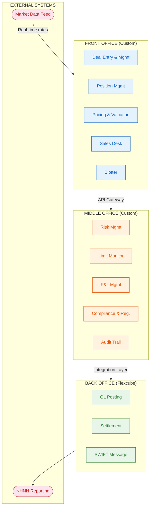
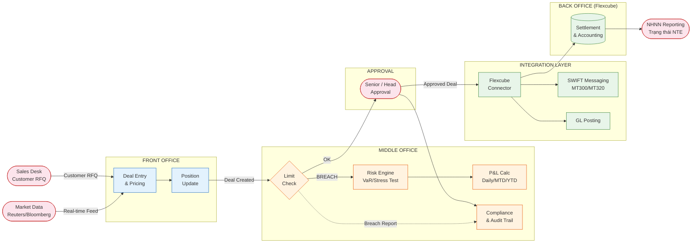
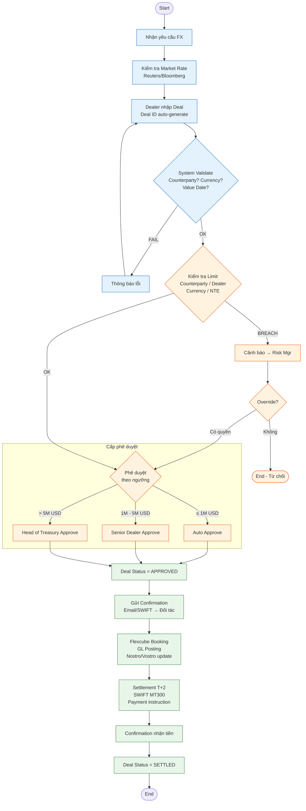
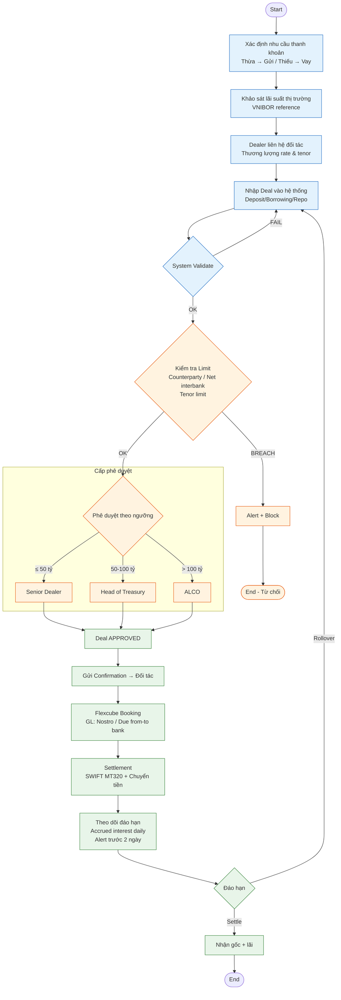
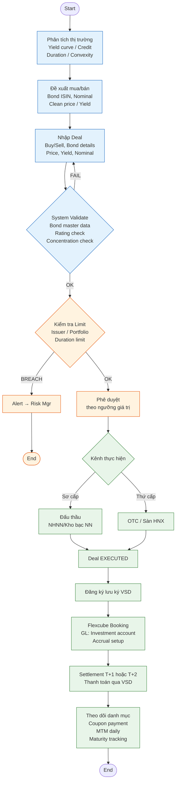
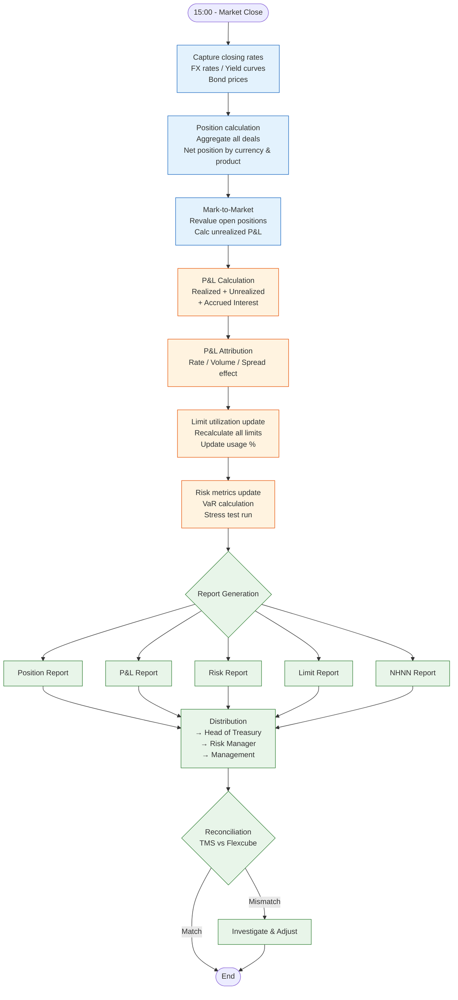
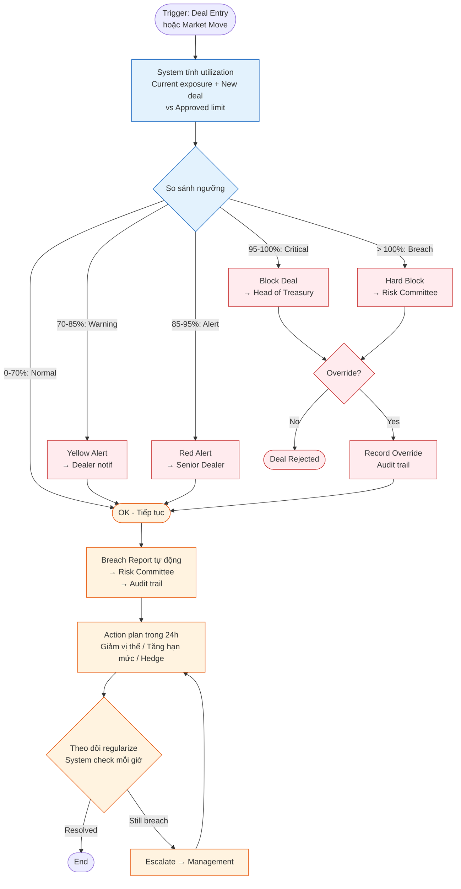
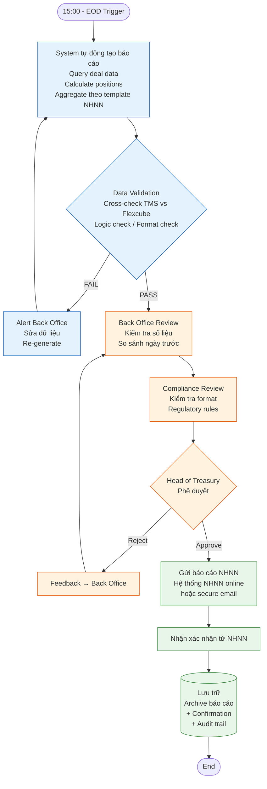

---
pdf_options:
  format: A4
  margin: 20mm
  printBackground: true
---

# TREASURY MANAGEMENT SYSTEM — KienlongBank

## Tài liệu Đặc tả Hệ thống (System Specification Document)

| Thông tin | Chi tiết |
|-----------|----------|
| **Ngân hàng** | Ngân hàng TMCP Kiên Long (KienlongBank) |
| **Dự án** | Treasury Management System (TMS) |
| **Phiên bản** | 2.0 |
| **Ngày phát hành** | 31/03/2026 |
| **Phân loại** | Nội bộ — Mật |
| **Phê duyệt** | Ban Lãnh đạo KienlongBank |

---

# 1. Tổng quan hệ thống

## 1.1. Mục tiêu dự án

Xây dựng hệ thống **Custom Treasury Management System (TMS)** cho KienlongBank với chiến lược:

- **Phát triển mới** Front Office và Middle Office phù hợp đặc thù nghiệp vụ ngân hàng
- **Giữ nguyên** Oracle Flexcube làm Back Office (hạch toán GL, settlement, SWIFT)
- **Tích hợp** Market Data Feed (Reuters/Bloomberg) và hệ thống báo cáo NHNN

**Lý do lựa chọn kiến trúc này:**

| Yếu tố | Giải thích |
|---------|-----------|
| **Linh hoạt** | Custom FO/MO đáp ứng nhanh yêu cầu nghiệp vụ riêng của KLB |
| **Ổn định** | Flexcube đã triển khai, đã kiểm chứng cho core banking |
| **Chi phí** | Tối ưu so với mua TMS trọn gói (Murex, Calypso) |
| **Thời gian** | Triển khai theo giai đoạn, giảm rủi ro go-live |

## 1.2. Kiến trúc tổng quan 3 tầng

## 1.3. Danh sách module chính

| # | Module | Tầng | Mô tả |
|---|--------|------|-------|
| 1 | Deal Entry & Management | Front Office | Nhập, sửa, hủy giao dịch Treasury |
| 2 | Position Management | Front Office | Theo dõi vị thế real-time |
| 3 | Pricing & Valuation | Front Office | Định giá, mark-to-market |
| 4 | Sales Desk | Front Office | Báo giá khách hàng, quản lý margin |
| 5 | Deal Blotter | Front Office | Bảng tổng hợp giao dịch trong ngày |
| 6 | Risk Management | Middle Office | VaR, stress test, scenario |
| 7 | Limit Monitoring | Middle Office | Giám sát hạn mức real-time |
| 8 | P&L Management | Middle Office | Lãi/lỗ daily, MTD, YTD |
| 9 | Compliance & Regulatory | Middle Office | Tuân thủ NHNN, audit trail |
| 10 | Flexcube Integration | Integration | GL posting, settlement |
| 11 | Market Data Feed | Integration | Reuters/Bloomberg connector |
| 12 | NHNN Reporting | Integration | Báo cáo quy định |

---

# 2. Mô tả chi tiết chức năng (Functional Specification)

## 2.1. FRONT OFFICE

### 2.1.1. Deal Entry & Management

**Mục đích:** Cung cấp giao diện nhập, quản lý toàn bộ giao dịch Treasury.

#### Sản phẩm hỗ trợ

| Nhóm sản phẩm | Loại giao dịch | Mô tả |
|----------------|----------------|-------|
| **FX** | Spot | Mua/bán ngoại tệ giao ngay (T+2) |
| | Forward | Mua/bán ngoại tệ kỳ hạn (>T+2) |
| | FX Swap | Kết hợp Spot + Forward ngược chiều |
| | NDF | Non-Deliverable Forward |
| **Money Market** | Interbank Deposit | Gửi tiền liên ngân hàng |
| | Interbank Borrowing | Vay liên ngân hàng |
| | Repo/Reverse Repo | Mua/bán lại có kỳ hạn |
| **Bonds** | Outright Buy/Sell | Mua/bán trái phiếu đứt đoạn |
| | Bond Repo | Repo trái phiếu |
| **Derivatives** | IRS | Interest Rate Swap |
| | CCS | Cross Currency Swap |
| | Options | Quyền chọn tiền tệ/lãi suất |

#### Chức năng chi tiết

| # | Chức năng | Mô tả |
|---|-----------|-------|
| F1.1 | **New Deal** | Tạo giao dịch mới, tự động sinh Deal ID |
| F1.2 | **Deal Amendment** | Sửa đổi thông tin deal (trước settlement) |
| F1.3 | **Deal Cancellation** | Hủy deal, yêu cầu approval |
| F1.4 | **Deal Rollover** | Gia hạn deal FX Forward/MM |
| F1.5 | **Deal Splitting** | Tách deal thành nhiều phần nhỏ |
| F1.6 | **Quick Deal** | Nhập nhanh deal từ template |
| F1.7 | **Deal Confirmation** | Gửi/nhận confirmation với đối tác |
| F1.8 | **Auto-pricing** | Tự động lấy giá từ Market Data |
| F1.9 | **Deal Ticket Print** | In phiếu giao dịch |
| F1.10 | **Audit Trail** | Lưu toàn bộ lịch sử thay đổi |

#### Trường dữ liệu chính — FX Deal

| Trường | Kiểu | Bắt buộc | Mô tả |
|--------|------|----------|-------|
| Deal ID | String | Auto | Mã giao dịch tự sinh |
| Deal Date | Date | Có | Ngày giao dịch |
| Value Date | Date | Có | Ngày thanh toán |
| Product Type | Enum | Có | SPOT/FWD/SWAP/NDF |
| Buy/Sell | Enum | Có | BUY/SELL |
| Currency Pair | String | Có | VD: USD/VND |
| Deal Amount | Decimal | Có | Số tiền gốc |
| Counter Amount | Decimal | Auto | Tính từ rate × amount |
| Exchange Rate | Decimal | Có | Tỷ giá thỏa thuận |
| Counterparty | String | Có | Đối tác giao dịch |
| Dealer | String | Auto | Người nhập deal |
| Portfolio | String | Có | Danh mục (Trading/Banking) |
| Status | Enum | Auto | NEW/VERIFIED/APPROVED/SETTLED |
| Remarks | Text | Không | Ghi chú |

### 2.1.2. Position Management

**Mục đích:** Cung cấp bức tranh tổng thể vị thế Treasury real-time.

#### Chức năng chi tiết

| # | Chức năng | Mô tả |
|---|-----------|-------|
| F2.1 | **Real-time Position** | Hiển thị vị thế tức thời theo currency |
| F2.2 | **Position by Product** | Phân tích theo FX/MM/Bonds/Derivatives |
| F2.3 | **Position by Counterparty** | Vị thế theo từng đối tác |
| F2.4 | **Position by Dealer** | Vị thế theo từng dealer |
| F2.5 | **Position by Portfolio** | Trading Book vs Banking Book |
| F2.6 | **Cash Flow Projection** | Dự báo dòng tiền theo ngày |
| F2.7 | **Maturity Ladder** | Bậc thang đáo hạn |
| F2.8 | **Gap Analysis** | Phân tích chênh lệch kỳ hạn |
| F2.9 | **Position Drill-down** | Xem chi tiết từ tổng → deal |
| F2.10 | **Position Export** | Xuất Excel/PDF |

### 2.1.3. Pricing & Valuation

**Mục đích:** Định giá tài sản Treasury real-time, hỗ trợ quyết định giao dịch.

#### Chức năng chi tiết

| # | Chức năng | Mô tả |
|---|-----------|-------|
| F3.1 | **Live Rate Board** | Bảng tỷ giá real-time từ market |
| F3.2 | **FX Rate Calculation** | Tính tỷ giá forward, cross rate |
| F3.3 | **Yield Curve** | Đường cong lãi suất VND/USD |
| F3.4 | **Bond Pricing** | Định giá trái phiếu (clean/dirty price) |
| F3.5 | **Mark-to-Market** | Đánh giá lại giá trị thị trường |
| F3.6 | **Fair Value Calc** | Tính giá trị hợp lý derivatives |
| F3.7 | **Swap Point Calc** | Tính swap point từ lãi suất |
| F3.8 | **Historical Rate** | Tra cứu tỷ giá lịch sử |

#### Công thức chính

- **Forward Rate:** `F = S × (1 + r_d × t) / (1 + r_f × t)`
- **Bond Price:** `P = Σ C/(1+y)^t + FV/(1+y)^n`
- **Mark-to-Market:** `MTM = (Market Rate - Deal Rate) × Amount × DPV`
- **VaR (Parametric):** `VaR = Position × σ × z × √t`

### 2.1.4. Sales Desk

**Mục đích:** Hỗ trợ bộ phận Sales báo giá, quản lý giao dịch với khách hàng doanh nghiệp.

#### Chức năng chi tiết

| # | Chức năng | Mô tả |
|---|-----------|-------|
| F4.1 | **Customer Quote** | Tạo báo giá cho khách hàng |
| F4.2 | **Spread Management** | Quản lý biên lợi nhuận (spread) |
| F4.3 | **Customer Limit** | Kiểm tra hạn mức KH trước khi giao dịch |
| F4.4 | **Quote History** | Lịch sử báo giá |
| F4.5 | **RFQ Management** | Quản lý yêu cầu báo giá |
| F4.6 | **Customer Portfolio** | Danh mục giao dịch theo KH |
| F4.7 | **Sales Report** | Báo cáo doanh số Sales |
| F4.8 | **Margin Analysis** | Phân tích biên lợi nhuận |

---

## 2.2. MIDDLE OFFICE

### 2.2.1. Risk Management

**Mục đích:** Đo lường, giám sát và kiểm soát rủi ro toàn bộ hoạt động Treasury.

#### Chức năng chi tiết

| # | Chức năng | Mô tả |
|---|-----------|-------|
| M1.1 | **Market Risk (VaR)** | Tính Value-at-Risk hàng ngày |
| M1.2 | **Credit Risk** | Rủi ro tín dụng đối tác |
| M1.3 | **Liquidity Risk** | Rủi ro thanh khoản |
| M1.4 | **Interest Rate Risk** | Rủi ro lãi suất (DV01, Duration) |
| M1.5 | **FX Risk** | Rủi ro tỷ giá |
| M1.6 | **Stress Testing** | Kiểm tra sức chịu đựng |
| M1.7 | **Scenario Analysis** | Phân tích kịch bản |
| M1.8 | **Sensitivity Analysis** | Phân tích độ nhạy (Greeks) |
| M1.9 | **Back-testing** | Kiểm chứng mô hình VaR |
| M1.10 | **Risk Dashboard** | Tổng quan rủi ro real-time |

#### Phương pháp tính VaR

| Phương pháp | Mô tả | Ưu điểm |
|-------------|--------|---------|
| **Parametric** | Giả định phân phối chuẩn | Nhanh, dễ triển khai |
| **Historical Simulation** | Dùng dữ liệu lịch sử | Không cần giả định phân phối |
| **Monte Carlo** | Mô phỏng ngẫu nhiên | Linh hoạt, chính xác |

#### Kịch bản Stress Test

| Kịch bản | Tham số | Mức biến động |
|----------|---------|---------------|
| FX Shock | USD/VND | ±5%, ±10%, ±15% |
| Rate Shock | Lãi suất VND | ±100bps, ±200bps |
| Credit Event | Default đối tác Top 5 | 100% exposure |
| Liquidity Crisis | Outflow 30% deposit | 1 tuần |
| Combined | Tất cả trên | Đồng thời |

### 2.2.2. Limit Monitoring

**Mục đích:** Giám sát hạn mức giao dịch real-time, cảnh báo khi tiệm cận hoặc vi phạm.

#### Các loại hạn mức

| Loại hạn mức | Đối tượng | Mô tả |
|-------------|-----------|-------|
| **Counterparty Limit** | Đối tác | Tổng exposure tối đa với 1 đối tác |
| **Product Limit** | Sản phẩm | Hạn mức theo loại sản phẩm |
| **Dealer Limit** | Dealer | Hạn mức giao dịch của từng dealer |
| **Currency Limit** | Tiền tệ | Vị thế tối đa theo từng loại tiền |
| **Stop Loss Limit** | Portfolio | Mức lỗ tối đa cho phép |
| **Tenor Limit** | Kỳ hạn | Hạn mức theo kỳ hạn giao dịch |
| **Intraday Limit** | Trong ngày | Hạn mức giao dịch trong ngày |
| **Overnight Limit** | Qua đêm | Hạn mức vị thế qua đêm |

#### Ngưỡng cảnh báo

| Mức | % Sử dụng | Hành động |
|-----|-----------|-----------|
| **Normal** | 0% – 70% | Giao dịch bình thường |
| **Warning** | 70% – 85% | Cảnh báo vàng → Dealer + Senior |
| **Alert** | 85% – 95% | Cảnh báo đỏ → Head of Treasury |
| **Critical** | 95% – 100% | Block deal mới, escalate Management |
| **Breach** | > 100% | Tự động block, báo cáo Risk Committee |

### 2.2.3. P&L Management

**Mục đích:** Tính toán, theo dõi lãi/lỗ hoạt động Treasury.

#### Chức năng chi tiết

| # | Chức năng | Mô tả |
|---|-----------|-------|
| M3.1 | **Daily P&L** | Lãi/lỗ trong ngày |
| M3.2 | **MTD P&L** | Lãi/lỗ lũy kế tháng |
| M3.3 | **YTD P&L** | Lãi/lỗ lũy kế năm |
| M3.4 | **P&L by Product** | Phân tích theo sản phẩm |
| M3.5 | **P&L by Dealer** | Theo dõi hiệu quả dealer |
| M3.6 | **P&L by Currency** | Phân tích theo loại tiền |
| M3.7 | **Realized P&L** | Lãi/lỗ đã thực hiện |
| M3.8 | **Unrealized P&L** | Lãi/lỗ chưa thực hiện (MTM) |
| M3.9 | **P&L Attribution** | Phân tích nguồn lãi/lỗ |
| M3.10 | **P&L Report** | Báo cáo lãi/lỗ tự động |

#### Công thức P&L

- **Realized P&L (FX):** `(Close Rate - Open Rate) × Amount`
- **Unrealized P&L (FX):** `(Market Rate - Deal Rate) × Outstanding Amount`
- **Total P&L:** `Realized + Unrealized + Accrued Interest`
- **P&L Attribution:** `Rate P&L + Volume P&L + Spread P&L`

### 2.2.4. Compliance & Regulatory

**Mục đích:** Đảm bảo tuân thủ quy định NHNN và chính sách nội bộ.

#### Chức năng chi tiết

| # | Chức năng | Mô tả |
|---|-----------|-------|
| M4.1 | **Regulatory Check** | Kiểm tra tuân thủ quy định NHNN |
| M4.2 | **Internal Policy** | Kiểm tra chính sách nội bộ |
| M4.3 | **Audit Trail** | Lưu vết kiểm toán toàn bộ |
| M4.4 | **Suspicious Alert** | Cảnh báo giao dịch bất thường |
| M4.5 | **Regulatory Report** | Tự động tạo báo cáo NHNN |
| M4.6 | **Compliance Dashboard** | Tổng quan trạng thái tuân thủ |
| M4.7 | **Policy Management** | Quản lý chính sách, quy trình |
| M4.8 | **Exception Report** | Báo cáo ngoại lệ |

#### Quy định NHNN liên quan

| Quy định | Nội dung | Tần suất báo cáo |
|----------|----------|-------------------|
| TT 15/2015 | Trạng thái ngoại tệ | Hàng ngày |
| TT 01/2015 | Hoạt động ngoại hối | Hàng tháng/quý |
| TT 22/2019 | Giới hạn, tỷ lệ an toàn | Hàng tháng |
| TT 40/2011 | Quy định cấp tín dụng | Hàng quý |
| QĐ 1726/2020 | Báo cáo thống kê | Hàng tháng |

---

## 2.3. INTEGRATION LAYER

### 2.3.1. Flexcube Integration

**Mục đích:** Kết nối TMS với Oracle Flexcube Back Office để hạch toán và settlement.

#### Điểm tích hợp

| # | Interface | Hướng | Mô tả |
|---|-----------|-------|-------|
| I1.1 | **Deal Booking** | TMS → Flexcube | Gửi deal đã approved để hạch toán |
| I1.2 | **GL Posting** | TMS → Flexcube | Bút toán kế toán tự động |
| I1.3 | **Settlement** | TMS → Flexcube | Lệnh thanh toán |
| I1.4 | **SWIFT Message** | Flexcube → SWIFT | Gửi MT300, MT320, MT103 |
| I1.5 | **Confirmation** | Flexcube → TMS | Trạng thái settlement |
| I1.6 | **EOD Feed** | Flexcube → TMS | Dữ liệu cuối ngày |
| I1.7 | **Customer Data** | Flexcube → TMS | Thông tin khách hàng, CIF |
| I1.8 | **Account Balance** | Flexcube → TMS | Số dư tài khoản Nostro |

#### Giao thức tích hợp

- **Protocol:** REST API + SOAP (legacy Flexcube)
- **Message Format:** JSON (TMS) ↔ XML (Flexcube)
- **Queue:** Apache Kafka cho async messaging
- **Retry:** 3 lần, exponential backoff
- **Timeout:** 30 giây cho synchronous calls

### 2.3.2. Market Data Feed

**Mục đích:** Nhận dữ liệu thị trường real-time phục vụ pricing và risk.

#### Nguồn dữ liệu

| Nguồn | Dữ liệu | Tần suất |
|-------|----------|----------|
| **Reuters/Refinitiv** | FX rates, yield curves | Real-time (tick) |
| **Bloomberg** | Bond prices, CDS spreads | Real-time |
| **NHNN** | Tỷ giá trung tâm, lãi suất điều hành | Hàng ngày |
| **HNX/HOSE** | Giá trái phiếu niêm yết | Real-time |
| **Internal** | Tỷ giá niêm yết KLB | Hàng ngày |

### 2.3.3. NHNN Reporting

**Mục đích:** Tự động tạo và gửi báo cáo theo quy định NHNN.

#### Danh sách báo cáo

| # | Báo cáo | Mã | Tần suất | Deadline |
|---|---------|-----|----------|----------|
| 1 | Trạng thái ngoại tệ | BC-NTE | Hàng ngày | 16:00 |
| 2 | Doanh số mua bán ngoại tệ | BC-DSNTE | Hàng ngày | 16:00 |
| 3 | Tỷ giá giao dịch thực tế | BC-TGTT | Hàng ngày | 16:00 |
| 4 | Giao dịch phái sinh | BC-GDPS | Hàng tháng | Ngày 5 |
| 5 | Đầu tư trái phiếu | BC-DTTP | Hàng tháng | Ngày 10 |
| 6 | Vay gửi liên ngân hàng | BC-VLNH | Hàng tháng | Ngày 10 |
| 7 | Tỷ lệ an toàn vốn (CAR) | BC-CAR | Hàng quý | Ngày 15 |

---

# 3. Lưu đồ Data Flow tổng quan

## 3.1. System Data Flow Diagram

## 3.2. Data Flow theo thời gian (Daily Cycle)

| Thời gian | Hoạt động | Chi tiết |
|-----------|-----------|----------|
| 06:00 | System Start | Config Load, Health Check |
| 08:00 | Market Open | Rate Feed, Yield Curve |
| 09:00 – 15:00 | Trading Session | Deal Entry, Limit Check, Approval, Settlement |
| 15:00 | EOD Cut-off | P&L Calc, Position MTM, Reports |
| 16:00 | NHNN Report | Auto Generate, Submit |
| 17:00 | EOD Batch | GL Post, Settle, SWIFT Confirm |

---

# 4. Luồng nghiệp vụ chi tiết (Business Process Flows)

## 4.1. Giao dịch FX Spot

### Mô tả quy trình

Quy trình giao dịch mua/bán ngoại tệ giao ngay (T+2), từ khi nhận yêu cầu đến khi hoàn tất thanh toán.

### Actors

| Actor | Vai trò |
|-------|---------|
| **Dealer** | Nhập deal, thương lượng giá |
| **Senior Dealer** | Phê duyệt deal vượt hạn mức dealer |
| **Head of Treasury** | Phê duyệt deal lớn |
| **Risk Manager** | Giám sát hạn mức, rủi ro |
| **Back Office** | Xác nhận, settlement |

### Input / Output

| | Chi tiết |
|---|---------|
| **Input** | Yêu cầu mua/bán FX từ Sales/Interbank, Market Rate |
| **Output** | Deal ticket, GL entries, SWIFT MT300, Confirmation |

### Business Rules

| # | Rule | Mô tả |
|---|------|-------|
| BR1 | Giá phải nằm trong biên cho phép | ± 0.5% so với mid-market |
| BR2 | Kiểm tra hạn mức đối tác | Trước khi confirm deal |
| BR3 | Kiểm tra hạn mức dealer | Theo cấp phê duyệt |
| BR4 | Kiểm tra trạng thái NTE | Không vượt giới hạn NHNN |
| BR5 | Deal > $1M | Cần Senior Dealer approve |
| BR6 | Deal > $5M | Cần Head of Treasury approve |
| BR7 | Value Date | T+2 cho Spot (business days) |

### Process Flow

---

## 4.2. Giao dịch Money Market (Vay/Gửi liên ngân hàng)

### Mô tả quy trình

Quy trình giao dịch vay hoặc gửi tiền trên thị trường liên ngân hàng, bao gồm cả Repo/Reverse Repo.

### Actors

| Actor | Vai trò |
|-------|---------|
| **Dealer** | Tìm đối tác, thương lượng lãi suất |
| **Senior Dealer** | Phê duyệt deal > ngưỡng |
| **Head of Treasury** | Phê duyệt deal lớn |
| **ALCO** | Phê duyệt chiến lược thanh khoản |
| **Back Office** | Settlement, theo dõi đáo hạn |

### Business Rules

| # | Rule | Mô tả |
|---|------|-------|
| BR1 | Lãi suất trong biên | So sánh với lãi suất tham chiếu NHNN |
| BR2 | Kỳ hạn tối đa | Overnight → 12 tháng |
| BR3 | Hạn mức đối tác | Kiểm tra trước khi giao dịch |
| BR4 | Deal > 100 tỷ VND | Cần Head of Treasury approve |
| BR5 | Tổng vay ròng | Không vượt hạn mức ALCO quy định |
| BR6 | Repo collateral | Tài sản đảm bảo ≥ 105% giá trị vay |

### Process Flow

---

## 4.3. Giao dịch Trái phiếu (Mua/Bán)

### Mô tả quy trình

Quy trình mua/bán trái phiếu trên thị trường sơ cấp (đấu thầu) và thứ cấp (OTC, sàn).

### Actors

| Actor | Vai trò |
|-------|---------|
| **Bond Dealer** | Phân tích, đề xuất mua/bán |
| **Senior Dealer** | Phê duyệt giao dịch |
| **Head of Treasury** | Phê duyệt danh mục lớn |
| **Risk Manager** | Đánh giá rủi ro tín dụng |
| **Back Office** | Đăng ký, lưu ký, settlement |

### Business Rules

| # | Rule | Mô tả |
|---|------|-------|
| BR1 | Chỉ mua trái phiếu investment grade | Rating ≥ BBB |
| BR2 | Duration danh mục | Theo hạn mức ALCO |
| BR3 | Tập trung tổ chức phát hành | ≤ 15% tổng danh mục |
| BR4 | Mark-to-market | Hàng ngày cho Trading Book |
| BR5 | Phân loại | Trading Book vs Banking Book |

### Process Flow

---

## 4.4. Quản lý vị thế & P&L Daily

### Mô tả quy trình

Quy trình End-of-Day (EOD) tính toán vị thế, mark-to-market và P&L cho toàn bộ danh mục Treasury.

### Business Rules

| # | Rule | Mô tả |
|---|------|-------|
| BR1 | Closing rate | Lấy rate lúc 15:00 (market close) |
| BR2 | MTM frequency | Daily cho Trading Book |
| BR3 | P&L threshold | Alert nếu daily loss > ngưỡng |
| BR4 | Reconciliation | Đối chiếu TMS vs Flexcube |

### Process Flow

---

## 4.5. Giám sát hạn mức (Limit Breach Workflow)

### Mô tả quy trình

Quy trình xử lý khi giao dịch tiệm cận hoặc vi phạm hạn mức, từ cảnh báo đến xử lý escalation.

### Business Rules

| # | Rule | Mô tả |
|---|------|-------|
| BR1 | Real-time check | Kiểm tra mọi deal trước khi approve |
| BR2 | Auto-block | Tự động chặn deal khi breach |
| BR3 | Override | Chỉ Head of Treasury trở lên |
| BR4 | Breach report | Gửi trong 1 giờ cho Risk Committee |
| BR5 | Regularize | Phải đưa về hạn mức trong 24h |

### Process Flow

---

## 4.6. Báo cáo NHNN

### Mô tả quy trình

Quy trình tạo, kiểm tra và gửi báo cáo quy định cho Ngân hàng Nhà nước Việt Nam.

### Business Rules

| # | Rule | Mô tả |
|---|------|-------|
| BR1 | Deadline | Báo cáo ngày: gửi trước 16:00 |
| BR2 | Format | Theo template NHNN quy định |
| BR3 | Validation | Kiểm tra cross-check trước khi gửi |
| BR4 | Archive | Lưu trữ tối thiểu 5 năm |
| BR5 | Late submission | Phải có công văn giải trình |

### Process Flow

---

# 5. Ma trận phân quyền (Authorization Matrix)

## 5.1. Bảng phân quyền theo chức năng

Ký hiệu: **C** = Create | **R** = Read | **U** = Update | **D** = Delete | **A** = Approve | **—** = Không có quyền

| Chức năng | Dealer | Sr. Dealer | Head Treasury | Risk Mgr | Back Office | Compliance | Mgmt |
|-----------|--------|------------|---------------|----------|-------------|------------|------|
| **FRONT OFFICE** | | | | | | | |
| Deal Entry (New) | C,R | C,R | C,R | R | R | R | R |
| Deal Amendment | U,R | U,R,A | U,R,A | R | R | R | R |
| Deal Cancellation | R | R,A | R,A | R | R | R | R |
| Deal Approval ≤$1M | — | A | A | — | — | — | — |
| Deal Approval $1-5M | — | — | A | — | — | — | — |
| Deal Approval >$5M | — | — | — | — | — | — | A |
| Position View | R | R | R | R | R | R | R |
| Pricing/Rate Board | R | R | R | R | R | R | R |
| Sales Desk Quote | C,R | C,R,A | C,R,A | R | R | — | R |
| Spread Setup | — | U,R | C,U,R,A | — | — | — | A |
| **MIDDLE OFFICE** | | | | | | | |
| Risk Dashboard | R | R | R | R | — | R | R |
| VaR Report | — | R | R | C,R | — | R | R |
| Stress Test Config | — | — | R | C,U,R | — | R | A |
| Stress Test Run | — | — | R | C,R | — | R | R |
| Limit Setup | — | — | R | C,U,R | — | R | A |
| Limit Override | — | — | A | R | — | R | A |
| Limit Report | R | R | R | R | R | R | R |
| P&L Report | R | R | R | R | R | R | R |
| P&L Config | — | — | R | C,U,R | — | — | A |
| Compliance Report | — | — | R | R | R | C,R | R |
| Audit Trail | — | — | R | R | R | R | R |
| **BACK OFFICE** | | | | | | | |
| Settlement Process | — | — | — | — | C,U,R | — | R |
| GL Posting | — | — | — | — | C,R | R | R |
| SWIFT Message | — | — | — | — | C,R | — | R |
| Confirmation Mgmt | — | — | — | — | C,U,R | — | R |
| NHNN Report Generate | — | — | R | R | C,R | R | R |
| NHNN Report Submit | — | — | A | — | R | A | A |
| **ADMINISTRATION** | | | | | | | |
| User Management | — | — | — | — | — | — | C,U,R,D |
| Role Management | — | — | — | — | — | — | C,U,R,D |
| System Config | — | — | — | — | — | — | C,U,R |
| Counterparty Setup | — | — | C,U,R | R | C,U,R | R | A |
| Product Setup | — | — | C,U,R | R | R | — | A |

## 5.2. Ngưỡng phê duyệt giao dịch

| Sản phẩm | Dealer (tự duyệt) | Senior Dealer | Head of Treasury | Management |
|----------|-------------------|---------------|------------------|------------|
| **FX Spot/Forward** | ≤ $500K | ≤ $1M | ≤ $5M | > $5M |
| **FX Swap** | ≤ $500K | ≤ $1M | ≤ $5M | > $5M |
| **MM Deposit** | ≤ 20 tỷ VND | ≤ 50 tỷ | ≤ 100 tỷ | > 100 tỷ |
| **MM Borrowing** | ≤ 20 tỷ VND | ≤ 50 tỷ | ≤ 100 tỷ | > 100 tỷ |
| **Bond Buy/Sell** | ≤ 10 tỷ VND | ≤ 30 tỷ | ≤ 50 tỷ | > 50 tỷ |
| **Derivatives** | — | ≤ $1M | ≤ $5M | > $5M |

## 5.3. Ma trận phân quyền — Limit Override

| Loại Limit | Risk Manager | Head of Treasury | Management/ALCO |
|-----------|-------------|------------------|-----------------|
| Dealer Limit | Recommend | Approve | — |
| Counterparty Limit | Recommend | Approve (≤10%) | Approve (>10%) |
| Product Limit | Recommend | Approve (≤10%) | Approve (>10%) |
| Currency Position | Recommend | — | Approve |
| Stop Loss Limit | — | — | Approve |
| NTE Limit (NHNN) | — | — | Không cho phép override |

> **Lưu ý:** Hạn mức trạng thái ngoại tệ (NTE) theo quy định NHNN **không được phép override** trong mọi trường hợp. Mọi giao dịch vượt hạn mức NTE sẽ bị từ chối tự động.

---

# Phụ lục

## A. Danh mục thuật ngữ

| Thuật ngữ | Giải thích |
|-----------|-----------|
| **ALCO** | Asset Liability Committee — Ủy ban Quản lý Tài sản Nợ |
| **CAR** | Capital Adequacy Ratio — Tỷ lệ an toàn vốn |
| **CCS** | Cross Currency Swap — Hoán đổi chéo tiền tệ |
| **CIF** | Customer Information File — Hồ sơ thông tin khách hàng |
| **DV01** | Dollar Value of 1 basis point — Giá trị 1 điểm cơ bản |
| **EOD** | End of Day — Cuối ngày |
| **GL** | General Ledger — Sổ cái |
| **IRS** | Interest Rate Swap — Hoán đổi lãi suất |
| **ISIN** | International Securities Identification Number |
| **MTD** | Month to Date — Lũy kế tháng |
| **MTM** | Mark-to-Market — Đánh giá theo thị trường |
| **NDF** | Non-Deliverable Forward — Kỳ hạn không giao nhận |
| **NHNN** | Ngân hàng Nhà nước Việt Nam |
| **NTE** | Ngoại tệ — Trạng thái ngoại tệ |
| **P&L** | Profit and Loss — Lãi/Lỗ |
| **RFQ** | Request for Quote — Yêu cầu báo giá |
| **TMS** | Treasury Management System |
| **VaR** | Value at Risk — Giá trị rủi ro |
| **VNIBOR** | Vietnam Interbank Offered Rate |
| **VSD** | Vietnam Securities Depository — Trung tâm Lưu ký CKVN |
| **YTD** | Year to Date — Lũy kế năm |

## B. Tài liệu tham chiếu

| # | Tài liệu | Mô tả |
|---|----------|-------|
| 1 | Thông tư 15/2015/TT-NHNN | Quy định về trạng thái ngoại tệ |
| 2 | Thông tư 01/2015/TT-NHNN | Hoạt động ngoại hối |
| 3 | Thông tư 22/2019/TT-NHNN | Giới hạn, tỷ lệ an toàn |
| 4 | Oracle Flexcube Universal Banking | Back Office System |
| 5 | SWIFT Standards | MT300, MT320, MT103 |
| 6 | KLB Internal Policy | Chính sách quản lý rủi ro nội bộ |

---

*Tài liệu này là tài sản nội bộ của Ngân hàng TMCP Kiên Long. Nghiêm cấm sao chép, phân phối khi chưa được phê duyệt.*
